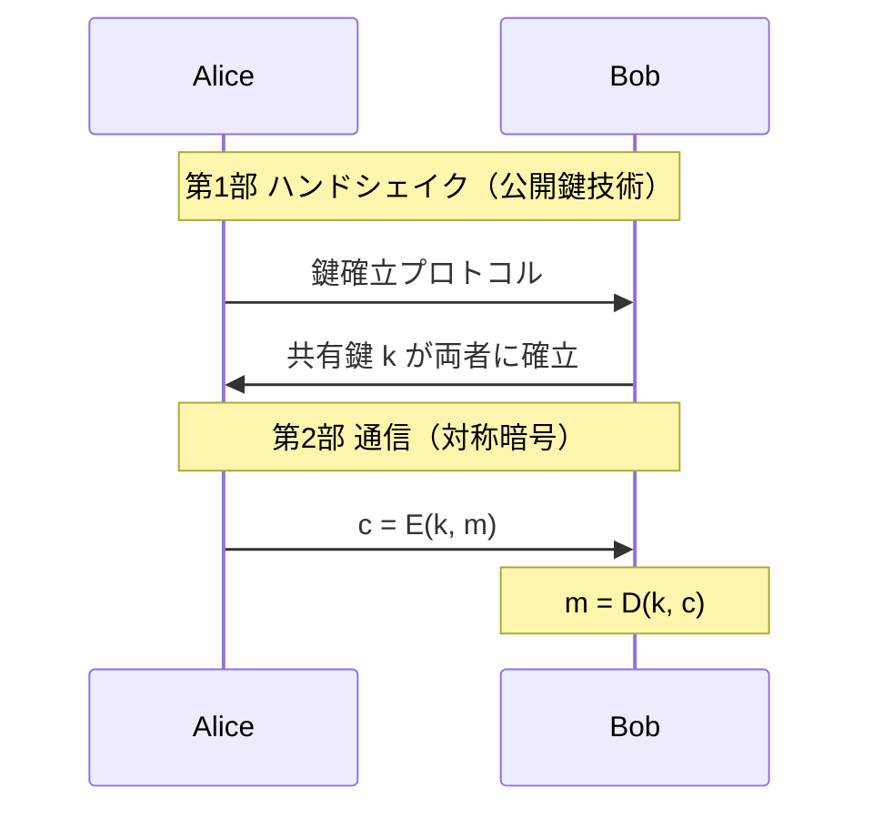

# 01. コース概要と応用

> 親: [README](./README.md) ｜ 前: [README](./README.md) ｜ 次: [02 暗号にできること](./02_what-crypto-can-do.md) ｜ 出典: Crypto I ビデオ1 (0:00:00–0:10:24)

暗号（cryptography）は、敵対者がいる環境で通信とデータを守る道具箱。コースの目標と、暗号が使われている場所を俯瞰する。

**この1ページで分かること**

- コースの 4 つの目標（仕組み・正しい使い方・安全性の論証・攻撃の視点）
- 安全な通信は「鍵確立」＋「対称暗号による通信」の 2 段構成
- Kerckhoffs の原則＝秘密にするのは鍵だけ。自作暗号は使わない

---

## コースの目標

| # | 目標 | 意味 |
|---|---|---|
| 1 | 仕組みを理解する | ブロック暗号・ハッシュ・鍵共有などの動作原理 |
| 2 | 正しく使う | 部品が正しくても組み合わせを誤ると壊れる |
| 3 | 安全性を推論する | 「なぜ安全と言えるか」を論証できる |
| 4 | 破る力を持つ | 攻撃の視点がないと安全性は評価できない |

---

## 暗号は身の回りのどこにあるか

| 使われる場所 | 何を守るか |
|---|---|
| HTTPS（SSL/TLS） | Web ブラウザとサーバ間の通信 |
| Wi-Fi（WPA2 / 802.11i） | 無線 LAN の通信 |
| GSM・Bluetooth | 携帯電話・近距離無線の通信 |
| ディスク暗号化 | 保存されたファイル |
| DVD（CSS）／Blu-ray（AACS） | 映像コンテンツの保護 |

---

## 安全な通信の2部構成

登場人物は送信者 **Alice**、受信者 **Bob**、盗聴者（eavesdropper）。



盗聴者が第1部を見ていても `k` は漏れない。**ディスク暗号化も同じ構造**——「今日の Alice が明日の Alice へ送る通信」と同型で、相手が未来の自分になるだけ。

---

## 対称暗号と Kerckhoffs の原則

対称暗号 = アルゴリズム対 `(E, D)` + Alice と Bob が共有する鍵 `k`。

```
暗号化:  c = E(k, m)     （m: 平文, c: 暗号文）
復号:    m = D(k, c)
```

> **Kerckhoffs の原則**: アルゴリズム（`E`, `D`）は公開してよい。秘密にすべきは**鍵だけ**。

独自の秘密アルゴリズムを使ってはいけない理由:

| 理由 | 内容 |
|---|---|
| 査読の欠如 | 公開アルゴリズム（AES など）は世界中の専門家が解析済み。自作暗号は未検証 |
| 秘密は保てない | 製品に組み込んだアルゴリズムはリバースエンジニアリングされる。解析後ただちに破られた例が多数 |

安全性をアルゴリズムの秘密に頼る設計（security through obscurity）は脆い。詳細は [`topics/02_cryptography/01_goals-and-primitives.md`](../../../topics/02_cryptography/01_goals-and-primitives.md)。

---

## one-time key と many-time key

同じ鍵を何回使うかで、必要な暗号方式が変わる。

| 種別 | 定義 | 実例 |
|---|---|---|
| one-time key | 鍵を 1 メッセージにだけ使う | TLS/HTTPS のセッション鍵（接続ごとに新鍵）・PGP（メール 1 通ごとに鍵を生成し公開鍵で包む）・Signal（メッセージごとに鍵を進め使用後は破棄） |
| many-time key | 同じ鍵で多数を暗号化 | ディスク暗号化（BitLocker / FileVault / LUKS。1 鍵で全セクタ）・WPA2-PSK（1 鍵を全接続で流用）・DB のカラム暗号化・毎晩の暗号化バックアップ |

many-time key は攻撃者に手がかりを与えやすく、より強い方式が要る。one-time key なら暗号文は鍵あたり 1 個なので OTP で足りるが、many-time key で同じことをすると鍵が打ち消し合い平文が漏れる（→ [two-time pad 攻撃](../03_stream-ciphers/03_attacks-on-otp.md)）。実務では nonce/IV やセクタ番号を混ぜて「鍵は同じでも毎回別の暗号」にする。

---

## 暗号にできないこと（3つの限界）

| 限界 | 内容 |
|---|---|
| 万能でない | 守るのは通信路とデータだけ。ソフトウェアのバグや、人をだますソーシャルエンジニアリングには無力 |
| 実装を誤ると無意味 | Wi-Fi 初期規格 **WEP** は暗号の使い方を誤り、容易に破られた |
| 自作するな | 標準化され査読された暗号（AES など）を使う。素人設計はほぼ確実に破られる |

---

## 問題

**Q1.** 次のプロトコルと、それが主に守る対象を対応させよ。(a) HTTPS (b) WPA2 (c) ディスク暗号化

<details><summary>解答</summary>

(a) HTTPS = Web ブラウザとサーバ間の**通信**。(b) WPA2 = **無線 LAN（Wi-Fi）の通信**。(c) ディスク暗号化 = **保存されたファイル**（＝「今日の自分から明日の自分への通信」と同型）。

</details>

**Q2.** Kerckhoffs の原則によれば、暗号システムで秘密にすべきものは何か。アルゴリズムを秘密にする設計はなぜ危険か。

<details><summary>解答</summary>

秘密にすべきなのは**鍵だけ**。アルゴリズムは公開してよい。アルゴリズムの秘密に頼る設計（security through obscurity）は、(1) 公開レビューを受けておらず弱点が未検証、(2) リバースエンジニアリングで解析されると秘密が保てない、という理由で危険。

</details>

**Q3.** 次のうち one-time key の使い方はどれか。(a) 1通のメールごとに新しい鍵で暗号化する (b) 1つの鍵でディスク上の全ファイルを暗号化する

<details><summary>解答</summary>

(a)。メール1通ごとに別鍵を使うのが one-time key。(b) は同じ鍵を多数回使う many-time key。

</details>

**Q4.** 同僚が「社内向けに独自の秘密暗号アルゴリズムを設計した。非公開だから安全だ」と提案してきた。暗号の観点から正しい対応は何か。

<details><summary>解答</summary>

採用すべきでない。Kerckhoffs の原則に反し、査読されていない自作暗号は破られる可能性が高い。AES など標準化・査読済みの暗号を、正しい方法で使うよう勧めるのが正しい対応。

</details>

## 関連リンク

- [セキュリティ目標とプリミティブの分類](../../../topics/02_cryptography/01_goals-and-primitives.md) — Kerckhoffs の原理・対称/公開鍵の分類・攻撃者モデルの体系的整理
- [02 暗号にできること](./02_what-crypto-can-do.md) — 署名・匿名通信・多者計算など、暗号の応用の広がり
