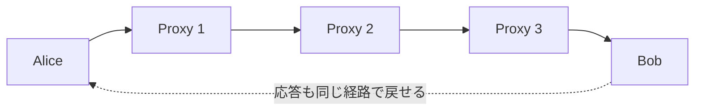
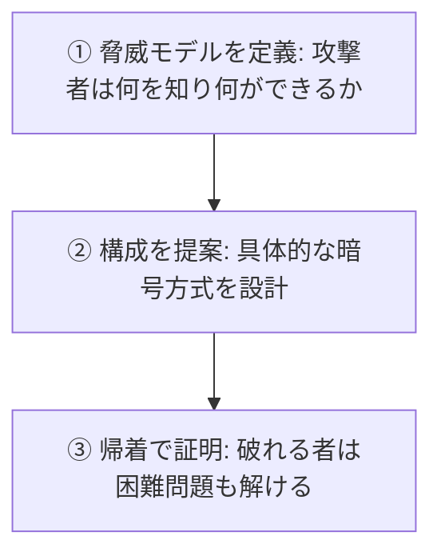

# 02. 暗号にできること

> 親: [README](./README.md) ｜ 前: [01 コース概要と応用](./01_course-overview-and-applications.md) ｜ 次: [03 歴史的暗号](./03_history-of-ciphers.md) ｜ 出典: Crypto I ビデオ1 (0:10:24–0:26:34)

暗号は「盗聴を防ぐ」だけの技術ではない。署名・匿名通信・電子現金・多者計算・ゼロ知識証明まで、直感を超える応用がある。

**この1ページで分かること**

- 土台は鍵共有＋安全な通信（秘匿性と完全性の両立）
- 署名・ミックスネット・匿名電子現金・MPC・ゼロ知識証明が「何を隠して何を保証するか」
- 現代暗号の 3 ステップ（脅威モデル → 構成 → 帰着による証明）

---

## 中核：鍵共有と安全な通信

安全な通信は 2 つの性質を同時に守る。

| 性質 | 意味 |
|---|---|
| 秘匿性（confidentiality） | 盗聴者にメッセージの中身を読ませない |
| 完全性（integrity） | 途中で改ざんされていないことを保証する |

---

## デジタル署名

文書が本人によって作られたことを証明する。紙のサインとの決定的な違い:

> デジタル署名は**署名対象の内容の関数**でなければならない。

固定値の署名なら、攻撃者は署名を別の文書にコピー＆ペーストして偽造できる。内容から計算すれば 1 文字の変更で署名が無効になり、**カット＆ペースト攻撃を防げる**（→ [`topics/…/01_goals-and-primitives.md`](../../../topics/02_cryptography/01_goals-and-primitives.md) の否認防止）。

---

## 匿名通信：ミックスネット

誰が誰に送ったかを隠す。複数のプロキシ（中継サーバ）を多段に経由し、各段で暗号化・復号を重ねる。

各プロキシは「直前の送り元」と「直後の宛先」しか知らない。双方向に構成すれば Bob からの**応答も匿名のまま**返せる。

---

## 匿名電子現金

| 要求 | 内容 |
|---|---|
| 匿名性 | 誰が何に使ったか追跡されない |
| 二重使用の防止 | 同じコインを 2 回使う不正を止める |

匿名だと履歴を追えず、二重使用の検出が難しい。暗号の解決:

> **1 回使う分には完全に匿名。2 回使うとその瞬間に身元が数学的に露呈する。**

正直なユーザは匿名を保ち、不正者だけが特定される非対称性を暗号で作る。

---

## 安全な多者計算（MPC）

**Secure Multiparty Computation**: 各自の入力を秘密にしたまま、関数の結果だけを全員で計算する。

| 例 | 秘匿するもの | 公開するもの |
|---|---|---|
| 選挙 | 各人の投票（個票） | 多数決の結果 |
| Vickrey（第 2 価格）オークション | 各人の入札額 | 勝者と第 2 位の価格（＝落札額） |

> **定理**: 信頼できる権威（trusted authority）がいれば計算できる関数は、**権威なしでも**参加者だけで計算できる。

---

## 魔法級の応用

| 応用 | できること | 状況 |
|---|---|---|
| 秘匿計算の外部委託 | 暗号化したクエリを渡し、サーバは中身を知らずに検索して暗号化結果を返す | 理論的に可能、実用にはまだ遠い |
| ゼロ知識証明（zero-knowledge proof） | 事実を、根拠を一切明かさず証明する。例: `N = p·q` の素因数 `p, q` を知っていることを、値を明かさず証明 | 実用化が進む |

---

## 現代暗号の厳密性：3ステップ

「なんとなく安全そう」ではなく、必ずこの順で安全性を論証する。

③ の**帰着（reduction）**が鍵: 「この方式を破れるなら素因数分解も解ける」と示せば、素因数分解が困難である限りこの方式も破れない。

---

## 問題

**Q1.** デジタル署名が「署名対象の文書内容の関数」でなければならないのはなぜか。文書ごとに変わらない固定署名だと何が起きるか。

解答

署名が内容と無関係な固定値だと、攻撃者が署名だけを別の文書にコピー＆ペーストして偽造できる（カット＆ペースト攻撃）。署名を文書内容から計算すれば、内容が変わると署名が無効になり、この偽造を防げる。

**Q2.** Vickrey（第2価格）オークションを MPC で行うとき、最終的に公開される情報は何か。逆に秘匿されるものは何か。

解答

公開されるのは**勝者（落札者）と第2位の入札価格（落札額）**のみ。各参加者の実際の入札額（勝者自身の額を含む）は秘匿される。

**Q3.** 匿名電子現金における二重使用問題を、匿名性を保ったまま解決するアイデアを一言で述べよ。

解答

「1回使う分には完全に匿名だが、同じコインを2回使うと数学的に身元が露呈する」という仕組みにする。正直なユーザは匿名を保て、二重使用した不正者だけが特定される。

**Q4.** 現代暗号で安全性を確立する3つのステップを正しい順に並べよ。(a) 構成を提案する (b) 脅威モデルを定義する (c) 帰着により安全性を証明する

解答

(b) → (a) → (c)。まず脅威モデル（攻撃者の能力）を定義し、次に具体的な構成を提案し、最後に「破れるなら困難問題が解ける」という帰着で安全性を証明する。

## 関連リンク

- [セキュリティ目標とプリミティブの分類](../../../topics/02_cryptography/01_goals-and-primitives.md) — 秘匿性・完全性・認証・否認防止と、署名/MAC の使い分け
- [01 コース概要と応用](./01_course-overview-and-applications.md) — 安全な通信の2部構成と対称暗号の基礎
- [03 歴史的暗号](./03_history-of-ciphers.md) — 厳密な方法論が確立する前の、破られてきた暗号たち
