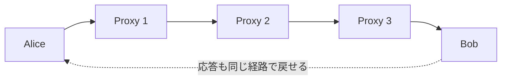

# 02. 暗号にできること

> 親: [README](./README.md) ｜ 前: [01 コース概要と応用](./01_course-overview-and-applications.md) ｜ 次: [03 歴史的暗号](./03_history-of-ciphers.md) ｜ 出典: Crypto I ビデオ1 (0:10:24–0:26:34)

暗号は「盗聴を防ぐ」だけの技術ではない。署名・匿名通信・電子現金・多者計算・ゼロ知識証明といった、直感に反するほど強力な応用が可能だ。ここでは暗号にできることの広がりと、それを支える現代暗号の厳密な方法論を見る。

---

## 中核：鍵共有と安全な通信

まず土台となるのが、**鍵共有**と**安全な通信**だ。安全な通信は2つの性質を同時に守る。

- **秘匿性（confidentiality）**: 盗聴者にメッセージの中身を読ませない。
- **完全性（integrity）**: メッセージが途中で改ざんされていないことを保証する。

この2つが揃って初めて「安全な通信」と呼べる。

---

## デジタル署名

デジタル署名は、文書が本人によって作られたことを証明する。ただし物理的なサインとは決定的に違う点がある。

> デジタル署名は**署名対象の内容の関数**でなければならない。

紙のサインは文書と切り離せる（切り取って別の紙に貼れる）。もし署名が文書の中身と無関係な固定値なら、攻撃者は署名だけを別の文書にコピー＆ペーストして偽造できてしまう。署名を文書内容から計算することで、内容が1文字でも変われば署名が無効になり、**カット＆ペースト攻撃を防げる**。（→ [`topics/02_cryptography/01_goals-and-primitives.md`](../../../topics/02_cryptography/01_goals-and-primitives.md) の否認防止の議論）

---

## 匿名通信：ミックスネット

誰が誰に送ったかを隠したい場合、**ミックスネット（mix net）**を使う。送信者は複数のプロキシ（中継サーバ）を多段に経由させ、各段で暗号化・復号を重ねる。



各プロキシは「直前の送り元」と「直後の宛先」しか分からず、全体像を1台では把握できない。双方向に構成すれば、宛先の Bob から Alice への**応答も匿名のまま**返せる。

---

## 匿名電子現金

電子的な現金には、物理現金にない緊張関係がある。

- **匿名性**: 誰が何に使ったかを追跡されたくない。
- **二重使用（double spending）の防止**: 同じ電子コインを2回使う不正を止めたい。

匿名だと使用履歴を追えないため、二重使用の検出が難しくなる。暗号の巧妙な解決アイデアはこうだ。

> **1回使う分には完全に匿名。しかし2回使うと、その瞬間に身元が数学的に露呈する。**

正直に1回だけ使うユーザは匿名を保て、不正に2回使ったユーザだけが特定される、という非対称性を暗号で作り出す。

---

## 安全な多者計算（MPC）

**安全な多者計算（Secure Multiparty Computation, MPC）**は、各自が入力を秘密にしたまま、全員で関数の結果だけを計算する技術だ。

- **選挙**: 各人の投票（個票）は秘匿したまま、**多数決の結果だけ**を公開する。
- **Vickrey オークション（第2価格オークション）**: 各人の入札額は秘匿し、**勝者と第2位の価格（＝落札額）だけ**を公開する。

MPC の中心にあるのが次の定理だ。

> 信頼できる権威（trusted authority）がいれば計算できる関数は、**権威なしでも**（各参加者だけで）計算できる。

つまり「全員が信頼する第三者に秘密を預けて計算してもらう」のと同じことを、そんな第三者を一切使わずに実現できる。

---

## 魔法級の応用

さらに直感を超える応用もある（一部は現状まだ理論段階）。

- **秘匿計算の外部委託**: クエリを暗号化したまま Google に渡し、Google は中身を知らないまま検索し、暗号化した結果を返す。サーバは何を検索されたか分からない。実用にはまだ遠いが理論的には可能。
- **ゼロ知識証明（zero-knowledge proof）**: ある事実を、その根拠を一切明かさずに証明する。例えば「合成数 `N = p·q` の**素因数 `p`, `q` を知っている**」ことを、`p` と `q` の値そのものは相手に一切明かさずに証明できる。

---

## 現代暗号の厳密性：3ステップ

現代暗号が過去の暗号と違うのは、「なんとなく安全そう」ではなく**厳密に安全性を論証する**点だ。手順は必ず次の順で進む。

```
① 脅威モデルを厳密に定義する
     攻撃者は何を知っていて、何ができるのかを明文化する
        ↓
② 構成（construction）を提案する
     具体的な暗号方式を設計する
        ↓
③ 安全性を証明する（帰着による証明）
     「この方式を破れる者がいるなら、その者は
      困難と信じられている問題（例: 素因数分解）も解けてしまう」
     を示す。素因数分解が困難である限り、この方式も破れない。
```

③の帰着（reduction）が鍵だ。暗号方式の安全性を、長年解かれていない数学的困難問題に結びつけることで、「破られない」ことに根拠を与える。

---

## 問題

**Q1.** デジタル署名が「署名対象の文書内容の関数」でなければならないのはなぜか。文書ごとに変わらない固定署名だと何が起きるか。

<details><summary>解答</summary>

署名が内容と無関係な固定値だと、攻撃者が署名だけを別の文書にコピー＆ペーストして偽造できる（カット＆ペースト攻撃）。署名を文書内容から計算すれば、内容が変わると署名が無効になり、この偽造を防げる。

</details>

**Q2.** Vickrey（第2価格）オークションを MPC で行うとき、最終的に公開される情報は何か。逆に秘匿されるものは何か。

<details><summary>解答</summary>

公開されるのは**勝者（落札者）と第2位の入札価格（落札額）**のみ。各参加者の実際の入札額（勝者自身の額を含む）は秘匿される。

</details>

**Q3.** 匿名電子現金における二重使用問題を、匿名性を保ったまま解決するアイデアを一言で述べよ。

<details><summary>解答</summary>

「1回使う分には完全に匿名だが、同じコインを2回使うと数学的に身元が露呈する」という仕組みにする。正直なユーザは匿名を保て、二重使用した不正者だけが特定される。

</details>

**Q4.** 現代暗号で安全性を確立する3つのステップを正しい順に並べよ。(a) 構成を提案する (b) 脅威モデルを定義する (c) 帰着により安全性を証明する

<details><summary>解答</summary>

(b) → (a) → (c)。まず脅威モデル（攻撃者の能力）を定義し、次に具体的な構成を提案し、最後に「破れるなら困難問題が解ける」という帰着で安全性を証明する。

</details>

## 関連リンク

- [セキュリティ目標とプリミティブの分類](../../../topics/02_cryptography/01_goals-and-primitives.md) — 秘匿性・完全性・認証・否認防止と、署名/MAC の使い分け
- [01 コース概要と応用](./01_course-overview-and-applications.md) — 安全な通信の2部構成と対称暗号の基礎
- [03 歴史的暗号](./03_history-of-ciphers.md) — 厳密な方法論が確立する前の、破られてきた暗号たち
