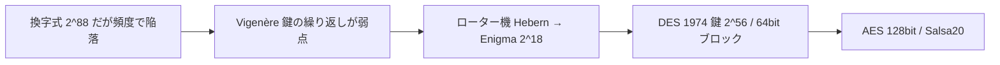

# 03. 歴史的暗号

> 親: [README](./README.md) ｜ 前: [02 暗号にできること](./02_what-crypto-can-do.md) ｜ 次: [02 離散確率](../02_discrete-probability/README.md) ｜ 出典: Crypto I ビデオ1 (0:26:34–0:45:19)

ここで挙げる暗号は**すべて破られている**。教訓は「鍵空間が大きいだけでは安全でない」「統計的偏りが致命傷になる」の 2 つ（名著: David Kahn *The Codebreakers*）。

**この1ページで分かること**

- 換字式は鍵空間 `2^88` でも頻度解析で落ちる
- Vigenère は鍵の繰り返しが弱点、ローター機は鍵空間が小さい
- DES（1974, 鍵 56 bit）は今日では総当たり可能。後継は AES

---

## 一覧

| 暗号 | 鍵 | 鍵空間 | 破り方 |
|---|---|---|---|
| 換字式 | 文字→文字の置換表 | `26! ≈ 2^88` | 頻度解析（暗号文単独） |
| シーザー | 固定 3 文字シフト | なし（鍵がない） | 方式を知れば即復号 |
| Vigenère | 語（例 `CRYPTO`）を繰り返す | `26^鍵長` | 鍵長ごとに群分け → 各群を頻度解析 |
| Hebern（1 ローター） | ローター初期位置 | 小 | 十分な暗号文で頻度解析 |
| Enigma（4 ローター） | 各ローターの初期設定 | `26^4 ≈ 2^18` | 総当たり可能。Bletchley Park が解読 |
| DES（1974） | 56 bit | `2^56` | 現代では総当たり（1997〜99 実証） |



---

## 換字式暗号(substitution cipher)

鍵空間 `26! ≈ 2^88`（約 88 bit）は今日でも通用する大きさ。それでも**暗号文単独攻撃**（暗号文だけで解読）で破れる。使うのは英語の**頻度**:

| 単位 | 頻出 |
|---|---|
| 1 文字 | `e` 約 12.7%、`t` 約 9.1%、`a` 約 8.1% |
| ダイグラム（2 文字） | `he`, `an`, `in`, `th` |
| トライグラム（3 文字） | `the`, `ing` |

上位数文字を頻度で当て、残りをダイグラム・トライグラムで詰める。**大きな鍵空間は安全性の必要条件であって十分条件ではない。**

## シーザー暗号(Caesar cipher)

換字式の特殊形（a→d, b→e, …, z→c）。シフト量固定＝**鍵が存在しない**ので暗号と呼べない。

## Vigenère 暗号

平文の下に鍵語を繰り返し、文字ごとに **mod 26 の加算**。

```
平文: w h a t a n i c e d a y ...
鍵  : C R Y P T O C R Y P T O ...   ← 繰り返す
暗号: 各列を (平文+鍵) mod 26
```

破り方（暗号文単独）:

1. 鍵長を仮定（例 6）し、暗号文を 6 文字ごとの群に分ける。
2. 各群の 1 文字目だけ集めると**同じ鍵文字**で暗号化された単なるシフト暗号。最頻文字はほぼ `e` の暗号化。
3. 最頻文字が `H` なら鍵の 1 文字目 = `H − e` = `C`。2 文字目以降も同様。
4. 鍵長未知なら 1, 2, 3, … と試し、意味の通る平文が出た長さが正解。

mod 26 加算の発想は良い（OTP に通じる）。問題は鍵が短く繰り返されること。

## ローター機

回転する円盤（ローター）が置換表を表し、1 文字打つごとに 1 ノッチ回って置換表が変わる。Hebern（単一）は十分な暗号文で頻度解析、Enigma（3〜5 ローター）は鍵空間 `2^18` で第二次大戦中に解読され、戦局に影響した。

## デジタル時代へ

1974 年、IBM が **DES**（Data Encryption Standard）を提出し連邦標準に。鍵 `2^56`、ブロック 64 bit。今日では総当たりで破れるため使ってはいけない。後継が **AES**（128 bit 鍵）、ストリーム暗号では Salsa20。

---

## 問題

**Q1.** 換字式暗号の鍵空間 26! はおよそ何ビットか。またこれだけ大きくても安全でないのはなぜか。

<details><summary>解答</summary>

26! ≈ 2^88(約88ビット)。総当たりには十分大きいが、平文言語(英語)の**文字頻度の偏り**が暗号文に残るため、暗号文単独で頻度解析でき、鍵空間の大きさが安全性に寄与しない。安全性には「大きな鍵空間」だけでなく「統計的偏りを消すこと」が必要。

</details>

**Q2.** シーザー暗号が「暗号ではない」と言われる理由を1文で述べよ。

<details><summary>解答</summary>

シフト量が3に固定されていて**鍵がない**ため。方式(Kerckhoffs の原則により公開前提)を知る攻撃者は即座に復号でき、秘密が何も残らない。

</details>

**Q3.** Vigenère 暗号を鍵長6で解読中、ある群(6文字ごとに集めた文字列)の最頻文字が `H` だった。対応する鍵文字を求めよ(A=0, …, Z=25、最頻文字は `e`=4 の暗号化と仮定)。

<details><summary>解答</summary>

鍵文字 = 最頻文字 − `e` = `H`(7) − `e`(4) = 3 = `D`。
(講義例では最頻 `H`・平文 `E` から鍵 `C` を得ている。ここでは E=4 として H−E=3=D となる。要は「最頻文字コード − 4 mod 26」で鍵文字が求まる。)

</details>

**Q4.** 4ローターの Enigma(各ローター26通り、鍵=初期設定)の鍵空間はいくつか。それは何ビット相当で、今日総当たり可能か。

<details><summary>解答</summary>

26^4 = 456,976 ≈ 2^18。現代の計算機なら一瞬で総当たりできる(講義では「腕時計でも数秒」と表現)。当時は機械的な制約で十分だった。

</details>

**Q5.** DES の鍵長・ブロック長を答え、今日 DES を使うべきでない理由を述べよ。

<details><summary>解答</summary>

鍵 56 ビット、ブロック 64 ビット。鍵空間 2^56 は現在では専用ハードや分散計算で総当たり可能(1997〜1999 年に実証)であり、単体 DES は安全でない。互換が必要なら 3DES を使う([04. ブロック暗号](../04_block-ciphers/README.md) 参照)。

</details>

## 関連リンク

- [02_cryptography/01_goals-and-primitives](../../../topics/02_cryptography/01_goals-and-primitives.md) — 暗号の目標とプリミティブの全体像
