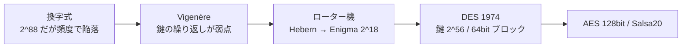

# 03. 歴史的暗号

> 親: [README](./README.md) ｜ 前: [02 暗号にできること](./02_what-crypto-can-do.md) ｜ 次: [02 離散確率](../02_discrete-probability/README.md) ｜ 出典: Crypto I ビデオ1 (0:26:34–0:45:19)

技術に入る前に、歴史上の暗号をいくつか見ておく。ここで挙げるものは**すべて破られている**。共通する教訓は「鍵空間が大きいだけでは安全ではない」こと、そして「頻度などの統計的偏りが致命傷になる」ことだ。歴史の名著として David Kahn *The Codebreakers* がある。

---

## 換字式暗号(substitution cipher)

鍵は「文字→文字」の置換表。26文字なら鍵は 26 文字の並べ替え(順列)なので、鍵空間の大きさは

```
26! ≈ 2^88   （鍵1個の記述に約88ビット）
```

これは今日の暗号でも通用しうる大きさだ。にもかかわらず換字式は**暗号文単独攻撃**(暗号文だけを見て解読)で簡単に破れる。使うのは英語の**頻度**である。

- 単一文字: `e` が最頻(約12.7%)、次いで `t`(約9.1%)、`a`(約8.1%)。暗号文で最も多い文字はほぼ `e` の暗号化。
- ダイグラム(2文字): `he`, `an`, `in`, `th` などが頻出。
- トライグラム(3文字): `the`, `ing` など。

上位数文字を頻度で当て、残りはダイグラム・トライグラムで詰める。鍵空間が 2^88 あっても、この統計的偏りのせいで解読できてしまう。**大きな鍵空間は安全性の必要条件であって十分条件ではない。**

## シーザー暗号(Caesar cipher)

換字式の特殊形で、置換が「3文字シフト」に固定されている(a→d, b→e, …, z→c)。シフト量が固定=**鍵が存在しない**ので、そもそも暗号と呼べない。方式を知っている攻撃者は即座に復号できる。

## Vigenère 暗号

鍵は「語」(例 `CRYPTO`)。平文の下に鍵語を繰り返し書き、文字ごとに **mod 26 の加算**をする。

```
平文: w h a t a n i c e d a y ...
鍵  : C R Y P T O C R Y P T O ...   ← 繰り返す
暗号: 各列を (平文+鍵) mod 26
```

破り方(暗号文単独攻撃):

1. **鍵長を仮定**(例 6)。暗号文を6文字ごとの群に分ける。
2. 各群の1文字目だけ集めると、それらは**同じ鍵文字**で暗号化されている=単なるシフト暗号。その中の最頻文字はほぼ `e` の暗号化。
3. 最頻文字が例えば `H` なら、鍵の1文字目 = `H − e` = `C`。同様に2文字目、3文字目…と鍵を復元。
4. 鍵長が未知でも、鍵長 1, 2, 3, … と総当たりして、意味の通る平文が出た長さが正しい。

加算 mod 26 という発想自体は良い(後のワンタイムパッドに通じる)。問題は鍵が短く繰り返されることだ。

## ローター機

19〜20世紀、電気仕掛けの暗号機が登場した。回転する円盤(ローター)が置換表を表し、1文字打つごとに1ノッチ回って置換表が変わる。

- **Hebern マシン**(単一ローター): 置換が毎文字変わるが、十分な暗号文があれば頻度・ダイグラム・トライグラムでやはり破れる。
- **Enigma**(3〜5ローター): 鍵はローターの初期設定。図の4ローター機なら鍵空間は 26^4 ≈ 2^18 と、今日の計算機では総当たり可能な小ささ。第二次大戦中、Bletchley Park の暗号解読者が暗号文単独攻撃で解読し、戦局に影響した。



## デジタル時代へ

計算機の時代になり、政府は調達機器に良い暗号を求めた。1974 年 IBM が **DES**(Data Encryption Standard)を提出し連邦標準に。鍵 2^56、ブロック 64 ビット(8文字単位で処理)。当時は十分でも、今日では総当たりで破れるため使ってはいけない。後継が **AES**(128 ビット鍵)であり、Salsa20 のようなストリーム暗号もある。以降のモジュールでこれらを詳しく扱う。

---

## 問題

**Q1.** 換字式暗号の鍵空間 26! はおよそ何ビットか。またこれだけ大きくても安全でないのはなぜか。

<details><summary>解答</summary>

26! ≈ 2^88(約88ビット)。総当たりには十分大きいが、平文言語(英語)の**文字頻度の偏り**が暗号文に残るため、暗号文単独で頻度解析でき、鍵空間の大きさが安全性に寄与しない。安全性には「大きな鍵空間」だけでなく「統計的偏りを消すこと」が必要。

</details>

**Q2.** シーザー暗号が「暗号ではない」と言われる理由を1文で述べよ。

<details><summary>解答</summary>

シフト量が3に固定されていて**鍵がない**ため。方式(Kerckhoffs の原則により公開前提)を知る攻撃者は即座に復号でき、秘密が何も残らない。

</details>

**Q3.** Vigenère 暗号を鍵長6で解読中、ある群(6文字ごとに集めた文字列)の最頻文字が `H` だった。対応する鍵文字を求めよ(A=0, …, Z=25、最頻文字は `e`=4 の暗号化と仮定)。

<details><summary>解答</summary>

鍵文字 = 最頻文字 − `e` = `H`(7) − `e`(4) = 3 = `D`。
(講義例では最頻 `H`・平文 `E` から鍵 `C` を得ている。ここでは E=4 として H−E=3=D となる。要は「最頻文字コード − 4 mod 26」で鍵文字が求まる。)

</details>

**Q4.** 4ローターの Enigma(各ローター26通り、鍵=初期設定)の鍵空間はいくつか。それは何ビット相当で、今日総当たり可能か。

<details><summary>解答</summary>

26^4 = 456,976 ≈ 2^18。現代の計算機なら一瞬で総当たりできる(講義では「腕時計でも数秒」と表現)。当時は機械的な制約で十分だった。

</details>

**Q5.** DES の鍵長・ブロック長を答え、今日 DES を使うべきでない理由を述べよ。

<details><summary>解答</summary>

鍵 56 ビット、ブロック 64 ビット。鍵空間 2^56 は現在では専用ハードや分散計算で総当たり可能(1997〜1999 年に実証)であり、単体 DES は安全でない。互換が必要なら 3DES を使う([04. ブロック暗号](../04_block-ciphers/README.md) 参照)。

</details>

## 関連リンク

- [02_cryptography/01_goals-and-primitives](../../../topics/02_cryptography/01_goals-and-primitives.md) — 暗号の目標とプリミティブの全体像
