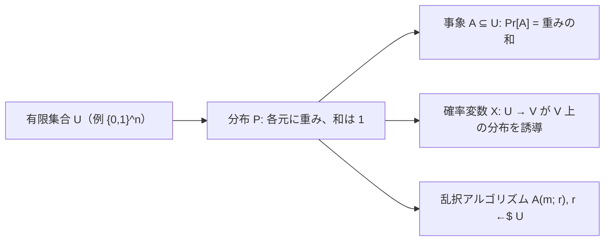

# 01. 確率の基礎

> 親: [README](./README.md) ｜ 前: [README](./README.md) ｜ 次: [XOR と誕生日パラドックス](./02_xor-and-birthday-paradox.md) ｜ 出典: Crypto I ビデオ1 (0:45:19–1:03:21)

暗号の安全性は「攻撃者が鍵を当てる確率」のような命題で語る。その土台の離散確率を最小限の道具で整理する。

**この1ページで分かること**

- 分布＝有限集合 `U` の各元への重みづけ（総和 1）。一様分布と点分布
- 事象は `U` の部分集合、確率変数は `U` からの関数。union bound で和事象を上から抑える
- 乱択アルゴリズムは「隠れた一様乱数 `r`」を追加入力に持つ



---

## 分布 — 有限集合上の重みづけ

有限集合 `U`（暗号では典型的に `{0,1}^n`、`|U| = 2^n`）上の**確率分布** `P`:

```
P(x) ∈ [0, 1]   かつ   Σ_{x∈U} P(x) = 1
```

分布は長さ `|U|` のベクトル（各成分が重み、和が 1）とみなせる。

| 分布 | 定義 | 暗号での意味 |
|---|---|---|
| 一様分布 (uniform) | `P(x) = 1/|U|` | 鍵をランダムに選ぶ状況 |
| 点分布 (point) | 1 点 `x0` に `P(x0) = 1`、他は 0 | 決定的に 1 つの値を取る状況 |

---

## 事象 (event) と確率

**事象** `A` は部分集合 `A ⊆ U`。確率は含まれる元の重みの総和:

```
Pr[A] = Σ_{x∈A} P(x)     （0 ≤ Pr[A] ≤ 1）
```

**例**: `U = {0,1}^8`（256 個）の一様分布、`A =「下位 2 bit が 11」`。残り 6 bit は自由なので `|A| = 2^6 = 64`、`Pr[A] = 64/256 = 1/4`。

---

## union bound(合併上界)

```
Pr[A1 ∪ A2] ≤ Pr[A1] + Pr[A2]
```

等号は `A1 ∩ A2 = ∅`（互いに素）のときだけ。重なった部分を 2 回数えるぶん右辺が大きくなる。安全性証明では「複数の失敗事象のどれかが起きる確率」を各確率の和で雑に抑える道具として頻出。

**例**: 上の `U` で `A1 =「下位 2 bit = 11」`、`A2 =「上位 2 bit = 11」`。上界は `1/4 + 1/4 = 1/2`。真の値は両方 11 の元（中間 4 bit 自由、16 個）が重複するので `(64 + 64 − 16)/256 = 0.4375 < 0.5`。

---

## 確率変数 (random variable)

**確率変数** `X` は関数 `X : U → V`。`U` 上の分布が `V` 上の分布を**誘導**する:

```
Pr[X = v] = Pr[ { x ∈ U : X(x) = v } ]
```

**例**: `X = lsb(y)`（最下位ビット、`V = {0,1}`）。`y` が `{0,1}^n` 上一様なら最下位ビットが 0 の元と 1 の元は半々で `Pr[X = 0] = Pr[X = 1] = 1/2`。

`U` 上一様な確率変数を**一様確率変数**と呼び、`r ←$ U`（`U` から一様ランダムに取る）と書く。

---

## 乱択アルゴリズム

暗号のアルゴリズムの多くは**乱択 (randomized)**: 入力 `m` に加え、毎回新たに一様サンプルする暗黙の乱数 `r ←$ {0,1}^n` を使う。

```
y ← A(m ; r)          r は毎回サンプルし直す
```

出力 `y` は確率変数になり、値域上の分布を定める。決定的アルゴリズムは `r` を使わない特別な場合。鍵生成や暗号化の「ランダム性」はこの `r` に由来する。

---

## 問題

**Q1.** `U = {0,1}^2` の 4 元に重み `(1/2, 1/8, 1/4, 1/8)` を割り当てた。これは分布か。

<details><summary>解答</summary>

各値は `[0,1]` に入り、総和は `1/2 + 1/8 + 1/4 + 1/8 = 4/8 + 1/8 + 2/8 + 1/8 = 8/8 = 1`。よって正しい分布である(ただし一様ではない)。

</details>

**Q2.** `U = {0,1}^8` の一様分布で、事象「上位 2 bit が 11」の確率は。

<details><summary>解答</summary>

上位 2 bit を固定すると残り 6 bit が自由なので該当は `2^6 = 64` 個。`64/256 = 1/4`。

</details>

**Q3.** union bound `Pr[A1 ∪ A2] ≤ Pr[A1] + Pr[A2]` で等号が成り立つのはどんなときか。

<details><summary>解答</summary>

`A1 ∩ A2 = ∅`(互いに素)のとき。重複がないので和事象の重みがちょうど各重みの和になる。重なりがあると右辺が重複ぶんだけ大きくなり、真の値は小さくなる。

</details>

**Q4.** `r1, r2` は `{0,1}^2` 一様分布の 2 bit。各 bit を整数 0/1 とみて `X = r1 + r2`。`Pr[X = 2]` は。

<details><summary>解答</summary>

`X = 2` は両ビットが 1、すなわち `r = 11` のときだけ。4 通り中 1 通りなので `Pr[X = 2] = 1/4`。(ちなみに `Pr[X=0]=1/4`, `Pr[X=1]=1/2`。)

</details>

## 関連リンク

- [暗号のための数学](../../../topics/01_prerequisites/01_math-for-crypto/index.md) — 有限集合・剰余算など前提の数学
- [XOR と誕生日パラドックス](./02_xor-and-birthday-paradox.md) — 独立性・XOR の一様化・衝突確率へ続く
