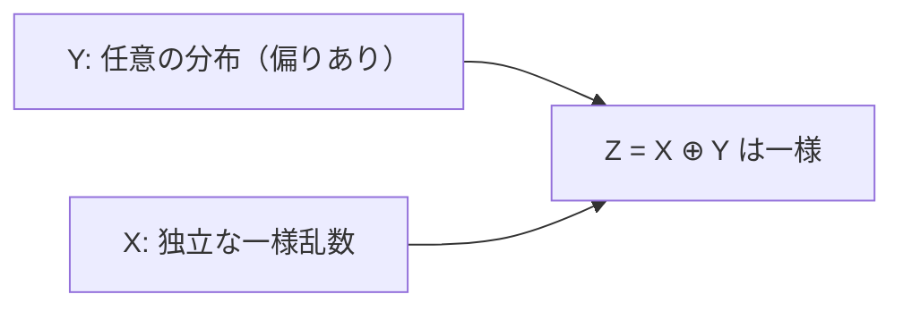

# 02. XOR と誕生日パラドックス

> 親: [README](./README.md) ｜ 前: [確率の基礎](./01_probability-basics.md) ｜ 次: [03. ストリーム暗号](../03_stream-ciphers/README.md) ｜ 出典: Crypto I ビデオ1 (1:03:21–1:17:16)

なぜ暗号は XOR を多用し、なぜ「128 bit で安全」と言いつつ攻撃者は `2^64` を狙うのか。答えは XOR の一様化と誕生日パラドックスにある。

**この1ページで分かること**

- 独立性の定義: `Pr[A ∧ B] = Pr[A]·Pr[B]`
- XOR 定理: 任意分布 `Y` に独立な一様乱数 `X` を XOR すると一様になる（OTP の核心）
- 誕生日パラドックス: `|B|` 通りの空間は約 `1.2√|B|` サンプルで衝突する

---

## 独立性 (independence)

事象 `A, B` が**独立** ⟺ `Pr[A ∧ B] = Pr[A] · Pr[B]`。確率変数 `X, Y` の独立はすべての値の組で成り立つこと:

```
Pr[X = a ∧ Y = b] = Pr[X = a] · Pr[Y = b]     （∀ a, b）
```

**例**: `y ←$ {0,1}^2`、`X = lsb(y)`、`Y = msb(y)`。`Pr[X=0∧Y=0]` は `y = 00` の 1 通りで `1/4`、`Pr[X=0]·Pr[Y=0] = 1/2 · 1/2 = 1/4`。他の 3 組も一致し、独立。

---

## XOR の定理 —— 一様化

> **定理.** `Y` を `{0,1}^n` 上の**任意の**分布、`X` を `Y` と独立な**一様**確率変数とする。`Z = X ⊕ Y` は**一様**分布に従う。



攻撃者が `Z` を見ても、`X` を知らない限り `Y` について何も分からない。これが One-Time Pad とストリーム暗号の核心。

**1 bit の場合の証明**: `Pr[Y=0] = p0`, `Pr[Y=1] = p1`（`p0 + p1 = 1`）。`X` は一様で独立なので結合分布は:

| `X\Y` | `Y=0` | `Y=1` |
|-------|-------|-------|
| `X=0` | p0/2  | p1/2  |
| `X=1` | p0/2  | p1/2  |

`Z = 0` となるのは `X = Y`、すなわち `(0,0),(1,1)`:

```
Pr[Z=0] = p0/2 + p1/2 = (p0 + p1)/2 = 1/2
Pr[Z=1] = p1/2 + p0/2 = 1/2
```

`Y` の偏りが打ち消されて `Z` は一様。∎

---

## 誕生日パラドックス (birthday paradox)

`|B|` 通りの集合から独立同分布に `n` 個サンプルすると、直感より遥かに少ない `n` で 2 つが**衝突**する。一様分布で衝突確率が `1/2` を超える `n`:

```
n ≈ 1.2 · √|B|
```

必要数が `|B|` ではなく **`√|B|` オーダー**である点が肝。一様分布は最も衝突しにくい**最悪ケース**で、偏った分布ではさらに少なく済む。

| 例 | 空間の大きさ | 必要サンプル数 ≈ 1.2√ | 意味 |
|---|---|---|---|
| 誕生日 | 365 | ≈ 23 | 23 人で誕生日一致が 5 割超 |
| 128 bit ハッシュ | `2^128` | `2^64` | 全数 `2^128` ではなく `2^64` で衝突 |

衝突耐性を狙うハッシュは、この誕生日攻撃に備えて出力を長く取る。立ち上がりは急峻で、`√|B|` 付近を超えると衝突はほぼ確実（`|B| = 10^6`）:

```
衝突確率
 1.0 |                         ● ● ●●●●●●   (≈3000 で ほぼ1)
     |                   ●
 0.9 |                ●              (≈2200 で 90%)
     |            ●
 0.5 |        ●                      (≈1200 で 50%)
     |     ●
 0.1 |  ●
 0.0 |●___________________________________ サンプル数 n
     0    1000   2000   3000
```

---

## 問題

**Q1.** 1 bit の XOR 定理で、`Pr[Y=0]=0.9, Pr[Y=1]=0.1`、`X` は独立な一様。結合分布表を埋めて `Pr[Z=0]` を求めよ。

<details><summary>解答</summary>

`Pr[XY=00]=0.45, Pr[XY=01]=0.05, Pr[XY=10]=0.45, Pr[XY=11]=0.05`。`Z=0` は `X=Y`、すなわち `00` と `11`。`Pr[Z=0]=0.45+0.05=0.5`。`Y` が偏っていても `Z` は一様。

</details>

**Q2.** `X, Y` が独立で `Pr[X=0]=1/2, Pr[Y=0]=1/3`。`Pr[X=0 ∧ Y=0]` は。

<details><summary>解答</summary>

独立の定義より `Pr[X=0]·Pr[Y=0] = (1/2)·(1/3) = 1/6`。

</details>

**Q3.** `|B| = 10^6` からの一様サンプルで、衝突確率が `1/2` を超えるのに必要なおよそのサンプル数は。

<details><summary>解答</summary>

`n ≈ 1.2 · √|B| = 1.2 · √(10^6) = 1.2 · 1000 = 1200` 個。全数 `10^6` の平方根オーダーで済む。

</details>

**Q4.** 128 bit 出力のハッシュ関数で、衝突を 1 組見つける計算量のおよそのオーダーは。

<details><summary>解答</summary>

誕生日攻撃より約 `√(2^128) = 2^64` 回のハッシュ計算。総当たり `2^128` よりはるかに小さく、これが「衝突耐性には出力長 = 目標強度の 2 倍が必要」という設計指針の根拠になる。

</details>

## 関連リンク

- [確率の基礎](./01_probability-basics.md) — 分布・事象・確率変数・union bound
- [暗号のための数学](../../../topics/01_prerequisites/01_math-for-crypto/index.md) — 前提となる数学
- [03. ストリーム暗号](../03_stream-ciphers/README.md) — XOR の一様化を One-Time Pad で使う
