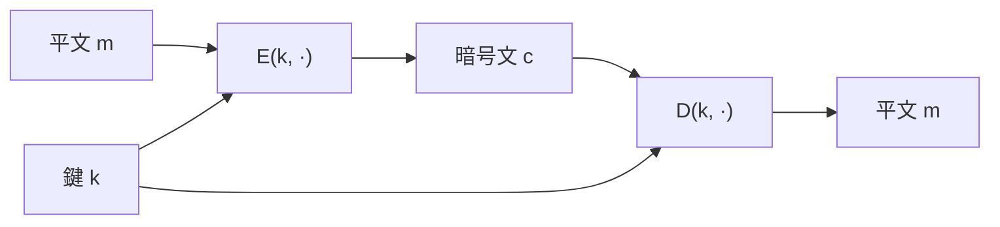

# 01. 暗号の定義と OTP

> 親: [README](./README.md) ｜ 前: [README](./README.md) ｜ 次: [PRG とストリーム暗号](./02_prg-and-stream-ciphers.md) ｜ 出典: Crypto I ビデオ1 (1:17:16–1:35:40)

「暗号とは何か」を式で固定し、OTP（ワンタイムパッド）が「破れない」と言える意味（Shannon の完全秘匿）とその代償を見る。

**この1ページで分かること**

- 暗号 = 正当性 `D(k, E(k, m)) = m` を満たすアルゴリズム対 `(E, D)`
- OTP `c = k ⊕ m` は完全秘匿（暗号文だけからは平文について何も分からない）
- 代償は `|K| ≥ |M|`——鍵が平文と同じ長さ必要で、大量通信には非現実的

---

## 暗号の正式な定義

鍵空間 `K`・平文空間 `M`・暗号文空間 `C` 上の**効率的アルゴリズムの対** `(E, D)`:

```
E : K × M → C        （暗号化。乱択でよい）
D : K × C → M        （復号。決定的でよい）
```

唯一の要件が**正当性 (correctness)**: `∀ m ∈ M, ∀ k ∈ K : D(k, E(k, m)) = m`。



`E` は乱数を使ってよい（同じ `m` でも暗号文が変わりうる）が、`D` は同じ `(k, c)` に必ず同じ `m` を返す。

---

## OTP(Vernam 暗号)

`M = C = K = {0,1}^n`（鍵・平文・暗号文が同じ長さ）:

```
鍵生成 :  k ←$ {0,1}^n   （一様ランダムな n ビット)
暗号化 :  c = E(k, m) = k ⊕ m
復号   :  m = D(k, c) = k ⊕ c
```

正当性: `k ⊕ (k ⊕ m) = (k ⊕ k) ⊕ m = 0 ⊕ m = m`。

| 長所 | 短所 |
|---|---|
| XOR だけで極めて速い | 鍵が平文と同じ長さ（鍵を安全に配送できるなら平文も送れる＝鍵配送問題） |
| 完全秘匿（次節） | `(m, c)` が 1 組漏れると `k = m ⊕ c` で鍵が丸ごと復元される |

### 動かして確かめる

`c = k ⊕ m` を 1 ビットずつ計算し、そのまま `m = k ⊕ c` まで進む。鍵や平文を変えても `m` は必ず元に戻る（=正当性）。

<div class="stream-lab" data-lab="xor-pad" data-plaintext="10110010" data-key="01101101"></div>

鍵配送問題の重さはデータ量を動かすと数字で見える。`|K| ≥ |M|` は運用上こういう意味になる。

<div class="stream-lab" data-lab="key-cost"></div>

---

## Shannon の完全秘匿 (perfect secrecy)

暗号文だけを見た攻撃者が平文について**何も**学べないことの厳密化。鍵 `k` を一様ランダムとして:

```
∀ 同じ長さの m0, m1 ∈ M, ∀ c ∈ C :
    Pr[ E(k, m0) = c ] = Pr[ E(k, m1) = c ]
```

「どの `c` を見ても `m0` の暗号化か `m1` の暗号化か区別できない」＝**暗号文単独攻撃 (ciphertext-only attack) が原理的に不可能**。守るのはこの攻撃だけで、改竄や鍵の使い回しは対象外（次ファイル以降）。

---

## OTP は完全秘匿である

「`E(k,m) = c` を成立させる鍵の個数」を数える。`k ⊕ m = c ⟺ k = m ⊕ c` なので**ちょうど 1 個**。鍵は一様だから:

```
Pr[ E(k, m) = c ] = 1 / |K| = 1 / 2^n     （m に依存しない定数）
```

`m0, m1` のどちらでも確率が等しく、完全秘匿の定義を満たす。

---

## Shannon の悪い知らせ: |K| ≥ |M|

```
完全秘匿 ⇒ |K| ≥ |M|
```

直感: 各暗号文 `c` はどの平文からも到達可能でなければならない（そうでないと `c` を見た時点で一部の平文を除外できる）。1 つの `c` に平文ごとの別鍵が要るので、鍵は平文と同数必要。OTP は `|K| = |M| = 2^n` で等号を達成する**最適な**完全秘匿暗号だが、大量通信には非現実的。次ファイルでは完全秘匿を諦め、計算量的安全性に切り替える。

---

## 問題

**Q1.** `n = 4`、`m = 1011`、`k = 0110` のとき OTP 暗号文 `c` を求めよ。

<details><summary>解答</summary>

`c = k ⊕ m = 0110 ⊕ 1011 = 1101`。

</details>

**Q2.** ある OTP 通信を盗聴し、平文 `m = 0101` とその暗号文 `c = 1100` の対を入手した。鍵 `k` を復元せよ。

<details><summary>解答</summary>

`k = m ⊕ c = 0101 ⊕ 1100 = 1001`。1 組の既知平文で鍵が丸ごと漏れる。

</details>

**Q3.** OTP は完全秘匿だが、それでも防げない攻撃を 2 つ挙げよ。

<details><summary>解答</summary>

(1) **改竄**: 攻撃者が `c` を `c ⊕ p` に書き換えると復号結果が `m ⊕ p` になり、狙った位置を反転できる(可鍛性)。(2) **鍵の使い回し**: 同じ `k` で 2 つの平文を暗号化すると `c1 ⊕ c2 = m1 ⊕ m2` となり秘匿が崩れる(two-time pad)。完全秘匿はあくまで「暗号文単独から平文を推測する攻撃」に対する保証。

</details>

**Q4.** 「完全秘匿 ⇒ |K| ≥ |M|」は実務上どんな帰結をもたらすか。

<details><summary>解答</summary>

鍵を平文と同じ長さだけ用意し、安全に配送しなければならない。長いメッセージほど長い鍵が要り、鍵配送問題が解決できない。だから実務では完全秘匿を諦め、短い鍵で計算量的に安全なストリーム暗号へ移行する。

</details>

## 関連リンク

- [対称暗号の全体像](../../../topics/02_cryptography/02_symmetric-crypto/README.md) — OTP・ストリーム暗号が対称鍵暗号のどこに位置するか
- [PRG とストリーム暗号](./02_prg-and-stream-ciphers.md) — 短い鍵で OTP を実用化する次の一手
