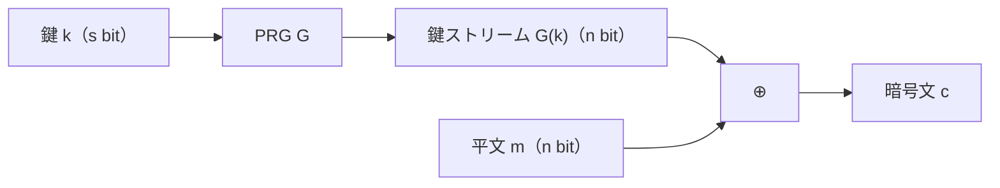

# 02. PRG とストリーム暗号

> 親: [README](./README.md) ｜ 前: [暗号の定義と OTP](./01_cipher-definition-and-otp.md) ｜ 次: [OTP への攻撃](./03_attacks-on-otp.md) ｜ 出典: Crypto I ビデオ1 (1:35:40–1:55:24)

OTP の弱点「鍵が平文と同じ長さ」を、短い鍵から長い鍵ストリームを**擬似的に**作って解く。完全秘匿は失われ、安全性は PRG の質にすべてかかる。

**この1ページで分かること**

- ストリーム暗号 = OTP の鍵を `G(k)` に差し替えたもの（PRG: 短いシード → 長いビット列）
- 「次のビットが当てられる」PRG は危険。LCG や `random()` は予測可能
- negligible（無視できる量）の厳密な意味と実務の目安

---

## PRG とストリーム暗号

**PRG (pseudorandom generator)**: 短いシード（=鍵）を長いビット列に伸ばす**決定的**関数。

```
G : {0,1}^s → {0,1}^n       （n ≫ s。決定的）
暗号化 :  c = m ⊕ G(k)
復号   :  m = c ⊕ G(k)
```



鍵は `s` bit で済むが `2^s < 2^n` なので Shannon の定理により**完全秘匿は不可能**。安全性は「`G(k)` が本物の乱数と見分けられないか」だけに依存する。

### 動かして確かめる: G が伸ばす様子

中身が見える最小の `G` として LFSR を回す。8 ビットのシードから、いくらでも長いストリームが出てくる。

<div class="stream-lab" data-lab="prg-expand" data-seed="10110101"></div>

シードを `00000000` にすると出力が永久に 0 になる（LFSR の固定点）。「悪いシード/悪い `G` は暗号を無力化する」実例。

### 動かして確かめる: 状態機械としての `G`

実用のストリーム暗号は `G` を「鍵 `K` と IV から状態を初期化し、更新しながらキーストリーム `Z` を吐く FSM」として実装する。左が `c = m ⊕ Z`、右が `m = c ⊕ Z`。

<div class="stream-lab" data-lab="fsm-stream" data-key="10110101" data-iv="00110011" data-plaintext="10110010"></div>

IV を変えると同じ `K` でも別のキーストリームになる。`K` と IV を両方使い回すと同じ `Z` が再生され、[two-time pad](./03_attacks-on-otp.md) に落ちる。

---

## 予測不可能性 (unpredictability)

PRG に最低限求める性質。逆に**予測可能**とは、ある位置 `i` で:

```
先頭 i ビット G(k)[1..i] から i+1 ビット目を
    確率 1/2 + ε  (ε は non-negligible)
で当てる効率的アルゴリズム A が存在する
```

予測可能な PRG は危険。攻撃者が平文の接頭辞を知っていれば（例: メールは `From:` で始まる）、`k[i] = c[i] ⊕ m[i]` で鍵ストリームの一部を得て予測器で残りを伸ばし、平文全体を復号できる。

---

## 反例と危険な PRG

| PRG | なぜ危険か |
|---|---|
| 「全ビット XOR が常に 1」の `G` | 先頭 `n-1` ビットから最後の 1 ビットが確率 1 で当たる。統計的にランダムに見えても予測可能 |
| 線形合同法 (LCG) `r ← a·r + b mod p` | 少しの出力から連立方程式で内部状態 `(a, b, r)` が解け、以後を完全予測 |
| glibc の `random()` | 統計的な質は良いが暗号学的には予測可能 |

実例: **Kerberos v4** は弱い乱数源を使い、セッション鍵が予測されて破られた。

---

## negligible と non-negligible

「`ε` は無視できるほど小さいか」の語彙。安全パラメータ `λ` の関数として扱う。

| 版 | 定義 |
|---|---|
| 厳密版 | `ε(λ)` が negligible ⟺ どんな多項式 `p` でも十分大きい `λ` で `ε(λ) < 1/p(λ)`（多項式より速く 0 に潰れる） |
| 実務の目安 | `ε < 1/2^80` なら実質ゼロ。`ε ≥ 1/2^30` は攻撃が現実的 |

```
例:  2^(-λ)      → negligible (指数的に潰れる)
     λ^(-1000)   → non-negligible (多項式なので潰れ方が遅い)
     1/1000      → 定数なので当然 non-negligible
```

---

## 問題

**Q1.** 「全ビットの XOR が常に 1」の PRG に対する予測器を、次ビット予測の枠組みで 1 行で述べよ。

<details><summary>解答</summary>

最後のビットを予測する `A`: 先頭 `n-1` ビットの XOR を計算し、それを 1 と合わせる値(= 先頭 XOR の反転)を出力する。常に的中するので成功確率 1、`ε = 1/2`。

</details>

**Q2.** 攻撃者はメールが `From:` で始まると知っている。ストリーム暗号の暗号文 `c` からこの接頭辞ぶんの鍵ストリームをどう得るか。

<details><summary>解答</summary>

平文接頭辞 `m[1..t] = "From:"` は既知。`G(k)[i] = c[i] ⊕ m[i]`(i = 1..t)で先頭 `t` バイトの鍵ストリームが判明する。PRG が予測可能ならここから残りを伸ばし、`c` 全体を復号できる。

</details>

**Q3.** 次の `ε(λ)` は negligible か non-negligible か。(a) `2^(-λ)` (b) `1/λ^5` (c) `λ^10 · 2^(-λ)`

<details><summary>解答</summary>

(a) negligible(指数的に潰れる)。(b) non-negligible(多項式の逆数)。(c) negligible(多項式を掛けても指数減衰が勝つ)。

</details>

**Q4.** 線形合同法や glibc の `random()` を暗号に使ってはいけない理由を一言で。

<details><summary>解答</summary>

統計的な質は良くても**予測可能**だから。出力を少し観測すれば内部状態を代数的に解け、以後の鍵ストリームが完全に再現され、平文が復号されてしまう(Kerberos v4 の失敗例)。

</details>

## 関連リンク

- [暗号の定義と OTP](./01_cipher-definition-and-otp.md) — 完全秘匿が不可能になる理由(`|K| < |M|`)
- [PRG の安全性の定義](./05_prg-security-definitions.md) — 予測不可能性を「安全な PRG」として厳密化(Yao の定理)
- [OTP への攻撃](./03_attacks-on-otp.md) — 鍵ストリームを再利用したときに起きること
