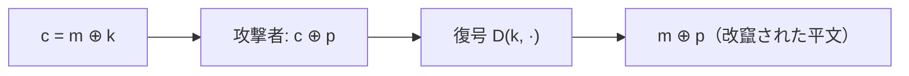

# 03. OTP への攻撃

> 親: [README](./README.md) ｜ 前: [PRG とストリーム暗号](./02_prg-and-stream-ciphers.md) ｜ 次: [実在するストリーム暗号](./04_real-world-stream-ciphers.md) ｜ 出典: Crypto I ビデオ1 (1:55:24–2:18:57)

OTP は正しく使えば強いが、誤用が 1 つあれば崩れる。2 大失敗＝**鍵の使い回し**と**可鍛性**を実例で見る。

**この1ページで分かること**

- two-time pad: 同じ鍵で 2 回暗号化すると `c1 ⊕ c2 = m1 ⊕ m2` で鍵が消え、平文が漏れる
- VENONA・MS-PPTP・WEP は全てこの失敗。ディスクにもストリーム暗号は不向き
- 可鍛性: 暗号文に `p` を XOR すると平文に `p` が乗る。だから MAC が要る

---

## two-time pad — 鍵の使い回しは致命的

```
c1 = m1 ⊕ k
c2 = m2 ⊕ k
c1 ⊕ c2 = (m1 ⊕ k) ⊕ (m2 ⊕ k) = m1 ⊕ m2      ← k が消える
```

英語や ASCII は冗長性が高い（空白は 0x20、英字は限られた範囲）ので、`m1 ⊕ m2` から両平文を復元できる。**鍵ストリームは絶対に使い回さない。**

```
     m1 ⊕ k ─┐
             ├─ XOR ─→ m1 ⊕ m2  （k が相殺され、冗長性から平文が漏れる）
     m2 ⊕ k ─┘
```

---

## 歴史的・実装上の実例

| 実例 | 何が起きたか | 教訓 |
|---|---|---|
| **Project VENONA** | 米国が旧ソ連の通信を解読。手作業の OTP が使い回され、冗長性から数千の平文が復元 | 「一度きり」を人手で徹底するのは難しい |
| **MS-PPTP** | VPN でクライアント→サーバとサーバ→クライアントを**同じ鍵**で暗号化 = two-time pad | 方向ごとに別鍵を使う |
| **WEP**（無線 LAN） | フレーム鍵 `IV ∥ k`（IV は 24 bit）。約 `2^24 ≒ 1600 万`フレームで IV が一巡し再利用。電源再投入で IV=0 に戻るカードもあった。`IV ∥ k` の**関連鍵**構造が Fluhrer–Mantin–Shamir（FMS）攻撃を許し、当初 ~10^6、後に ~4 万フレームで長期鍵が復元 | 長期鍵を PRG に通しフレームごとに独立な鍵を導出する |
| **ディスク暗号化** | セクタをストリーム暗号で暗号化すると、1 ブロック書き換えた位置が暗号文の変化から漏れる | ディスクにはストリーム暗号は不向き |

---

## 可鍛性 (malleability) — OTP は完全性ゼロ

秘匿は守るが**改竄検知はできない**。暗号文に既知パターン `p` を XOR すると復号結果に同じ `p` が乗る:

```
D(k, c ⊕ p) = (c ⊕ p) ⊕ k = (m ⊕ k ⊕ p) ⊕ k = m ⊕ p
```



例: 平文が `From: Bob` と分かっていれば、名前部分に `"Bob" ⊕ "Eve"` を XOR して `From: Eve` に書き換えられる:

```
文字   ASCII   XOR
 B^E   42^45 = 07
 o^v   6F^76 = 19
 b^e   62^65 = 07
→ パッチ = 0x07, 0x19, 0x07
```

鍵を知らなくても、受信側は `From: Eve` を正しい平文として受け取る。秘匿とは別に**メッセージ認証（MAC）**が必要な理由がこれ。

---

## 問題

**Q1.** 同一鍵で暗号化された `c1, c2` を入手した攻撃者は、まず何を計算し、なぜそれが役立つのか。

<details><summary>解答</summary>

`c1 ⊕ c2 = m1 ⊕ m2` を計算する。鍵が相殺されて 2 平文の XOR だけが残る。英語/ASCII の冗長性(空白・頻出文字)を手がかりに、両平文を復元できる。

</details>

**Q2.** WEP で鍵ストリームが最短で再利用され始めるのはどんな条件か。

<details><summary>解答</summary>

24 ビットの IV が一巡したとき。最悪ケースはカードの電源再投入で IV が 0 にリセットされ、以前と同じ `IV=0` のフレームが再び現れる瞬間。一般には約 `2^24 ≒ 1600 万`フレームで必ず衝突する。

</details>

**Q3.** 平文 `Bob` を `Eve` に書き換える XOR パッチを 16 進で求めよ(ASCII: B=42, o=6F, b=62, E=45, v=76, e=65)。

<details><summary>解答</summary>

`42^45=07`, `6F^76=19`, `62^65=07`。パッチ = `0x07, 0x19, 0x07`。これを該当位置の暗号文に XOR する。

</details>

**Q4.** MS-PPTP の設計ミスを 1 行で述べ、対策を示せ。

<details><summary>解答</summary>

双方向の通信を同一鍵で暗号化して two-time pad を作ってしまった。対策は送信方向ごとに独立な鍵を使うこと。

</details>

## 関連リンク

- [PRG とストリーム暗号](./02_prg-and-stream-ciphers.md) — フレームごとに独立鍵を導出する正しい設計
- [実在するストリーム暗号](./04_real-world-stream-ciphers.md) — WEP が使った RC4 と FMS 攻撃の詳細
- [対称暗号の全体像](../../../topics/02_cryptography/02_symmetric-crypto/README.md) — 可鍛性への対策として MAC・認証付き暗号へ
