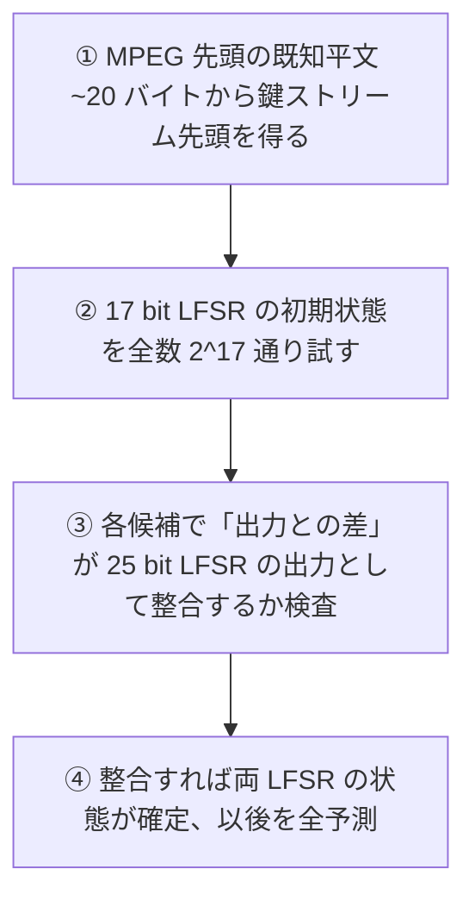

# 04. 実在するストリーム暗号

> 親: [README](./README.md) ｜ 前: [OTP への攻撃](./03_attacks-on-otp.md) ｜ 次: [PRG の安全性の定義](./05_prg-security-definitions.md) ｜ 出典: Crypto I ビデオ1 (2:18:57–2:38:12)

歴史的に使われた RC4・CSS（DVD）の破られ方と、その反省から設計された近代的ストリーム暗号（eSTREAM / Salsa20）。

**この1ページで分かること**

- RC4 は出力にバイアスがあり、関連鍵にも弱い。新規設計では非推奨
- CSS は 40 bit 鍵だが LFSR の線形性で `2^17` で破れる
- 近代設計は鍵 + **nonce** を取り、`(k, nonce)` が一意なら鍵を再利用できる

| 暗号 | 年 | 鍵長 | 構造 | 状況 |
|---|---|---|---|---|
| RC4 | 1987 | 可変 | 256 バイトの置換表、1 バイトずつ出力 | バイアス・関連鍵攻撃。非推奨 |
| CSS | DVD | 40 bit | LFSR 2 本 + バイト加算 | `2^17` で破れる |
| Salsa20 | eSTREAM | 128/256 bit + 64 bit nonce | 可逆な混合関数 ×10 | 実用攻撃なし、鍵探索 ~`2^128` |

---

## RC4(1987)

Ron Rivest 設計。可変長シードから 256 バイト（2048 bit）の内部状態（バイトの置換表）を作り、1 バイトずつ鍵ストリームを出す。HTTPS や WEP で広く使われた。

| 弱点 | 内容 | 対策 |
|---|---|---|
| 第 2 バイトのバイアス | 2 バイト目が 0 になる確率が `2/256`（本来 `1/256`） | **先頭 256 バイトを捨てる** |
| (0,0) の出現バイアス | 特定バイト対の出現確率が理論値からずれる | — |
| 関連鍵攻撃 | 似た鍵でストリームに相関（WEP の `IV ∥ k` が突かれた） | 独立な鍵を導出する |

---

## CSS — DVD 暗号(40 ビット鍵)

Content Scramble System。鍵 40 bit は当時の米国輸出規制の上限。**LFSR（線形帰還シフトレジスタ）2 本**とバイト加算で鍵ストリームを作る:

```
17bit LFSR ── seed = 1 ∥ 鍵の先頭 2 バイト ─┐
                                            ├─ バイト加算(桁上げ付き) → 出力
25bit LFSR ── seed = 1 ∥ 鍵の残り 3 バイト ─┘
```

LFSR はハードウェアで高速・安価だが線形で、出力から状態を代数的に復元しやすい。



`2^40` の総当たりを待たず構造の弱さで `2^17` に落ちる。「鍵長が短い」「構造が弱い」の二重の失敗例。

---

## eSTREAM と Salsa20

欧州プロジェクト **eSTREAM**（2008 終了）が近代的なストリーム暗号を選定。核心は PRG が鍵に加え **nonce（number used once）** を取ること:

```
鍵ストリーム = PRG(k, nonce)     ← (k, nonce) の対が一意なら鍵 k を再利用できる
```

**nonce は毎回異なればよく、秘密である必要はない**（WEP の欠陥を構造で回避）。

**Salsa20**: 128/256 bit 鍵 + 64 bit nonce + 64 bit カウンタ。内部関数 `h(τ定数, 鍵, nonce, カウンタ)` で 64 バイトの状態を組み、可逆な混合関数を 10 回（double-round）適用、最後に入力を加算して 64 バイトのブロックを出す。カウンタで任意位置にジャンプでき、ハード/ソフト両対応で数百 MB/s。目立った実用攻撃はなく鍵探索は ~`2^128`。RC4 は近代設計の中では遅い部類、Salsa20 や SOSEMANUK はソフトウェアで数百 MB/s 出る。

---

## 問題

**Q1.** RC4 の第 2 バイトが 0 になる確率は理論値の何倍か。実務上の対策は。

<details><summary>解答</summary>

本来 `1/256` のところ `2/256` なので約 2 倍のバイアス。対策は出力の**先頭 256 バイトを捨てて**から使うこと。

</details>

**Q2.** CSS 攻撃の計算量が `2^40`(鍵長)ではなく `2^17` になる理由は。

<details><summary>解答</summary>

2 本の LFSR のうち短い 17 ビット LFSR の初期状態を `2^17` 通り全数試し、各候補が 25 ビット LFSR の出力と整合するかを既知平文で検査すればもう一方の状態が決まるから。線形構造ゆえに鍵全体を総当たりする必要がない。

</details>

**Q3.** nonce の役割と、満たすべき一意性の条件を述べよ。nonce は秘密が必要か。

<details><summary>解答</summary>

同じ鍵でも `(k, nonce)` を変えれば独立な鍵ストリームが得られるので、鍵を再利用できる。条件は「同じ鍵の下で `(k, nonce)` の対を二度使わない」こと。nonce は毎回異なればよく、秘密である必要はない(カウンタや乱数でよい)。

</details>

**Q4.** LFSR がハードウェア実装に向く理由を一言で。またそれが暗号としての弱点になるのはなぜか。

<details><summary>解答</summary>

シフトレジスタと XOR だけで作れて高速・低コストだから。一方でその**線形性**ゆえ、出力から内部状態を連立方程式で復元しやすく、単体では暗号として弱い。

</details>

## 関連リンク

- [OTP への攻撃](./03_attacks-on-otp.md) — WEP における RC4 の関連鍵/IV 再利用問題
- [PRG の安全性の定義](./05_prg-security-definitions.md) — これらが「安全な PRG」の基準をどう満たす/満たさないか
