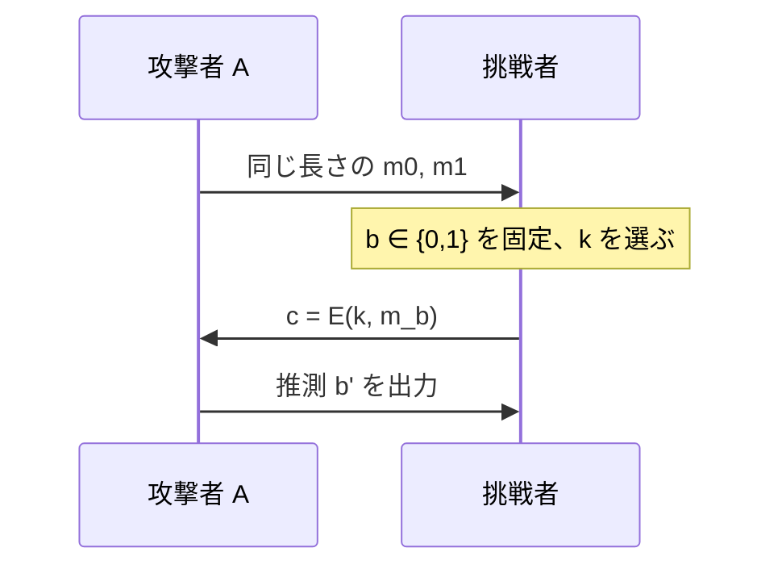

# 06. 意味論的安全性

> 親: [README](./README.md) ｜ 前: [PRG の安全性の定義](./05_prg-security-definitions.md) ｜ 次: [04. ブロック暗号](../04_block-ciphers/README.md) ｜ 出典: Crypto I ビデオ1 (3:03:21–3:29:57)

「暗号が安全」を平文の視点で定義する。素朴な定義は穴があり、「平文の 1 ビットも漏れない」を捉える意味論的安全性に至る。安全な PRG があればストリーム暗号がこの意味で安全になることを証明する。

**この1ページで分かること**

- 素朴な定義（鍵が漏れない／平文全体が漏れない）は弱い暗号を通してしまう
- 意味論的安全性 = 攻撃者が選んだ `m0, m1` のどちらの暗号文か区別できないこと
- ハイブリッド論法: `Adv_ss ≤ 2·Adv_PRG`。安全な PRG ⇒ ストリーム暗号は意味論的に安全

---

## 悪い定義の排除

| 素朴な定義 | 通ってしまう弱い暗号 |
|---|---|
| 「暗号文から鍵が求まらない」 | 恒等暗号 `E(k,m) = m`。鍵は出ないが平文は丸見え |
| 「平文全体は求まらない」 | `E(k, m) = m[前半] ∥ E'(k, m[後半])`。半分は漏れている |

必要なのは「**平文のいかなる部分情報も漏れない**」という強い条件。

---

## 意味論的安全性(one-time key)

攻撃者 `A` に「区別ゲーム」を挑ませる。



`A` のアドバンテージは `b=0` と `b=1` の世界で出力がどれだけずれるか:

```
EXP(b):  A が m0, m1 を出す → 挑戦者が c = E(k, mb) を返す → A が b' を出力
Adv[A] = | Pr[ EXP(0) → 1 ] − Pr[ EXP(1) → 1 ] |
定義:  暗号が意味論的に安全  ⟺  すべての効率的な A で Adv[A] が negligible
```

`m0, m1` を自由に選ばせても見分けられないなら、`c` は平文について何も語っていない。

---

## 含意 — 1 ビットも漏れない

「暗号文から平文の最下位ビット (lsb) を確率 1 で当てる攻撃者 `B`」がいれば、`m0 = (lsb 0)`、`m1 = (lsb 1)` を提出し `B` の答えを `b'` にする攻撃者 `A` が作れる。`EXP(0)` で必ず 0、`EXP(1)` で必ず 1 を出すので `Adv[A] = |0 − 1| = 1`。対偶: 意味論的に安全なら lsb すら当てられない。任意の 1 ビットで同じ。

---

## OTP は無条件に意味論的安全

`k` が一様なら `k ⊕ m` はどんな `m` でも一様分布:

```
c = k ⊕ m0  の分布  =  c = k ⊕ m1  の分布  =  一様分布
```

`EXP(0)` と `EXP(1)` で `c` の分布が完全に一致し、どんな `A` でも `Adv = 0`。攻撃者の計算能力に制限を課さない（無条件）。

---

## 定理: 安全な PRG ⇒ ストリーム暗号は意味論的に安全

**ハイブリッド論法**。`EXP(0)`（`G(k)` 使用）から `EXP(1)` へ、途中に「`G(k)` を本物の乱数 `r` に置き換えた世界」を挟む:

```
[1] EXP(0):  c = m0 ⊕ G(k)   ─(a)─→  [2] c = m0 ⊕ r  （= OTP ゲーム)
                                              │
                                            (b) Adv = 0（OTP は無条件安全)
                                              ▼
[4] EXP(1):  c = m1 ⊕ G(k)   ←(a')─   [3] c = m1 ⊕ r
```

| 遷移 | 差 | 理由 |
|---|---|---|
| (a), (a') | `Adv_PRG` | `G(k)` を `r` に差し替えた差に気づける攻撃者は PRG の識別器になる |
| (b) | 0 | [2]↔[3] は本物の乱数を使う OTP |

```
Adv_ss[A] ≤ Adv_PRG + 0 + Adv_PRG = 2·Adv_PRG  → negligible
```

安全な PRG なら `Adv_PRG` が negligible なので、ストリーム暗号の `Adv_ss` も negligible。∎

---

## 問題

**Q1.** 暗号文から平文の lsb を確実に当てる攻撃者 `B` から意味論的安全性攻撃 `A` を作り、`Adv[A]` を求めよ。

<details><summary>解答</summary>

`m0` を lsb=0 の平文、`m1` を lsb=1 の平文とし、返ってきた `c` に `B` を適用して得た lsb をそのまま `b'` とする。`EXP(0)` では常に 0、`EXP(1)` では常に 1 を出すので `Adv[A] = |0 − 1| = 1`。よって lsb が漏れる暗号は意味論的に安全でない。

</details>

**Q2.** ストリーム暗号が完全秘匿(perfect secrecy)になり得ない理由を述べよ。

<details><summary>解答</summary>

鍵 `s` ビットに対し平文は `n ≫ s` ビットで `|K| < |M|`。Shannon の定理「完全秘匿 ⇒ `|K| ≥ |M|`」に反するため、完全秘匿は不可能。得られるのは計算量的な意味論的安全性まで。

</details>

**Q3.** ハイブリッド論法の穴埋め: 遷移 [1]→[2] で `G(k)` を ___ に置き換え、その差は ___ に等しい。中間 [2]↔[3] の差は ___ 。

<details><summary>解答</summary>

`G(k)` を**本物の一様乱数 `r`** に置き換える。その差は **PRG のアドバンテージ `Adv_PRG`**(気づける攻撃者は PRG 識別器になる)。中間 [2]↔[3] は OTP なので差は **0**。合計 `≤ 2·Adv_PRG` で negligible。

</details>

**Q4.** ある攻撃者が意味論的安全性ゲームで `Adv = 1/2` を達成した。これは何を意味するか。

<details><summary>解答</summary>

`|Pr[EXP(0)→1] − Pr[EXP(1)→1]| = 1/2` は無視できない大きさ。攻撃者は `m0` と `m1` の暗号文をかなりの精度で区別できており、この暗号は意味論的に安全でない。

</details>

## 関連リンク

- [PRG の安全性の定義](./05_prg-security-definitions.md) — 証明で使う `Adv_PRG` と識別不可能性
- [04. ブロック暗号](../04_block-ciphers/README.md) — 次の柱。多数メッセージへの安全性へ
- [対称暗号の全体像](../../../topics/02_cryptography/02_symmetric-crypto/README.md) — 意味論的安全性が対称暗号全体でどう位置づくか
