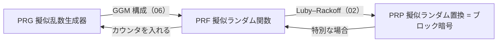

# 01. ブロック暗号と PRF/PRP

> 親: [README](./README.md) ｜ 前: [README](./README.md) ｜ 次: [02. DES](./02_des.md) ｜ 出典: Crypto I ビデオ1 (4:02:29–4:19:04)

ストリーム暗号は「鍵から乱数列を作って XOR」、ブロック暗号は「固定長ブロックを丸ごと別のブロックへ写す鍵付き置換」。この写像を抽象化した **PRF / PRP** を定義し、「安全」の意味を固める。

**この1ページで分かること**

- ブロック暗号 = 鍵付きの可逆な写像（PRP）。ラウンド関数の反復で作る
- PRF/PRP の「安全」= 真のランダム関数と識別器が区別できないこと
- 1 点を固定するだけで安全性は崩れる／PRF にカウンタを入れれば PRG になる

---

## ブロック暗号とは

`n` bit 入力を `n` bit 出力へ写す**鍵付き関数**。実装は「鍵展開 → ラウンド関数の反復」。

```
鍵 k ──[鍵展開]──> k1, k2, …, kd （ラウンド鍵）

m ─> [R(k1,・)] ─> [R(k2,・)] ─> … ─> [R(kd,・)] ─> c
        1ラウンド      2ラウンド            dラウンド
```

| 暗号 | ブロック | 鍵 | ラウンド |
|------|---------|----|---------|
| 3DES (Triple DES) | 64 bit | 168 bit | 48 |
| AES | 128 bit | 128 / 192 / 256 bit | AES-128 は 10 |

ラウンドを何度も回すため、ストリーム暗号より一般に**遅い**。

---

## PRF と PRP

| | PRF（擬似ランダム関数） | PRP（擬似ランダム置換） |
|---|---|---|
| 型 | `F: K × X → Y` | `E: K × X → X` |
| 要件 | `F(k,x)` を効率的に評価できればよい | 各 `k` で `E(k,·)` が全単射、逆演算 `D(k,·)` も効率的 |
| 関係 | 一般形 | `X = Y` かつ可逆な PRF の**特別な場合** |

ブロック暗号は PRP（暗号化 `E` と復号 `D` が対）。3 つの道具の関係:



---

## 「安全」の定義 —— 真の乱数と区別できない

`X → Y` の関数**全体**の集合を `Funs[X,Y]` と書く。

```
|Funs[X,Y]| = |Y|^|X|
S_F = { F(k,·) : k ∈ K },   |S_F| ≤ |K|
```

`|K|` は `|Y|^|X|` より桁違いに小さい（AES-128 なら `2^128` 個 対 `(2^128)!` 個）。

> **安全性**: `Funs[X,Y]` から一様に選んだ**真のランダム関数**と、`S_F` から選んだ関数とを、入力を自由にクエリできる識別器が**区別できない**とき `F` は安全な PRF。区別できる度合い（Adv）が無視できるほど小さいことを要求する。

---

## 1 点でも固定すると壊れる（反例）

安全な PRF `F` から `G(k,0) = 0`、それ以外は `G(k,x) = F(k,x)` と定める。

| | 真のランダム関数 | `G` |
|---|---|---|
| `x = 0` の出力が 0 になる確率 | `1/\|Y\|` | 1 |

識別器は `x = 0` を 1 回聞くだけ。Adv ≈ `1 − 1/|Y|` ≈ 1。**1 点の固定で崩壊する**。

---

## PRF から PRG を作る

```
G(k) = F(k,0) ‖ F(k,1) ‖ F(k,2) ‖ … ‖ F(k,t)
```

`F` が真のランダム関数なら各 `F(k,i)` は独立な真の乱数なので出力は真の乱数列。ゆえに `F` が擬似ランダムなら出力も擬似ランダム。各ブロックは独立に計算できるため**並列化**でき、カウンタモード（次モジュール）の原型になる。

---

## 問題

**Q1.** `X = Y = {0,1}^128` のとき `|Funs[X,Y]|` を指数の式で表せ。

<details><summary>解答</summary>

`|Y|^|X| = (2^128)^(2^128) = 2^(128 · 2^128)`。鍵で選べる `2^128` 個とは比較にならない巨大さで、この差が「有限の鍵で真の乱数を真似る」PRF の意味を与える。

</details>

**Q2.** `G(k,0)=0`、それ以外 `F` と定めた `G` に対する識別器のおおよその Adv は。

<details><summary>解答</summary>

`x=0` を 1 回クエリし「出力が 0 なら G と判定」。`G` では確率 1、真のランダム関数では確率 `1/|Y|`。よって Adv ≈ `1 − 1/|Y| ≈ 1`。1 点固定でも壊れる。

</details>

**Q3.** PRF と PRP の違いを、逆写像の観点で 1 文で述べよ。

<details><summary>解答</summary>

PRF は評価だけできればよく逆写像を要求しない（`X→Y` の一般の関数）。PRP は `X=Y` の全単射で、効率的な逆演算 `D` を持つ（＝可逆な PRF の特別な場合）。

</details>

**Q4.** `G(k)=F(k,0)‖…‖F(k,t)` が擬似ランダムになる直観を述べよ。

<details><summary>解答</summary>

`F` が真のランダム関数なら異なる入力 `0,1,…,t` への出力は独立な真の乱数なので `G(k)` は真の乱数列。安全な PRF はこれと識別不能なので、出力も擬似ランダムになる。

</details>

## 関連リンク

- [../../../topics/02_cryptography/02_symmetric-crypto/README.md](../../../topics/02_cryptography/02_symmetric-crypto/README.md) — 対称暗号の全体像（ストリーム/ブロック）
- [02. DES](./02_des.md) — 最初の実用 PRP を Feistel 構造で作る
