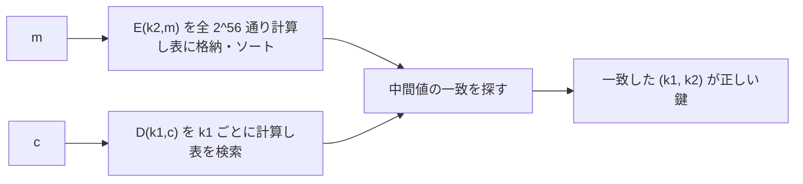

# 03. 総当たり攻撃と 3DES

> 親: [README](./README.md) ｜ 前: [02. DES](./02_des.md) ｜ 次: [04. 高度な攻撃](./04_advanced-attacks.md) ｜ 出典: Crypto I ビデオ1 (4:41:25–5:00:51)

DES の 56 bit 鍵はなぜ「死んだ」か。総当たりの実コストと、延命策 3DES・DESX を見る。**中間一致攻撃**は「鍵長 2 倍 ≠ 強度 2 倍」を示す重要な技法。

**この1ページで分かること**

- 1〜2 組の `(m, c)` で鍵はほぼ一意に決まるので、総当たりは正当な攻撃になる
- 2DES は中間一致攻撃で ~2^63 に落ちる。3DES (168 bit) でも実効 ~2^118
- DESX は前後**両方**の XOR で ~2^120。片側だけでは効かない

---

## 鍵はほぼ一意に決まる

理想的な暗号モデルでは、`(m, c)` 1 対で DES 鍵が一意になる確率は:

```
Pr[鍵が一意] ≈ 1 − 1/256 ≈ 99.5%
```

`m→c` を偶然満たす別の鍵の期待数が `2^56 / 2^64 = 1/256` だから。**2 対**あればほぼ確実。ゆえに「与えられた `(m,c)` に合う鍵を全探索せよ」が成立する。

---

## DES Challenge —— 56 bit は死んだ

| 年 | 手段 | コスト | 所要時間 |
|----|------|--------|----------|
| 1997 | インターネット分散探索 | — | 約 3 ヶ月 |
| 1998 | Deep Crack（専用ハード） | 約 $250k | 約 3 日 |
| 1999 | Deep Crack + 分散 | — | 約 22 時間 |
| 2006 | COPACOBANA（FPGA ×120） | 約 $10k | 約 7 日 |

コストは急落し、56 bit 鍵は現実的に総当たりできる。**単一 DES は使ってはならない。**

---

## 3DES

鍵 3 本で暗号→復号→暗号（**EDE**）:

```
c = E(k1, D(k2, E(k3, m)))
```

- **EDE の理由**: `k1 = k2 = k3` なら `E(D(E(m))) = E(m)` で**単一 DES と互換**（既存ハードを再利用）。
- **強度**: 鍵 168 bit だが中間一致攻撃で実効 **~2^118**。実用上は十分。
- **欠点**: DES を 3 回回すので**約 3 倍遅い**。

---

## なぜ 2DES ではダメか（中間一致攻撃）

2 段 `c = E(k1, E(k2, m))`（鍵 112 bit）は **meet-in-the-middle** で総当たり相当まで劣化する。式を中央で分離するのが鍵:

```
c = E(k1, E(k2, m))   ⇔   E(k2, m) = D(k1, c)
                             └左は k2 だけ┘ └右は k1 だけ┘
```



時間 `2^56 + 2^56` にソート/検索コストを乗せて **~2^63**、空間 **~2^56**。2DES(112 bit) の実効強度は単一 DES とほぼ同じで、**鍵長 2 倍の意味がほとんどない**。3DES にも当てられ、実効 ~2^118 に落ちる。

---

## DESX

DES を改造せず鍵長を伸ばす軽量策。前後を追加鍵で XOR する:

```
E'((k1,k2,k3), m) = k1 ⊕ E(k2, m ⊕ k3)      鍵 = 64 + 56 + 64 = 184 bit
```

最良攻撃でも **~2^120**。ただし**内側だけ** `E(k2, m⊕k3)` や**外側だけ** `k1 ⊕ E(k2, m)` の片側 XOR は、追加鍵の効果が打ち消され安全性がほとんど上がらない。

---

## まとめ

| 方式 | 鍵長 | 実効強度 | 速度 |
|------|------|----------|------|
| DES | 56 bit | 2^56（現実に破れる） | 1× |
| 2DES | 112 bit | ~2^63（中間一致） | 2 倍遅い |
| 3DES (EDE) | 168 bit | ~2^118 | 3 倍遅い |
| DESX | 184 bit | ~2^120 | ≈1×（XOR 追加のみ） |

---

## 問題

**Q1.** 2DES への中間一致攻撃のおおよその時間計算量と空間計算量を答えよ。

<details><summary>解答</summary>

時間 ~2^63（`2^56` の表構築 + `2^56` の検索、ソート/照合込み）、空間 ~2^56（中間値の表）。単一 DES の総当たり `2^56` とほぼ同水準まで劣化する。

</details>

**Q2.** 3DES が EEE ではなく EDE（暗号→復号→暗号）を使うのはなぜか。

<details><summary>解答</summary>

`k1=k2=k3` としたとき `E(D(E(m))) = E(m)` となり単一 DES と互換になるため。既存の DES ハード/実装をそのまま再利用できる後方互換性が目的。

</details>

**Q3.** 3DES(鍵 168 bit) の実効強度が 2^168 にならないのはなぜか。

<details><summary>解答</summary>

中間一致攻撃を当てられるため。3 段でも中央で分離して事前計算表を作ると実効 ~2^118 に落ちる。それでも現実的には破れないので実用上は安全。

</details>

**Q4.** DESX の外側だけ `k1 ⊕ E(k2, m)` とした変種が弱い理由を一言で。

<details><summary>解答</summary>

外側の XOR は出力を一律にずらすだけで、既知平文があれば `k1` を通した効果を打ち消して単一 DES への総当たりに帰着できる（内側 `k3` による入力の撹拌が無いため実効鍵長がほぼ増えない）。前後両方に XOR してはじめて ~2^120 の強度が出る。

</details>

## 関連リンク

- [02. DES](./02_des.md) — 攻撃対象である DES の内部構造
- [04. 高度な攻撃](./04_advanced-attacks.md) — 総当たり以外（線形解読・サイドチャネル・量子）
- [../../../topics/02_cryptography/02_symmetric-crypto/README.md](../../../topics/02_cryptography/02_symmetric-crypto/README.md) — 対称暗号の鍵長と安全性
