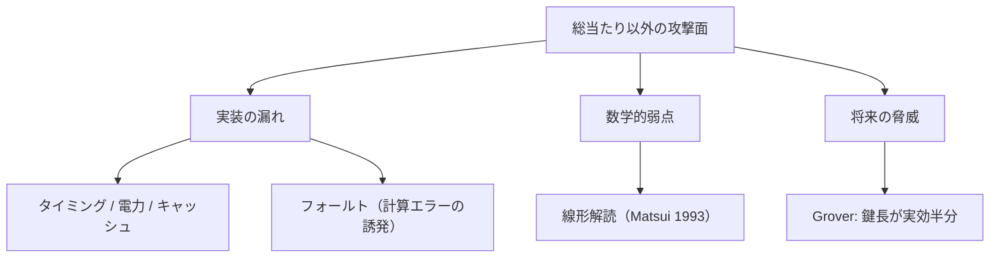

# 04. 高度な攻撃

> 親: [README](./README.md) ｜ 前: [03. 総当たり攻撃と 3DES](./03_exhaustive-search-and-3des.md) ｜ 次: [05. AES](./05_aes.md) ｜ 出典: Crypto I ビデオ1 (5:00:51–5:17:01)

鍵が長くても暗号は破られる。**数学的弱点**（線形解読）、**実装の漏れ**（サイドチャネル・フォールト）、**未来の脅威**（量子）を俯瞰する。教訓は「自前実装せず、標準ライブラリを使え」。

**この1ページで分かること**

- サイドチャネル: 時間・電力・キャッシュから鍵が漏れる → 定数時間の標準実装を使う
- 線形解読: S ボックスの偏り `1/2 + 1/2^21` を `2^42` 組で多数決 → 計 ~2^43 で鍵回復
- 量子 (Grover): 実効鍵長が半分になる → 256 bit 鍵を使う



---

## 実装攻撃（サイドチャネル・フォールト）

暗号の数式ではなく、動く**物理的な機械**から鍵が漏れる。

| 攻撃 | 漏洩源 | 対策 |
|------|--------|------|
| タイミング | 処理時間が鍵・データに依存 | 定数時間実装 |
| 電力解析 / DPA | 消費電力の波形に初期置換・16 ラウンドが見える。DPA は多数の波形を統計処理 | マスキング・標準ライブラリ |
| キャッシュ | 別コアのプロセスがキャッシュの使われ方を観測 | 鍵非依存なメモリアクセス |
| フォールト | 最終ラウンドで故意にエラー（電圧グリッチ・レーザ）を起こし、誤出力との差分から鍵 | 出力前に**検算**（複数回計算して多数決） |

実務の結論: **暗号を自前実装せず**、OpenSSL 等の実績ある標準ライブラリ（定数時間・キャッシュ対策済み）を使う。

---

## 線形解読法 (Matsui 1993)

Biham–Shamir の差分解読法の系譜に連なる統計的攻撃。松井充が発見。DES の第 5 S ボックスに残る**わずかな線形性**を突く。

```
(m のビット集合の XOR) ⊕ (c のビット集合の XOR) = (k のビット集合の XOR)
     が成り立つ確率 = 1/2 + ε        （ε = 1/2^21）
```

真にランダムなら確率はちょうど `1/2`。偏り `ε` を使い、多数の既知平文・暗号文対で左辺を集計して**多数決**すれば右辺（鍵ビットの XOR）が当たる。

| 手順 | 計算量 |
|------|--------|
| 必要な平文・暗号文対 | `1/ε^2 = 2^42` 組 |
| 得られる鍵ビット | 14 bit |
| 残り 42 bit を総当たり | `2^42` |
| **合計** | **~2^43** |

教訓: **わずかな線形性が致命傷になる**。

---

## 量子攻撃

Grover のアルゴリズムは鍵空間 `|K|` の探索を `O(√|K|)` に短縮する。対称鍵は**実効強度が半分の bit 数**になる。

| 暗号 | 古典 | Grover 後 | 評価 |
|------|------|-----------|------|
| DES | 2^56 | 2^28 | 即死 |
| AES-128 | 2^128 | 2^64 | 危うい |
| AES-256 | 2^256 | 2^128 | 安全 |

**量子時代に備えるなら 256 bit 鍵**（AES-256）。実用的な量子計算機が作れるかは未解決。

---

## 問題

**Q1.** 線形解読で偏りが `ε = 1/2^21` のとき、鍵ビットを推定するのに必要な既知平文・暗号文対のおおよその数は。

<details><summary>解答</summary>

`1/ε^2 = (2^21)^2 = 2^42` 組。これで 14 bit を復元し、残り 42 bit を総当たりして計 ~2^43。

</details>

**Q2.** Grover のアルゴリズム後の AES-128 と AES-256 の実効強度をそれぞれ答えよ。

<details><summary>解答</summary>

AES-128 → `2^64`（危険水準）、AES-256 → `2^128`（安全）。Grover は探索を `√|K|` にするので鍵の実効 bit 数が半分になる。だから量子時代は 256 bit 鍵。

</details>

**Q3.** サイドチャネル対策を 2 つ挙げよ。

<details><summary>解答</summary>

例: (1) 処理時間を入力・鍵に依存させない**定数時間実装**を使う、(2) 自前実装せず OpenSSL 等の**標準ライブラリ**を使う。他にキャッシュアクセスを鍵非依存にする、電力波形をマスキング/ノイズ付加で撹乱する、なども可。

</details>

**Q4.** 線形解読の教訓を 1 行で述べよ。

<details><summary>解答</summary>

S ボックスに残るわずかな線形性（`1/2 + ε` の偏り）でも、多数の既知平文で多数決すれば鍵が漏れる —— 非線形部品は「ほぼ線形」ですら危険。

</details>

## 関連リンク

- [02. DES](./02_des.md) — S ボックスの非線形性がなぜ必要か
- [05. AES](./05_aes.md) — これらの攻撃に耐える設計
- [../../../topics/02_cryptography/02_symmetric-crypto/README.md](../../../topics/02_cryptography/02_symmetric-crypto/README.md) — 対称暗号の安全性の考え方
