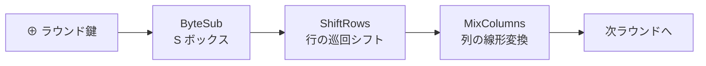

# 05. AES

> 親: [README](./README.md) ｜ 前: [04. 高度な攻撃](./04_advanced-attacks.md) ｜ 次: [06. PRG から PRF(GGM)](./06_prg-to-prf-ggm.md) ｜ 出典: Crypto I ビデオ1 (5:17:01–5:30:47)

DES の後継が AES。Feistel とは異なる **SPN（置換転置ネットワーク）** で全ビットを毎ラウンド撹拌する。現代の CPU には専用命令 (AES-NI) まで載っており、実用ブロック暗号の事実上の標準である。

---

## 経緯

1997 年に NIST が公募し、15 件の応募から選考の末、2000 年に **Rijndael**（ベルギーの Joan Daemen・Vincent Rijmen 設計）が AES として採択された。鍵長は 128 / 192 / 256 bit、ブロックは 128 bit。鍵が長いほどラウンド数が増えて遅くなるが強くなる。

---

## SPN（置換転置ネットワーク）

Feistel が毎ラウンド半分だけ変換したのに対し、SPN は**毎ラウンド全ビットを変換**する。各ステップは**必ず可逆**でなければならない（復号は各ステップの逆を逆順に適用するため）。



---

## AES のラウンド構成

状態は **4×4 バイト（16 バイト = 128 bit）**の行列。処理の流れ:

```
状態 ⊕ ラウンド鍵0
繰り返し（10 ラウンド）:
    ByteSub    … 256 バイトの S ボックスで各バイトを置換（非線形）
    ShiftRows  … 各行を巡回シフト
    MixColumns … 各列を線形変換（最終ラウンドのみ省略）
    ⊕ ラウンド鍵i
```

- AES-128 は **10 ラウンド**、**最終ラウンドだけ MixColumns を省く**。
- 鍵展開: 16 バイト鍵から **11 個のラウンド鍵**を生成（最初の 1 個 + 10 ラウンド分）。

---

## 実装トレードオフと AES-NI

- **速度重視**: S ボックスや MixColumns を事前計算テーブル（数 KB〜24 KB）に展開して高速化。
- **コード最小重視**: テーブルを持たず、S ボックスをオンザフライで計算。配布コードを小さくできる（例: JavaScript で小さなコードを送り、着地後にテーブルを展開）。
- **AES-NI（ハードウェア命令）**: Intel の `aesenc` / `aesenclast` / `aeskeygenassist`。ソフト実装より**約 14 倍高速**。AES-128 の暗号化は `aesenc` ×9 + `aesenclast` ×1。AMD にも同等命令がある。

---

## 安全性

- **鍵回復**: 最良でも総当たりの約 4 倍速い程度（実効 ~2^126）で、実害はない。
- **関連鍵攻撃**: AES-256 の鍵展開に対し ~2^99 の攻撃が知られるが、これは攻撃者が**関連する鍵**を作れる特殊設定を要する。実運用で意図的に関連鍵を生成しなければ問題にならない。

総じて AES は現時点で安全と考えられており、実務の第一選択である。

---

## 問題

**Q1.** AES で最終ラウンドだけ MixColumns を省く構成を選べ。(a) 全ラウンドで MixColumns (b) 最終ラウンドのみ MixColumns なし (c) MixColumns を一切使わない

<details><summary>解答</summary>

(b)。最終ラウンドの MixColumns は安全性に寄与せず、省くと復号の実装が対称的になり簡潔になる。設計上あってもなくても安全性は変わらないため省いている。

</details>

**Q2.** SPN の各ステップが可逆でなければならないのはなぜか。

<details><summary>解答</summary>

復号は暗号化の各ステップの逆を逆順に適用して行うため。どれか 1 ステップでも可逆でないと全体を復号できない。ByteSub・ShiftRows・MixColumns・鍵 XOR はいずれも逆演算を持つ。

</details>

**Q3.** AES-128 で生成されるラウンド鍵は何個か。

<details><summary>解答</summary>

11 個。最初に状態へ XOR する 1 個 + 10 ラウンド分。16 バイトのマスター鍵から鍵展開で導く。

</details>

**Q4.** AES-256 の関連鍵攻撃 (~2^99) が実運用で問題になりにくいのはなぜか。

<details><summary>解答</summary>

攻撃者が「互いに関連した複数の鍵」で暗号化させられるという特殊な設定を前提とするため。通常の運用では鍵は独立にランダム生成され関連鍵を作らないので、この攻撃条件が成立しない。

</details>

## 関連リンク

- [02. DES](./02_des.md) — Feistel 構造との対比
- [04. 高度な攻撃](./04_advanced-attacks.md) — サイドチャネル・量子への耐性
- [../../../topics/02_cryptography/02_symmetric-crypto/README.md](../../../topics/02_cryptography/02_symmetric-crypto/README.md) — 実務で使う対称暗号
