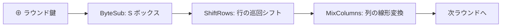

# 05. AES

> 親: [README](./README.md) ｜ 前: [04. 高度な攻撃](./04_advanced-attacks.md) ｜ 次: [06. PRG から PRF(GGM)](./06_prg-to-prf-ggm.md) ｜ 出典: Crypto I ビデオ1 (5:17:01–5:30:47)

DES の後継。Feistel と異なる **SPN（置換転置ネットワーク）**で毎ラウンド全ビットを撹拌する。CPU に専用命令 (AES-NI) が載り、実用ブロック暗号の事実上の標準。

**この1ページで分かること**

- SPN は毎ラウンド全ビットを変換し、各ステップは必ず可逆でなければならない
- AES-128 は 4×4 バイトの状態に 10 ラウンド（最終ラウンドのみ MixColumns なし）、ラウンド鍵 11 個
- 実装はテーブル展開・オンザフライ・AES-NI（約 14 倍速）を用途で選ぶ。鍵回復・関連鍵攻撃とも実害なし

---

## 経緯

| 項目 | 内容 |
|------|------|
| 公募 | 1997 年 NIST。15 件の応募 |
| 採択 | 2000 年 **Rijndael**（Joan Daemen・Vincent Rijmen、ベルギー） |
| ブロック | 128 bit |
| 鍵長 | 128 / 192 / 256 bit（長いほどラウンドが増え、遅いが強い） |

---

## SPN（置換転置ネットワーク）

| | Feistel (DES) | SPN (AES) |
|---|---|---|
| 毎ラウンドの変換 | 半分のビット | **全ビット** |
| 各ステップの可逆性 | 不要 | **必須**（復号は各ステップの逆を逆順に適用） |



---

## AES のラウンド構成

状態は **4×4 バイト（16 バイト = 128 bit）**の行列。

```
状態 ⊕ ラウンド鍵0
繰り返し（10 ラウンド）:
    ByteSub    … 256 バイトの S ボックスで各バイトを置換（非線形）
    ShiftRows  … 各行を巡回シフト
    MixColumns … 各列を線形変換（最終ラウンドのみ省略）
    ⊕ ラウンド鍵i
```

- AES-128 は **10 ラウンド**、**最終ラウンドだけ MixColumns を省く**。
- 鍵展開: 16 バイト鍵から **11 個のラウンド鍵**（最初の 1 個 + 10 ラウンド分）。

---

## 実装トレードオフと AES-NI

| 方針 | 手段 | 効果 |
|------|------|------|
| 速度重視 | S ボックス・MixColumns を事前計算表（数 KB〜24 KB）に展開 | 高速 |
| コード最小 | 表を持たず S ボックスをオンザフライ計算 | 配布コードが小さい（例: JS で小さく送り、着地後に表を展開） |
| ハード命令 AES-NI | Intel `aesenc` ×9 + `aesenclast` ×1、`aeskeygenassist`。AMD にも同等命令 | ソフト実装の**約 14 倍**高速 |

---

## 安全性

| 攻撃 | 状況 |
|------|------|
| 鍵回復 | 最良でも総当たりの約 4 倍速い程度（実効 ~2^126）。実害なし |
| 関連鍵攻撃 | AES-256 の鍵展開に ~2^99。攻撃者が**関連する鍵**を作れる特殊設定が必要で、通常運用では成立しない |

AES は現時点で安全と考えられ、実務の第一選択。

---

## 問題

**Q1.** AES で最終ラウンドだけ MixColumns を省く構成を選べ。(a) 全ラウンドで MixColumns (b) 最終ラウンドのみ MixColumns なし (c) MixColumns を一切使わない

<details><summary>解答</summary>

(b)。最終ラウンドの MixColumns は安全性に寄与せず、省くと復号の実装が対称的になり簡潔になる。設計上あってもなくても安全性は変わらないため省いている。

</details>

**Q2.** SPN の各ステップが可逆でなければならないのはなぜか。

<details><summary>解答</summary>

復号は暗号化の各ステップの逆を逆順に適用して行うため。どれか 1 ステップでも可逆でないと全体を復号できない。ByteSub・ShiftRows・MixColumns・鍵 XOR はいずれも逆演算を持つ。

</details>

**Q3.** AES-128 で生成されるラウンド鍵は何個か。

<details><summary>解答</summary>

11 個。最初に状態へ XOR する 1 個 + 10 ラウンド分。16 バイトのマスター鍵から鍵展開で導く。

</details>

**Q4.** AES-256 の関連鍵攻撃 (~2^99) が実運用で問題になりにくいのはなぜか。

<details><summary>解答</summary>

攻撃者が「互いに関連した複数の鍵」で暗号化させられるという特殊な設定を前提とするため。通常の運用では鍵は独立にランダム生成され関連鍵を作らないので、この攻撃条件が成立しない。

</details>

## 関連リンク

- [02. DES](./02_des.md) — Feistel 構造との対比
- [04. 高度な攻撃](./04_advanced-attacks.md) — サイドチャネル・量子への耐性
- [../../../topics/02_cryptography/02_symmetric-crypto/README.md](../../../topics/02_cryptography/02_symmetric-crypto/README.md) — 実務で使う対称暗号
