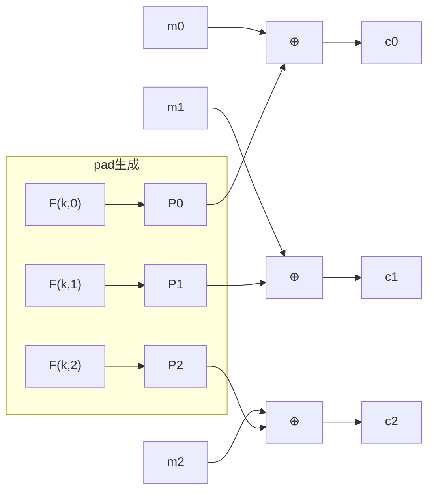

# 01. ワンタイム鍵と ECB

> 親: [README](./README.md) ｜ 前: [README](./README.md) ｜ 次: [CPA 安全性と nonce](./02_cpa-security-and-nonces.md) ｜ 出典: Crypto I ビデオ1 (5:42:20–6:01:03)

ブロック暗号(AES/3DES)は 1 ブロックしか変換できない。任意長のメッセージへ広げるのが「利用モード (mode of operation)」である。まずは鍵を 1 メッセージにしか使わない **ワンタイム鍵** の場合を扱い、素朴な ECB がなぜ壊れているかを見る。

---

## PRP を PRF として使う: Switching Lemma

ブロック暗号は擬似ランダム置換 (PRP) だが、モードの証明では擬似ランダム関数 (PRF) として扱えると便利なことが多い。**PRP/PRF Switching Lemma** は、この置き換えの誤差を定量化する:

```
安全な PRP E: K × X → X について、
  |Adv_PRF - Adv_PRP| ≤ q² / (2·|X|)      （q = 攻撃者のクエリ数）
```

つまり `|X|` が十分大きければ (AES なら `|X| = 2^128`)、`q` が現実的な範囲では差は無視でき、**安全な PRP はそのまま安全な PRF として使える**。

`|X|` が小さいと成り立たない反例: `X = {0,1}`(1 ビット)上で `E(k,x) = x ⊕ k` は置換なので PRP。しかし真のランダム関数 `f:{0,1}→{0,1}` は確率 1/2 で `f(0)=f(1)` の衝突を起こすのに、`E(k,·)` は置換だから決して衝突しない。識別器が「`f(0)=f(1)` か?」を調べれば PRF としては簡単に破れる。

---

## ECB(電子コードブック)は使うな

最も素朴なモード。メッセージをブロックに分け、各ブロックを独立に暗号化するだけ:

```
c_i = E(k, m_i)      （各ブロックを個別に暗号化）
```

問題は決定的なこと。**同一の平文ブロックは同一の暗号文ブロックになる**ので、平文中の反復パターンが暗号文に透けて見える。有名な「ペンギン画像」の例(Linux Tux を ECB で暗号化すると輪郭が残る)がこれを示す。

意味論的安全性 (semantic security) は 1 メッセージでも壊れる。攻撃者が `m0 = (hello ∥ hello)`、`m1 = (hello ∥ world)` を提出すると:

```
ECB(m0) = ( E(k,hello) , E(k,hello) )   ← 2 ブロックが等しい
ECB(m1) = ( E(k,hello) , E(k,world) )   ← 2 ブロックが異なる
```

暗号文の第 1・第 2 ブロックが等しいかを見るだけで `b` を当てられる。識別アドバンテージ `Adv = 1`(完全に破れる)。

---

## 決定的カウンタモード(ワンタイム鍵用)

ECB の代わりに、ブロック暗号を PRF として使い、疑似ランダムなパッドを作って XOR する:

```
pad = F(k,0) ∥ F(k,1) ∥ … ∥ F(k,L)
c   = m ⊕ pad          （復号は同じ pad をもう一度 XOR）
```



要点:

- **PRP でなく PRF で十分**。暗号化も復号もパッド生成に `F` を順方向に使うだけで、`E` の逆(復号関数)を一切使わない。
- 安全性証明は**ストリーム暗号と同型**。`F` を真のランダム関数に置換すると `pad` は一様ランダムなワンタイムパッドになり、意味論的安全性が従う。
- ただしこれは鍵を **1 メッセージにしか使わない** 前提。同じ鍵で 2 メッセージを暗号化すると同じ `pad` が再利用され、`c ⊕ c' = m ⊕ m'`(two-time pad)で崩れる。複数メッセージ対応は次ファイル以降。

---

## 問題

**Q1.** ECB に対する意味論的安全性攻撃を完成させよ。攻撃者は同長の `m0, m1` をどう選び、暗号文の何を見て `b` を判定するか。

<details><summary>解答</summary>

2 ブロック分の平文を用意し、`m0 = (X ∥ X)`(両ブロック同一)、`m1 = (X ∥ Y)`(`X≠Y`)とする。挑戦暗号文の第 1 ブロックと第 2 ブロックが等しければ `b=0`、異なれば `b=1`。ECB は決定的でブロック独立なので判定は常に正しく `Adv=1`。

</details>

**Q2.** Switching Lemma が実用上「PRP をそのまま PRF とみなしてよい」と言える条件は何か。3DES(`|X|=2^64`)ではどうか。

<details><summary>解答</summary>

`q² / (2·|X|)` が無視できる、すなわち `|X|` がクエリ数 `q` に対して十分大きいこと。AES は `|X|=2^128` なので現実の `q` では常に成立。3DES は `|X|=2^64` と小さく、`q` が `2^32` 程度で誤差が無視できなくなる(バースデー境界)。

</details>

**Q3.** 決定的カウンタモードを同じ鍵で 2 つのメッセージに使うとなぜ破れるか。

<details><summary>解答</summary>

パッド `pad = F(k,0)∥F(k,1)∥…` が鍵だけで決まり毎回同じになるため、`c = m⊕pad`、`c' = m'⊕pad` から `c⊕c' = m⊕m'` となり two-time pad と同じ状況で秘匿が崩れる。だから「ワンタイム鍵」限定。

</details>

**Q4.** `X={0,1}` 上の `E(k,x)=x⊕k` を PRF として破る識別器を述べよ。

<details><summary>解答</summary>

`f(0)` と `f(1)` を問い合わせ、`f(0)=f(1)` なら「真のランダム関数」、`f(0)≠f(1)` なら「`E`(置換)」と答える。置換は必ず `f(0)≠f(1)`、真のランダム関数は確率 1/2 で `f(0)=f(1)` なので識別アドバンテージは約 1/2。`|X|` が小さいと PRP→PRF が成り立たない実例。

</details>

## 関連リンク

- [対称暗号の全体像](../../../topics/02_cryptography/02_symmetric-crypto/README.md) — ブロック暗号と利用モードが対称鍵暗号のどこに位置するか
- [CPA 安全性と nonce](./02_cpa-security-and-nonces.md) — 鍵を複数メッセージに使う世界へ
