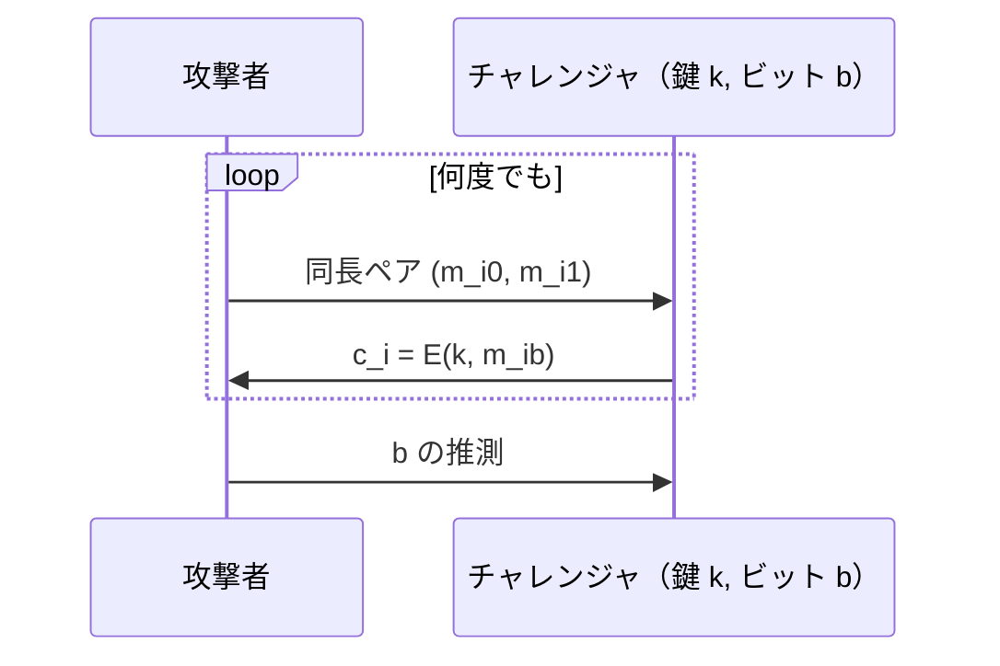

# 02. CPA 安全性と nonce

> 親: [README](./README.md) ｜ 前: [ワンタイム鍵と ECB](./01_one-time-key-and-ecb.md) ｜ 次: [CBC モード](./03_cbc-mode.md) ｜ 出典: Crypto I ビデオ1 (6:01:03–6:23:37)

現実では同じ鍵を何度も使う。すると攻撃者は「選んだ平文を暗号化させる」ことができる。この**選択平文攻撃 (CPA)** に耐える条件と、決定的暗号を救う 2 つの道（乱択と nonce）。

**この1ページで分かること**

- CPA ゲーム: 同長ペアを何度でも提出し、どちらが暗号化されたか当てられなければ安全
- 決定的暗号は必ず CPA で破れる（同じ平文 → 同じ暗号文）
- 対策は乱択暗号化（毎回乱数を混ぜる）か nonce ベース（`(k, n)` を 2 度使わない）

---

## 選択平文攻撃 (CPA) モデル



最後に `b` を当てられなければ CPA 安全。`m_i0 = m_i1` と選べば任意の平文の暗号文が手に入る = **選択平文クエリ**。

現実性の例: 攻撃者が Alice にメールを送り、Alice が暗号化ディスクに保存する。後でディスクを盗めば「自分が選んだ平文 → その暗号文」の対応が取れる。

---

## 決定的暗号は CPA 安全になれない

同じ鍵・同じ平文が常に同じ暗号文になる暗号は、鍵に依存しない一般攻撃で破れる:

```
1. (m, m) を提出 → c を受け取る       （m の暗号文を記録）
2. (m, m') を提出 (m ≠ m') → c' を受け取る
3. c' = c なら b=0、そうでなければ b=1 と答える
```

| 実害の例 | 何が漏れるか |
|---|---|
| 暗号化ディスク | 同一ファイルが同一暗号文 → どこに何があるか |
| 暗号化ボイス通話 | 無音区間が同一暗号文の反復 → 発話パターン |

結論: CPA 安全にするには暗号化を**非決定的**にする。

---

## 解1: 乱択暗号化 (randomized encryption)

暗号化のたびに乱数を混ぜ、**同じ平文でも暗号文が毎回変わる**。代償は乱数分の暗号文膨張。直感は「各平文に暗号文の“ボール”が対応し、暗号化のたびその中の 1 点を無作為に選ぶ」。

PRF を使う典型構成（乱数空間 `R`）:

```
E(k, m) = ( r , F(k, r) ⊕ m )      （r ←$ R を毎回選ぶ）
D(k,(r,c)) = F(k, r) ⊕ c
```

`F` を真のランダム関数に置換すると、`r` が毎回新しい限り `F(k,r)` は毎回新しい一様ワンタイムパッドになる。`r` が衝突した瞬間だけ two-time pad の危険が生じる（だから `R` を大きく取る）。

---

## 解2: nonce ベース暗号化

`E(k, m, n)` とし、**`(k, n)` のペアを 2 度使わない**ことだけを要求する。nonce は**公開でよく**、**乱数でなくてよい**（一意なら十分）。

| 方式 | 状態 | 特徴・使いどころ |
|------|------|------------------|
| カウンタ nonce | あり | 順序保証がある通信では nonce を送らなくてよい（受信側も同じカウンタを持つ）= TLS |
| ランダム nonce | なし | 複数デバイス・並行送信で座標合わせ不要。空間が十分大きければ衝突しない |

順序保証がないプロトコル（例: IPsec）では**nonce を暗号文に含める**。CPA ゲームでは攻撃者が nonce を選べる（重複は禁止）ため、`(k,n)` が一意なら安全という条件は現実の攻撃者にも耐える。

---

## 問題

**Q1.** 決定的暗号に対する CPA 攻撃を、提出する平文ペアと判定基準まで具体的に書け。

<details><summary>解答</summary>

(1) `(m,m)` を出して `c` を得る。(2) `m≠m'` として `(m,m')` を出し `c'` を得る。(3) `c'=c` なら `b=0`、`c'≠c` なら `b=1`。決定的だと `b=0` では同じ平文 `m` が同じ `c` になるので必ず当たり、`Adv=1`。

</details>

**Q2.** `E(k,m)=(r, F(k,r)⊕m)` の CPA 安全性が崩れるのはどんなときか。

<details><summary>解答</summary>

乱数 `r` が衝突したとき。同じ `r` が 2 回出ると `F(k,r)` が同じ値になり、その 2 メッセージが two-time pad(`c⊕c'=m⊕m'`)になる。だから `R` は衝突がバースデー的にも起きない程度に十分大きく取る。

</details>

**Q3.** カウンタ nonce とランダム nonce はそれぞれどんな状況に向くか。

<details><summary>解答</summary>

カウンタ nonce は単一送信者が状態を保てる場合に向き、順序保証があれば nonce を送らずに済む(TLS)。ランダム nonce は状態を持てない・複数デバイスが並行して暗号化する場合に向き、座標合わせが不要。ただし空間を大きく取り衝突を避ける必要がある。

</details>

**Q4.** nonce を重複させて `(k,n)` を 2 度使うと何が漏れるか。

<details><summary>解答</summary>

nonce ベース暗号は「`(k,n)` が一意」を安全性の前提にしている。重複すると同じパッド/同じ内部乱数が再利用され、たとえば pad ベースなら `c⊕c' = m⊕m'` となり 2 平文の XOR が漏れる(two-time pad)。CPA ゲームでも攻撃者に nonce 重複を許すと安全性が崩れるため、重複禁止は必須条件。

</details>

## 関連リンク

- [対称暗号の全体像](../../../topics/02_cryptography/02_symmetric-crypto/README.md) — CPA 安全性が対称鍵暗号の安全性目標のどこに位置するか
- [CBC モード](./03_cbc-mode.md) — nonce/IV を実際に使う最初の具体モード
