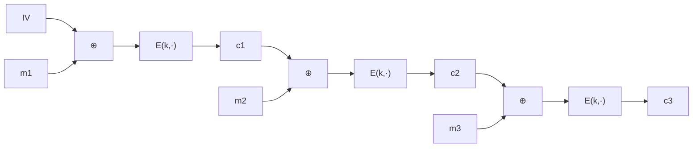

# 03. CBC モード

> 親: [README](./README.md) ｜ 前: [CPA 安全性と nonce](./02_cpa-security-and-nonces.md) ｜ 次: [カウンタモード](./04_counter-mode.md) ｜ 出典: Crypto I ビデオ1 (6:23:37–6:39:57)

CPA 安全を満たす最初の実用モード CBC（Cipher Block Chaining）。前ブロックの暗号文を次の入力に混ぜて連鎖させる。構成・安全性境界・IV の落とし穴・パディング。

**この1ページで分かること**

- `c_i = E(k, m_i ⊕ c_{i-1})`。IV は毎回ランダムに選び、暗号文の先頭に付ける
- 境界 `2·q²·L²/|X|`: AES ならほぼ無制限、3DES は約 0.5 MB で鍵交換が要る
- IV は予測不能が必須（TLS 1.0 の連鎖 IV → BEAST）。nonce は別鍵で暗号化して IV にする

---

## ランダム IV CBC の構成

```
c_0 = IV            （IV ←$ {0,1}^n、乱択）
c_i = E(k, m_i ⊕ c_{i-1})
復号: m_i = D(k, c_i) ⊕ c_{i-1}
```



暗号文は IV の分だけ 1 ブロック長い。連鎖により同じ平文ブロックでも前段が違えば異なる暗号文になり、ECB の弱点を解消する。

---

## 安全性境界

PRP `E` が安全なら CBC は CPA 安全。`q` = 同じ鍵で暗号化したメッセージ数、`L` = 最大ブロック長:

```
Adv_CBC ≤ 2·Adv_PRP + 2·q²·L² / |X|
```

| ブロック暗号 | `\|X\|` | 安全に使える `q·L` | 実感 |
|---|---|---|---|
| AES | `2^128` | `≪ 2^48` | 事実上無制限 |
| 3DES | `2^64` | 約 `2^16` ブロック | 約 0.5 MB で鍵交換 |

AES の 128 bit ブロックが大きい実利。

---

## IV の作り方 —— 予測可能だと CPA が崩壊

| IV の作り方 | 安全? | 理由 |
|---|---|---|
| 毎回ランダム | ○ | 予測不能 |
| 前レコードの最終暗号文ブロック（TLS 1.0） | ✗ | 送信済み = 攻撃者に既知 → **BEAST 系攻撃** |
| nonce をそのまま | ✗ | カウンタ等は予測可能 |
| `IV = E(k1, nonce)`（本体鍵 `k` とは別鍵） | ○ | 予測不能化。`k = k1` にしてもダメ |

予測できると破れる仕組み:

```
1. まず 0 を暗号化させ、暗号文 c を観測する（次に使われる IV も観測できる状況を想定）
2. 次レコードの IV を予測できるなら、m0 = (予測IV) ⊕ (前回のIV) を提出
3. E への入力が前回と一致 → 暗号文ブロックが一致するかで b を判別できる
```

TLS 1.1 以降は各レコードに明示的なランダム IV を置いて修正。OpenSSL の CBC API は生の IV を受け取るので、**呼び出し側が「ランダム IV」か「別鍵で暗号化した IV」を用意する責任**を負う。

---

## パディング

平文をブロック長の倍数に揃える。TLS 方式は「`n` バイト埋めるとき各バイトに値 `n` を書く」:

```
… DATA | 03 03 03        （3 バイト不足なら 0x03 を 3 個）
```

**平文がちょうどブロック倍数のときも、値 16 のダミーブロック（`0x10` ×16）を必ず 1 ブロック足す**。ないと復号側がパディング除去を誤り、偽造の余地が生まれる。長さを増やしたくなければ ciphertext stealing を使う。

---

## 問題

**Q1.** 予測可能 IV 攻撃のトレースの空欄を埋めよ。攻撃者は提出する平文を `m0 = ____ ⊕ ____` の形でどう作り、何を見て判別するか。

<details><summary>解答</summary>

`m0 = (次に使われると予測した IV) ⊕ (以前に E へ入力した値)` とすると、CBC 第 1 ブロックの `E` 入力 `m0 ⊕ 予測IV` が過去の入力と一致する。暗号文ブロックが過去のものと一致するかを見れば `b` を判別できる。IV が予測不能なら攻撃者は `E` の入力を狙って揃えられず、攻撃は成立しない。

</details>

**Q2.** AES-CBC で `Adv < 2^-32` を保つには `q·L` の上限はいくつか。目安を示せ。

<details><summary>解答</summary>

境界 `2·q²·L²/|X| = 2·(q·L)²/2^128 < 2^-32` を解くと `(q·L)² < 2^95`、すなわち `q·L < 2^47`〜`2^48` 程度。この総ブロック数に達する前に鍵を交換すればよい。AES では実用上ほぼ制約にならない。

</details>

**Q3.** ブロック長 16 バイトで、平文がちょうど 32 バイト(= 2 ブロック)のとき、TLS 方式ではパディングをどうするか。

<details><summary>解答</summary>

すでにブロック倍数だが、そのままだと復号側がパディングの有無を判定できない。値 16(`0x10`)を 16 個並べたダミーブロックを 1 つ追加し、暗号化は 3 ブロックになる。復号側は末尾バイト `0x10` を読んで 16 バイト全体を除去する。

</details>

**Q4.** nonce を暗号化せずそのまま IV に使うと何が起きるか。

<details><summary>解答</summary>

nonce はしばしば予測可能(カウンタ等)なので、予測可能 IV と同じ状況になり CPA が崩れる。攻撃者が `E` への入力を狙って一致させられてしまう。だから `IV = E(k1, nonce)` と別鍵で暗号化し、IV を予測不能にする必要がある。

</details>

## 関連リンク

- [対称暗号の全体像](../../../topics/02_cryptography/02_symmetric-crypto/README.md) — CBC が対称鍵暗号の実装のどこで使われるか
- [カウンタモード](./04_counter-mode.md) — 並列化でき境界も緩い、CBC の代替
