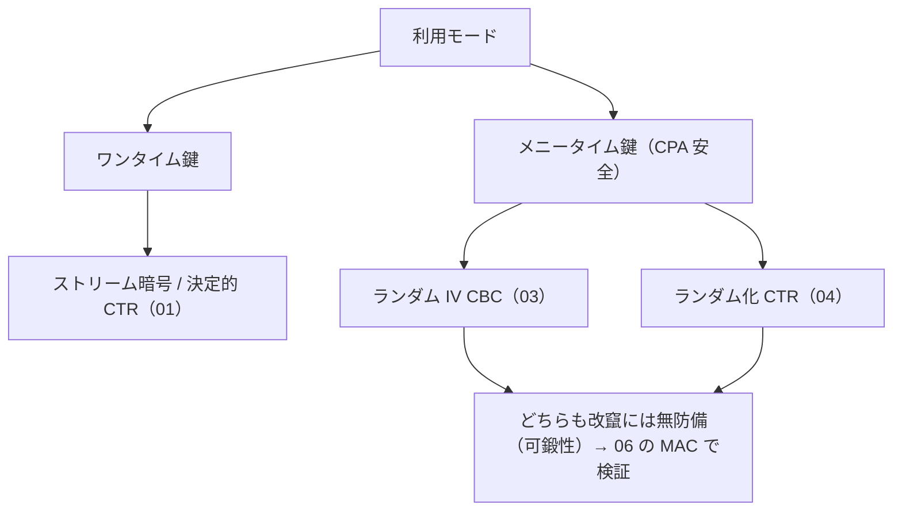

# 04. カウンタモード

> 親: [README](./README.md) ｜ 前: [CBC モード](./03_cbc-mode.md) ｜ 次: [06. メッセージ完全性](../06_message-integrity/README.md) ｜ 出典: Crypto I ビデオ1 (6:39:57–6:49:17)

CBC と並ぶ主要モード CTR。ブロック暗号を PRF として使い、カウンタを進めてパッドを作り XOR する。**完全に並列化**でき境界も CBC より緩く、新規設計の第一候補。

**この1ページで分かること**

- `c = (IV, m ⊕ F(k,IV) ∥ F(k,IV+1) ∥ …)`。PRF で十分、全ブロック並列
- 境界 `2·q²·L/|X|` は CBC より 1 次緩く、AES で約 `2^64` ブロックまで
- CBC も CTR も改竄には無防備 → 次モジュールの MAC へ

---

## ランダム化カウンタモード

```
IV ←$ {0,1}^n
pad = F(k,IV) ∥ F(k,IV+1) ∥ … ∥ F(k,IV+L)
c   = ( IV , m ⊕ pad )        （IV を暗号文に含める）
```

各 `F(k, IV+i)` は独立に計算できるので**全ブロックを並列に暗号化・復号**できる（CBC は連鎖のため逐次）。復号でも `F` を順方向に使うだけ = **PRF で十分**。

---

## nonce ベース CTR

128 bit の入力を「nonce 64 bit ∥ カウンタ 64 bit」に分割:

```
入力ブロック = [ nonce : 64bit ][ counter : 64bit ]
1 つの nonce で counter を 0,1,2,… と進める
```

1 つの nonce で暗号化できるのは**最大 `2^64` ブロック**。超えるとカウンタが隣の nonce 領域に食い込み、別メッセージとパッドが重複して two-time pad になる。

---

## 安全性境界

```
Adv_CTR ≤ 2·Adv_PRF + 2·q²·L / |X|
```

CBC の `q²·L²` に対し CTR は `q²·L`（`L` の次数が 1 つ低い）。AES では総計 **約 `2^64` ブロック**まで暗号化できる（CBC は約 `2^48`）。

---

## CBC との比較

| 項目 | CTR | CBC |
|------|-----|-----|
| 必要プリミティブ | PRF(復号も順方向) | PRP(復号に逆関数が必要) |
| 並列性 | 並列(暗号化・復号とも) | 逐次(暗号化は連鎖) |
| 安全性境界(誤差項) | `q²·L / \|X\|`(緩い) | `q²·L² / \|X\|`(厳しい) |
| 同一鍵の総量目安(AES) | 約 `2^64` ブロック | 約 `2^48` ブロック |
| ダミーパディング | 不要(ストリーム的) | 必要(ブロック倍数時も) |
| 1 バイト平文の膨張 | 1 バイト(+ IV) | 16 バイト(1 ブロックに切り上げ) |

短いメッセージが多い用途では膨張差が効く。**新規設計は CTR が推奨**。

---

## ここまでの整理



攻撃者が暗号文を書き換えても復号側は気づけない。秘匿だけでは足りず、**完全性 (MAC)** で「正規の相手が作った暗号文か」を検証する仕組みへ進む。

---

## 問題

**Q1.** CTR と CBC の誤り境界(`q²·L` vs `q²·L²`)の差が実際に効くのはどんな場面か。

<details><summary>解答</summary>

長いメッセージ(`L` 大)を大量(`q` 大)に同一鍵で暗号化する場面。CBC は `L²` に比例して境界が悪化するため鍵交換が早く必要になる。CTR は `L` の 1 乗なので同じ鍵でより多く暗号化でき、総計で約 `2^64` ブロック(CBC の約 `2^48`)まで持つ。

</details>

**Q2.** nonce ベース CTR で nonce を 64 ビット、カウンタを 64 ビットに分けたとき、1 つの nonce で暗号化できる最大ブロック数は?

<details><summary>解答</summary>

カウンタが 64 ビットなので `2^64` ブロック。これを超えるとカウンタが nonce 領域に繰り上がり、別 nonce のパッドと重複して two-time pad になるため危険。

</details>

**Q3.** 比較表の空欄を埋めよ。「必要プリミティブ: CTR=____ / CBC=____」「1 バイト平文の膨張: CTR=____ / CBC=____」。

<details><summary>解答</summary>

必要プリミティブ: CTR = PRF、CBC = PRP。1 バイト平文の膨張: CTR = 1 バイト(パッドを 1 バイトだけ XOR、別途 IV)、CBC = 16 バイト(1 ブロックに切り上げ)。

</details>

**Q4.** CTR が PRP でなく PRF でよいのはなぜか。

<details><summary>解答</summary>

暗号化も復号もパッド `F(k, IV+i)` を生成して XOR するだけで、ブロック暗号の**逆関数(復号)を一切使わない**。よって関数が全単射(置換)である必要がなく、擬似ランダム関数 PRF であれば十分。これが並列性と実装の単純さにもつながる。

</details>

## 関連リンク

- [対称暗号の全体像](../../../topics/02_cryptography/02_symmetric-crypto/README.md) — CTR/CBC が対称鍵暗号の実装のどこで使われるか
- [06. メッセージ完全性](../06_message-integrity/README.md) — 改竄を検知する MAC へ
