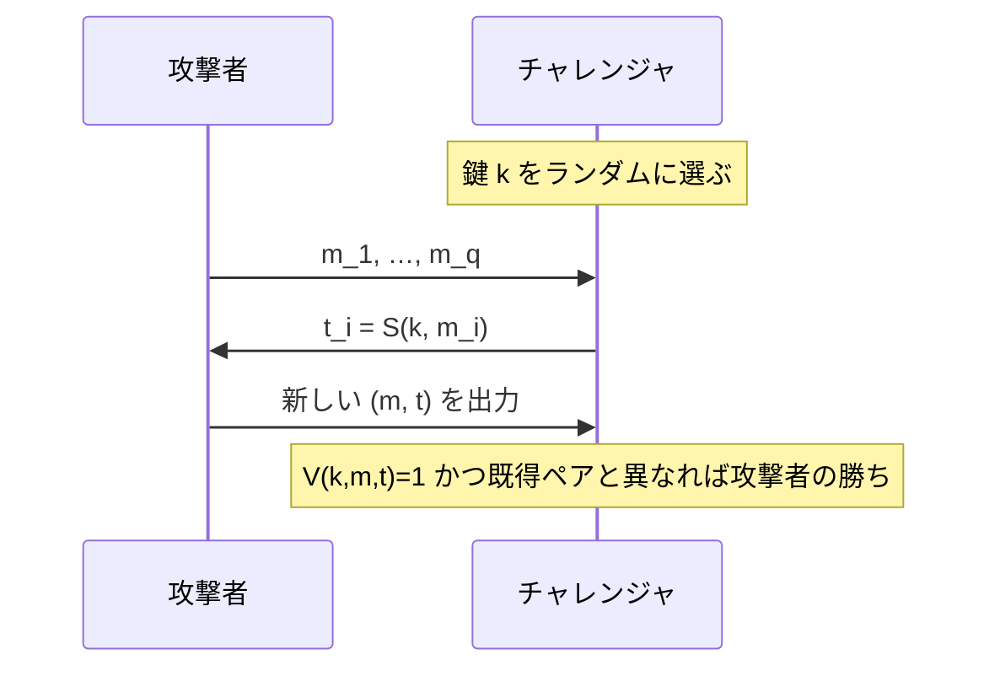

# 01. MAC の定義

> 親: [README](./README.md) ｜ 前: [README](./README.md) ｜ 次: [PRF ベース MAC](./02_prf-based-macs.md) ｜ 出典: Crypto I ビデオ1 (6:49:17–7:04:42)

**この1ページで分かること**

- MAC は署名 `S(k,m)` と検証 `V(k,m,t)` の組。**鍵が必須**で、CRC では代用できない
- 安全性 = 存在的偽造不可。新規性は「ペア単位」で、同じ `m` の別タグも偽造にあたる
- タグ長は `1/2^t` が無視できる長さ（実用は 64〜128 bit）

秘匿性とは独立に、**完全性 (integrity)**＝「改竄されていない」保証だけが欲しい場面は多い。専用の道具が **MAC (Message Authentication Code)** である。

---

## 完全性だけが要る場面

| 対象 | 隠す必要 | 守りたいこと |
|---|---|---|
| OS のシステムファイル | なし（公開） | ウイルスによる書き換えの検知 |
| バナー広告・設定ファイル | なし | 途中で差し替えられないこと |

---

## MAC の定義: (S, V)

```
署名 (tagging):   S(k, m) → t        メッセージ m にタグ t を付ける
検証 (verify):    V(k, m, t) → {0,1} タグが正しければ 1、偽なら 0

正当性: すべての k, m で  V(k, S(k,m)) = 1
```

送受信者は鍵 `k` を共有する。受信者は `(m, t)` を受け取り `V(k,m,t)=1` なら本物と判断する。

### CRC ではダメな理由

**CRC（巡回冗長検査。通信路の雑音を検出する符号）は鍵を使わない**。誰でも `CRC(m')` を再計算できるため、攻撃者は `m` を `m'` に差し替えタグも付け替えれば検証を通る。CRC はランダムな雑音の検出用であり、悪意ある改竄には無力。完全性には必ず鍵付きの MAC が要る。

---

## 安全性: 存在的偽造不可 (Existential Unforgeability under CMA)



この**選択メッセージ攻撃 (CMA)** に対し、どんな効率的攻撃者も勝つ確率（アドバンテージ `Adv`）が無視できるとき、その MAC は安全という。

新規性は **ペア単位**である。**同じ `m` に対する別のタグ `t' ≠ t_i` を作れてもそれは偽造**にあたる。この強い定義が、後で暗号化と完全性を合成するときに効く。

---

## タグ長は何ビット必要か

タグを当てずっぽうで通す確率は `1/2^t`（`t` = タグ長）。

| 状況 | アドバンテージ |
|---|---|
| ある 2 メッセージが確率 1/2 で同じタグ | 選択メッセージ 1 回で `Adv = 1/2` |
| タグが 5 bit | 推測で `Adv = 1/32` |

実用では **64 / 96 / 128 bit**（TLS のレコード MAC は 96 bit に切り詰めることが多い）。

---

## 応用: システムファイルの改竄検知

```
インストール直後（クリーンな状態）で  t_i = S(k, ファイル_i)  を計算して保存
起動時に各ファイルを再検証  V(k, ファイル_i, t_i) = 1 か?  → 書き換えを検知
```

鍵 `k` はパスワードから導く。**ファイル名もタグの対象に含めること。** さもないと攻撃者が正しいタグ付きの 2 ファイル（例: `login` と `notepad`）を**入れ替える**だけで、どちらの検証も通る（ファイル入れ替え攻撃）。タグ対象を `(ファイル名 ∥ 中身)` にすれば防げる。

---

## 問題

**Q1.** `MAC = CRC(m)` を「メッセージ認証符号」として使うと、攻撃者はどう偽造するか。

<details><summary>解答</summary>

CRC は鍵なしで誰でも計算できる。攻撃者は好きな `m'` を用意し、タグを `CRC(m')` に付け替えるだけで `(m', CRC(m'))` が検証を通る。CRC は雑音検出用で、鍵がないため悪意ある改竄を防げない。

</details>

**Q2.** タグが 5 bit の MAC のアドバンテージはいくらか。

<details><summary>解答</summary>

タグを一様ランダムに推測すると当たる確率は `1/2^5 = 1/32`。したがって `Adv = 1/32` で偽造でき、安全な MAC とは言えない。

</details>

**Q3.** すでに `t = S(k,m)` を得たとき、同じ `m` に対する**別のタグ** `t' ≠ t` を作ることがなぜ「偽造」として禁止されるのか。

<details><summary>解答</summary>

安全性の勝ち条件は「新しい `(m,t)` ペア」であり、`m` が既出でも `(m,t')` が既得ペアと異なれば偽造成立。この強い定義(strong unforgeability)にしておくと、暗号化と MAC を合成した認証付き暗号で、暗号文の改変を許さない保証が得られる。

</details>

**Q4.** ファイル名をタグ対象に含めないと、どんな攻撃が可能か。対策は。

<details><summary>解答</summary>

正しいタグを持つ 2 ファイルの中身を入れ替える「ファイル入れ替え攻撃」が可能(どちらも検証を通る)。対策はタグ対象を `(ファイル名 ∥ 中身)` にして、名前と内容の対応そのものを認証すること。

</details>

## 関連リンク

- [ハッシュ関数と MAC](../../../topics/02_cryptography/04_hash-and-mac.md) — MAC の全体像・HMAC・ハッシュ由来の MAC
- [PRF ベース MAC](./02_prf-based-macs.md) — 安全な PRF から MAC を作る
