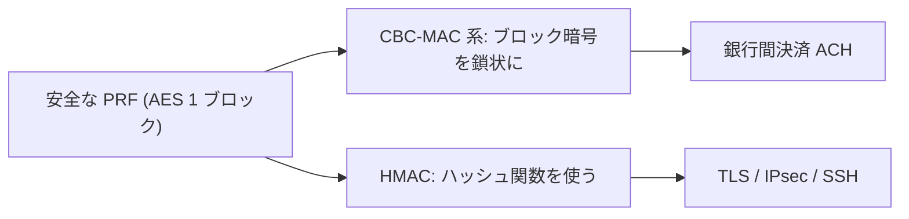

# 02. PRF ベース MAC

> 親: [README](./README.md) ｜ 前: [MAC の定義](./01_mac-definitions.md) ｜ 次: [CBC-MAC と NMAC](./03_cbc-mac-and-nmac.md) ｜ 出典: Crypto I ビデオ1 (7:04:42–7:14:54)

**この1ページで分かること**

- 安全な PRF はそのまま安全な MAC になる（`Adv_MAC ≤ Adv_PRF + 1/|Y|`）
- 出力の切り詰めは PRF 性を保つが、短すぎると当てずっぽうで破られる
- AES は 16 バイト固定の MAC。任意長への拡張が次の課題

MAC をゼロから設計する必要はない。手元の **PRF（擬似ランダム関数）** から安全な MAC が作れる。

---

## 安全な PRF ⇒ 安全な MAC

擬似ランダム関数 `F : K × X → Y` から MAC を作る:

```
S(k, m) = F(k, m)             タグ = PRF の出力
V(k, m, t):  F(k, m) == t なら 1、そうでなければ 0   （再計算して比較）
```

**主張:** `F` が安全な PRF で、かつ出力空間 `|Y|` が十分大きければ、この MAC は安全。

### 証明の直観

`F` を**真のランダム関数**に置き換えて考える。攻撃者が `m1,…,mq` のタグを得ても、未問合せの `m` に対する `F(k,m)` は攻撃者にとって完全にランダム。推測するしかない。

```
Adv_MAC ≤ Adv_PRF + 1/|Y|
           ↑          ↑
      PRF との差   当てずっぽうで通る確率
```

`F` が本物の PRF なら第 1 項は無視でき、残るのは `1/|Y|` だけ。

**`|Y|` が小さいと破綻する。** 出力 10 bit なら `1/|Y| = 1/1024`、約 1000 回の試行で偽造できる。タグ長 `t` は `1/2^t` が無視できる **64〜80 bit 以上**が必要。

---

## 出力の切り詰め (truncation)

`n` bit の PRF の**先頭 `t` bit を取り出したものもまた PRF** である。

```
F'(k, m) = F(k, m) の先頭 t bit       （t ≤ n）
```

真のランダム関数の出力の一部も一様ランダムなので、識別しやすさは悪化しない。ただし切り詰めすぎる（例: 16 bit）と `1/2^16` で偽造されるため不可。

---

## AES はそのまま「16 バイトの MAC」

AES は `F : K × {0,1}^128 → {0,1}^128` の安全な PRF とみなせる。つまり **ちょうど 16 バイトのメッセージなら AES 1 回が完成した MAC**:

```
S(k, m) = AES(k, m)      （m は 16 バイト固定）
```

実際のメッセージは 16 バイトより長い。課題は**「小さい MAC（1 ブロック）を大きい MAC（任意長）へ拡張する」**ことになる。



| 拡張方式 | 土台 | 主な採用先 |
|---|---|---|
| CBC-MAC 系 | ブロック暗号 | 銀行間決済 ACH |
| HMAC | ハッシュ関数 | TLS / IPsec / SSH |

CBC-MAC は次ファイル、HMAC は [ハッシュ関数と MAC](../../../topics/02_cryptography/04_hash-and-mac.md) で扱う。

---

## 問題

**Q1.** PRF ベース MAC で、攻撃者が新しい `m` のタグを偽造できる確率の上界を、`Adv_PRF` と `|Y|` で書け。

<details><summary>解答</summary>

`Adv_MAC ≤ Adv_PRF + 1/|Y|`。`F` を真のランダム関数に置換すると未問合せ点の値は一様ランダムで、当てる確率は `1/|Y|`。PRF との差が `Adv_PRF`。

</details>

**Q2.** タグを 16 bit に切り詰めた MAC は安全か。

<details><summary>解答</summary>

安全でない。当てずっぽうで通す確率が `1/2^16 ≈ 1/65000` あり、数万回の試行で偽造できる。切り詰め自体は PRF 性を保つが、タグ長は `1/2^t` が無視できる 64〜80 bit 以上にする必要がある。

</details>

**Q3.** `n` bit PRF の先頭 `t` bit を取り出したものが再び PRF になる直観は。

<details><summary>解答</summary>

真のランダム関数の出力の一部を取り出しても、その部分列は依然として一様ランダム。よって「PRF ↔ 真のランダム関数」の識別しやすさは切り詰めで悪化せず、先頭 `t` bit も PRF として扱える。ただし `t` を小さくすると MAC としての当てずっぽう成功率 `1/2^t` が上がる点は別問題。

</details>

**Q4.** どんな場面で「小さい MAC」を「大きい MAC」に拡張したくなるか。

<details><summary>解答</summary>

AES 1 回で MAC できるのは 16 バイト固定のメッセージだけ。実際のメッセージ(ファイル・パケット・電文)はもっと長いので、1 ブロックの PRF を任意長メッセージ用の MAC(CBC-MAC や HMAC)に拡張する必要がある。

</details>

## 関連リンク

- [ハッシュ関数と MAC](../../../topics/02_cryptography/04_hash-and-mac.md) — HMAC・ハッシュ由来 MAC の全体像
- [CBC-MAC と NMAC](./03_cbc-mac-and-nmac.md) — ブロック暗号を鎖状に使う拡張
