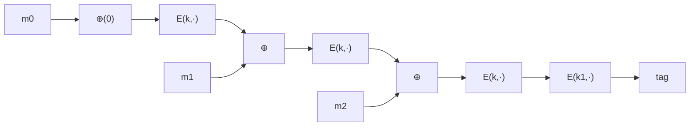

# 03. CBC-MAC と NMAC

> 親: [README](./README.md) ｜ 前: [PRF ベース MAC](./02_prf-based-macs.md) ｜ 次: [パディングと CMAC/PMAC](./04_padding-and-cmac-pmac.md) ｜ 出典: Crypto I ビデオ1 (7:14:54–7:34:12)

1 ブロックの PRF(AES 等)を任意長メッセージ用の MAC に広げる 2 大構成を扱う。鍵は「最後にもう 1 段」独立鍵で処理を挟むこと。これがないと簡単に破れる。

---

## ECBC-MAC(Encrypted CBC-MAC)

まず IV=0 で CBC のように鎖状に暗号化し(=raw CBC)、**最後にもう 1 回、独立した鍵 `k1` で暗号化** する。



```
raw CBC:  a0 = E(k, m0), a1 = E(k, m1 ⊕ a0), …, aL = E(k, mL ⊕ a_{L-1})
ECBC:     tag = E(k1, aL)      ← 独立鍵 k1 でもう 1 段
```

ACH(銀行間決済)で使われる MAC はこの系統。

---

## NMAC(Nested MAC)

**カスケード**構成。前段の出力を **次段の鍵として** 送り込んで連鎖し、最後に独立鍵 `fpad` を付けてもう 1 段:

```
t = F(k, m0)             最初の出力
t = F(t, m1)             出力を鍵にして次のブロックへ（カスケード）
…
t = F(t, mL)
tag = F(t ∥ fpad, k2)    ← 最終段を独立鍵で処理
```

NMAC はブロック暗号で素朴に作ると **毎ブロックで鍵展開(key schedule)が走り** 遅い。そこで実運用ではハッシュ関数を使った **HMAC** に発展させる(→ [ハッシュ関数と MAC](../../../topics/02_cryptography/04_hash-and-mac.md))。

---

## 最終段がないと破れる

**理由: 最終段のない裸の構成は「拡張攻撃」に弱い。**

### カスケード(NMAC の最終段なし)の拡張

裸のカスケードは `tag(m)` がそのまま内部状態。攻撃者は `t = カスケード(k,m)` を得ると、`t` を次段の鍵に使って `tag(m ∥ w) = F(t, w)` を **`k` を知らずに** 計算できる。継続計算が誰にでもできてしまう。

### raw CBC(ECBC の最終段なし)の偽造

1 ブロック `m` のタグ `t = F(k, m)` を得たとする。すると **2 ブロックのメッセージ `(m, t ⊕ m)`** のタグも `t` になる:

```
1 ブロック目: a0 = F(k, m) = t
2 ブロック目: 入力 = (t ⊕ m) ⊕ a0 = (t ⊕ m) ⊕ t = m
              a1 = F(k, m) = t          ← タグは t のまま！
```

攻撃者は 1 回のクエリで新メッセージ `(m, t⊕m)` に対する有効タグ `t` を得た → 偽造成立。最終段 `E(k1,·)` を挟めばこの継続計算ができなくなる。

---

## 安全性境界と誕生日攻撃

`q` 回のクエリに対し、おおよそ:

```
Adv_ECBC ≤ Adv_PRP + q² / |X|        （|X| = ブロック空間、AES なら 2^128）
Adv_NMAC ≤ Adv_PRF + q² / |K|        （|K| = 鍵空間）
```

第 2 項は **誕生日境界**。ブロック空間が有限なので、約 `√|X|` 回のクエリで **2 つの同タグ(内部衝突)メッセージ** が見つかる。攻撃者はこの 2 つに共通の接尾辞を付ければ偽造できる。これが現実的な上限で、AES-ECBC では `q` を **`2^48` 程度** より十分小さく保ち、それを超える前に鍵を替える必要がある。

---

## 問題

**Q1.** raw CBC-MAC への偽造をトレースせよ。`t = F(k,m)`(1 ブロック `m`)を得たとき、タグが `t` になる 2 ブロックメッセージは何か。

<details><summary>解答</summary>

`(m, t ⊕ m)`。1 ブロック目 `a0 = F(k,m) = t`、2 ブロック目の入力は `(t⊕m) ⊕ a0 = m` なので `a1 = F(k,m) = t`。よってタグは `t` のまま、新メッセージに対する有効タグを得たことになり偽造成立。

</details>

**Q2.** 裸のカスケード(NMAC の最終段なし)に対する拡張攻撃を書け。

<details><summary>解答</summary>

`t = カスケード(k, m)` を得ると、`t` を次段の鍵とみなして任意の `w` に対し `tag(m ∥ w) = F(t, w)` を計算できる。鍵 `k` を知らずにメッセージを延長したタグが作れてしまう。最終段を独立鍵で処理すれば内部状態が外に出ず防げる。

</details>

**Q3.** AES-ECBC-MAC で、鍵を替えるべきメッセージ数の目安は。

<details><summary>解答</summary>

誕生日境界 `q²/|X| = q²/2^128` が無視できる範囲、目安として `q` が `2^48` に達する前に鍵を更新する。`q` が `2^64` 付近になると内部衝突が起きて偽造されうる。

</details>

**Q4.** ECBC-MAC の安全性解析で、ブロック暗号の PRP 性(可逆な置換であること)はどこで効くか。

<details><summary>解答</summary>

構成全体で AES を PRP として使い、解析では PRP/PRF スイッチング補題で PRF に置き換える。その置き換えの誤差がちょうど `q²/|X|` の誕生日項として現れ、鍵を替えるべきメッセージ数の根拠になる。

</details>

## 関連リンク

- [ハッシュ関数と MAC](../../../topics/02_cryptography/04_hash-and-mac.md) — NMAC の実用形 HMAC
- [パディングと CMAC/PMAC](./04_padding-and-cmac-pmac.md) — 端数ブロックの扱いと改良版
