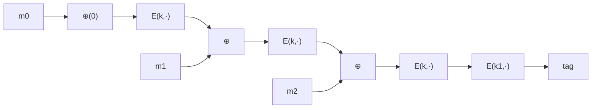

# 03. CBC-MAC と NMAC

> 親: [README](./README.md) ｜ 前: [PRF ベース MAC](./02_prf-based-macs.md) ｜ 次: [パディングと CMAC/PMAC](./04_padding-and-cmac-pmac.md) ｜ 出典: Crypto I ビデオ1 (7:14:54–7:34:12)

**この1ページで分かること**

- 1 ブロックの PRF を任意長に広げる 2 大構成: ECBC-MAC（鎖状）と NMAC（カスケード）
- **最後にもう 1 段、独立鍵で処理する**のが要。ないと拡張攻撃で破れる
- 安全性の限界は誕生日境界 `q²/|X|`。AES-ECBC なら `q < 2^48` で鍵を替える

---

## 2 つの構成

| 構成 | 連鎖のしかた | 最終段 | 主な採用先 |
|---|---|---|---|
| ECBC-MAC | 前段出力を次の入力に XOR | 独立鍵 `k1` で暗号化 | 銀行間決済 ACH |
| NMAC | 前段出力を**次段の鍵**に | `fpad` を付けて 1 段 | HMAC の原型 |

### ECBC-MAC（Encrypted CBC-MAC）

IV=0 で CBC のように鎖状に暗号化し（=raw CBC）、**最後にもう 1 回、独立鍵 `k1` で暗号化**する。



```
raw CBC:  a0 = E(k, m0), a1 = E(k, m1 ⊕ a0), …, aL = E(k, mL ⊕ a_{L-1})
ECBC:     tag = E(k1, aL)      ← 独立鍵 k1 でもう 1 段
```

### NMAC（Nested MAC）

前段の出力を**次段の鍵として**送り込むカスケード構成。

```
t = F(k, m0)             最初の出力
t = F(t, m1)             出力を鍵にして次のブロックへ
…
t = F(t, mL)
tag = F(t ∥ fpad, k2)    ← 最終段を独立鍵で処理
```

ブロック暗号で素朴に作ると**毎ブロックで鍵展開 (key schedule) が走り**遅い。実運用ではハッシュ関数を使った **HMAC** に発展させる（→ [ハッシュ関数と MAC](../../../topics/02_cryptography/04_hash-and-mac.md)）。

---

## 最終段がないと破れる

### カスケード（NMAC の最終段なし）の拡張

裸のカスケードは `tag(m)` がそのまま内部状態。`t = カスケード(k,m)` を得た攻撃者は、`t` を次段の鍵に使って `tag(m ∥ w) = F(t, w)` を **`k` を知らずに**計算できる。

### raw CBC（ECBC の最終段なし）の偽造

1 ブロック `m` のタグ `t = F(k, m)` を得ると、**2 ブロックの `(m, t ⊕ m)`** のタグも `t` になる。

```
1 ブロック目: a0 = F(k, m) = t
2 ブロック目: 入力 = (t ⊕ m) ⊕ a0 = (t ⊕ m) ⊕ t = m
              a1 = F(k, m) = t          ← タグは t のまま！
```

1 回のクエリで新メッセージの有効タグが得られ、偽造成立。最終段 `E(k1,·)` を挟めば内部状態が外に出ず、この継続計算ができなくなる。

---

## 安全性境界と誕生日攻撃

`q` 回のクエリに対し、おおよそ:

```
Adv_ECBC ≤ Adv_PRP + q² / |X|        （|X| = ブロック空間、AES なら 2^128）
Adv_NMAC ≤ Adv_PRF + q² / |K|        （|K| = 鍵空間）
```

第 2 項は**誕生日境界**。ブロック空間が有限なので約 `√|X|` 回のクエリで内部状態が衝突し、同タグの 2 メッセージが見つかる。攻撃者はこの 2 つに共通の接尾辞を付ければ偽造できる。AES-ECBC では `q` を **`2^48` 程度**より十分小さく保ち、超える前に鍵を替える。

---

## 問題

**Q1.** raw CBC-MAC への偽造をトレースせよ。`t = F(k,m)`(1 ブロック `m`)を得たとき、タグが `t` になる 2 ブロックメッセージは何か。

<details><summary>解答</summary>

`(m, t ⊕ m)`。1 ブロック目 `a0 = F(k,m) = t`、2 ブロック目の入力は `(t⊕m) ⊕ a0 = m` なので `a1 = F(k,m) = t`。よってタグは `t` のまま、新メッセージに対する有効タグを得たことになり偽造成立。

</details>

**Q2.** 裸のカスケード(NMAC の最終段なし)に対する拡張攻撃を書け。

<details><summary>解答</summary>

`t = カスケード(k, m)` を得ると、`t` を次段の鍵とみなして任意の `w` に対し `tag(m ∥ w) = F(t, w)` を計算できる。鍵 `k` を知らずにメッセージを延長したタグが作れてしまう。最終段を独立鍵で処理すれば内部状態が外に出ず防げる。

</details>

**Q3.** AES-ECBC-MAC で、鍵を替えるべきメッセージ数の目安は。

<details><summary>解答</summary>

誕生日境界 `q²/|X| = q²/2^128` が無視できる範囲、目安として `q` が `2^48` に達する前に鍵を更新する。`q` が `2^64` 付近になると内部衝突が起きて偽造されうる。

</details>

**Q4.** ECBC-MAC の安全性解析で、ブロック暗号の PRP 性(可逆な置換であること)はどこで効くか。

<details><summary>解答</summary>

構成全体で AES を PRP として使い、解析では PRP/PRF スイッチング補題で PRF に置き換える。その置き換えの誤差がちょうど `q²/|X|` の誕生日項として現れ、鍵を替えるべきメッセージ数の根拠になる。

</details>

## 関連リンク

- [ハッシュ関数と MAC](../../../topics/02_cryptography/04_hash-and-mac.md) — NMAC の実用形 HMAC
- [パディングと CMAC/PMAC](./04_padding-and-cmac-pmac.md) — 端数ブロックの扱いと改良版
