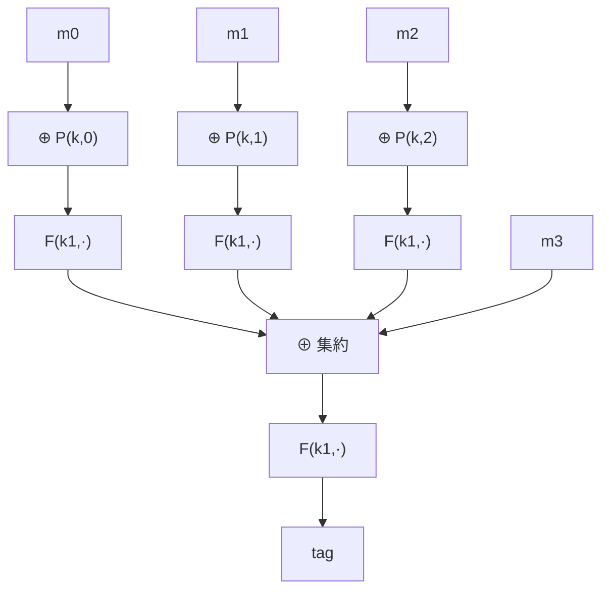

# 04. パディングと CMAC / PMAC

> 親: [README](./README.md) ｜ 前: [CBC-MAC と NMAC](./03_cbc-mac-and-nmac.md) ｜ 次: [ワンタイム MAC と Carter–Wegman](./05_one-time-mac-carter-wegman.md) ｜ 出典: Crypto I ビデオ1 (7:34:12–7:49:47)

**この1ページで分かること**

- パディングは**単射**でなければならない。ゼロ埋めは衝突して偽造される
- CMAC は最終ブロックに秘密値 `k1`/`k2` を XOR し、ダミーブロックも最終暗号化も省く
- PMAC は各ブロックを並列処理。位置ごとのマスクが入れ替え攻撃を防ぐ

CBC-MAC はブロック単位で処理するため、長さがブロックの倍数でないときパディングが要る。

---

## ゼロ埋めはダメ

```
pad(m)      = m ∥ 000…0
pad(m ∥ 0)  = m ∥ 0 ∥ 00…0   ← 同じビット列になりうる
```

`m` と `m∥0` のパディング結果が一致すると両者のタグも一致し、一方のタグを他方に流用できる。小切手の金額末尾に `0` を足して「10」→「100」に改竄する類の攻撃を許す。**パディングは単射（可逆）でなければならない。**

---

## ISO パディング: `100…0` を付ける

末尾に `1` を 1 ビット、続けて `0` を必要数だけ付ける。復号側は末尾から最初の `1` を探せば境界が分かる。

**平文がちょうどブロック倍数でも、ダミーブロック `1000…0` を必ず 1 個追加する。** さもないと `m`（ちょうど倍数）と `m ∥ 10…0` のパディングが衝突しうる。決定的なパディングでは「ブロックを 1 個増やす」場合が必ず残る（鳩の巣原理）。この余分な 1 ブロックが暗号化 1 回分のオーバーヘッドになる。

---

## CMAC（NIST 標準）— ダミーブロックも最終暗号化も不要

鍵を 3 つ `(k, k1, k2)` 使い（`k1,k2` は `k` から導出）、**最終ブロックの扱いだけを変える**。

| 最後のブロック | 処理 |
|---|---|
| 端数（パディングあり） | 最終ブロックに `⊕ k1` |
| ちょうど 1 ブロック分 | 最終ブロックに `⊕ k2` |
| それ以外 | raw CBC と同じ |

攻撃者は最終ブロックに入る値（`k1` か `k2` が XOR された値）を**知らない**ため、[前ファイル](./03_cbc-mac-and-nmac.md)の拡張攻撃を組み立てられない。結果として**最後の独立鍵による暗号化もダミーブロックも不要**になり、ISO パディングより 1 ブロック分速い。

---

## PMAC（並列 MAC）

CBC-MAC は鎖状で並列化できない。PMAC は各ブロックを独立に処理してから XOR で束ねる。



- 各ブロック `i` に**マスク `P(k,i)`**（有限体上の乗算などで安く計算）を XOR してから `F(k1,·)`。
- 全出力を XOR で集約し、最後にもう 1 回 `F(k1,·)` を通してタグにする。
- **マスクがないとブロック入れ替え攻撃**が成立する。XOR は可換なので `P` がなければ `m0` と `m1` を入れ替えても集約値が変わらず、タグが同じ → 偽造。位置ごとに違う `P(k,i)` が各ブロックの寄与を区別する。
- 最終ブロックは CMAC 風の処理で、ダミーブロックは不要。
- 安全性境界: `Adv_PMAC ≤ Adv_PRF + 2q²L / |X|`（`L` = 最大ブロック数）。

### インクリメンタル性

`F` が可逆（PRP）なら、**1 ブロックだけ変えたときタグを O(1) で更新**できる。旧タグを復号して集約値を取り出し、旧ブロックの寄与を XOR で除き、新ブロックの寄与を足して再暗号化する。

```
tag_new = F(k1,  F⁻¹(k1, tag_old)  ⊕  F(k1, m[i]⊕P(k,i))  ⊕  F(k1, m'[i]⊕P(k,i)) )
```

全ブロックの再計算が要らないので、巨大ファイルの一部更新に強い。

---

## 問題

**Q1.** ゼロ埋めパディングの MAC に対する偽造を示せ。

<details><summary>解答</summary>

`m` のタグ `t = S(k,m)` を得る。ゼロ埋めでは `pad(m) = pad(m∥0)` となりうるので、同じ `t` が `m∥0` に対しても有効。攻撃者は `(m∥0, t)` を出力して偽造成立。パディングが単射でないのが原因。

</details>

**Q2.** ISO パディングで、平文がちょうどブロック倍数のときダミーブロックが要るのはなぜか。

<details><summary>解答</summary>

ダミーがないと、ちょうど倍数の `m` と、末尾に `10…0` を含む別メッセージのパディング結果が衝突しうる。単射性を保つため、倍数のときも必ず `1000…0` の 1 ブロックを追加して境界を一意にする。

</details>

**Q3.** CMAC が最終暗号化なしで拡張攻撃を防げる直観は。

<details><summary>解答</summary>

最終ブロックに `k1`(端数)または `k2`(ちょうど)を XOR する。攻撃者はこの秘密値を知らないため、最終ブロックに入る実際の値を制御できず、raw CBC の継続計算(拡張)を組み立てられない。だから最後の独立鍵暗号化もダミーブロックも省ける。

</details>

**Q4.** PMAC で 1 ブロック `m[i]→m'[i]` を変えたときのタグ更新式を書け。前提は。

<details><summary>解答</summary>

前提は `F` が可逆(PRP)であること。`tag_new = F(k1, F⁻¹(k1, tag_old) ⊕ F(k1, m[i]⊕P(k,i)) ⊕ F(k1, m'[i]⊕P(k,i)))`。旧タグから集約値を復元し、旧寄与を除いて新寄与を足し、再暗号化する O(1) 更新。

</details>

## 関連リンク

- [CBC-MAC と NMAC](./03_cbc-mac-and-nmac.md) — CMAC/PMAC が改良した元の構成
- [ワンタイム MAC と Carter–Wegman](./05_one-time-mac-carter-wegman.md) — 1 メッセージ限定の高速 MAC
