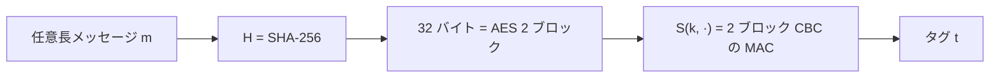

# 01. 衝突耐性の導入

> 親: [README](./README.md) ｜ 前: [README](./README.md) ｜ 次: [誕生日攻撃](./02_birthday-attack.md) ｜ 出典: Crypto I ビデオ1 (7:58:12–8:09:03)

**この1ページで分かること**

- 衝突は必ず存在する。「見つけられない」ことが衝突耐性
- 衝突耐性ハッシュを前置すると、短い MAC が任意長 MAC になる
- 鍵なしでもファイル完全性を守れるが、読み取り専用領域が要る

ハッシュ関数は任意長の入力を固定長に潰すので、衝突は必ず起こる。それでも安全でいられるのは、衝突が「存在する」ことと「見つけられる」ことが別物だからである。

---

## 衝突と衝突耐性の定義

ハッシュ関数 `H : M → T`。定義域 `M`（メッセージ空間）は値域 `T`（ダイジェスト空間）よりはるかに大きい（`|M| ≫ |T|`）。

| 用語 | 定義 |
|---|---|
| **衝突 (collision)** | `H(m0) = H(m1)` かつ `m0 ≠ m1` となる組 `(m0, m1)` |
| **衝突耐性 (collision resistance)** | どんな効率的アルゴリズムも、衝突を 1 組でも見つける確率が無視できるほど小さい |

`|M| ≫ |T|` なので、鳩の巣原理（箱より鳩が多ければ必ず同じ箱に 2 羽入る）により衝突は大量に存在する。それでも性質として意味を持つのは、**存在**と**計算で 1 組取り出せること**が別だから。

> 例: SHA-256 は出力 256 bit（32 バイト）。`2^256` 通りしかないので衝突は存在するが、1 組も見つかっていない。

---

## 応用1: 小さい MAC を大きい MAC に拡張する

短いメッセージ用の MAC `S(k, ·)`（検証 `V`）に、衝突耐性ハッシュ `H` を前置する。

```
S_big(k, m)    = S(k, H(m))
V_big(k, m, t) = V(k, H(m), t)
```



**具体構成**: AES 1 ブロックは 16 バイト。SHA-256 の出力 32 バイトは AES 2 ブロック分なので、2 ブロック CBC の MAC `S` に `H` を前置すればギガバイト級のメッセージにも使える。

**なぜ `H` の衝突耐性が要るか（帰着）**: 攻撃者が衝突 `H(m0) = H(m1)`（`m0 ≠ m1`）を持つと:

```
1) m0 のタグを 1 回だけ問い合わせる:  t = S_big(k, m0) = S(k, H(m0))
2) H(m0) = H(m1) なので            t = S(k, H(m1))  でもある
3) (m1, t) を出力                  → 1 回の選択メッセージ攻撃で存在的偽造
```

`H` の衝突はそのまま `S_big` の偽造になる。`S_big` の安全性は「`S` が安全」かつ「`H` が衝突耐性」の**両方**に依存する。

---

## 応用2: 鍵なしのファイル完全性

要点は**ハッシュ値を読み取り専用の場所に置く**こと。

- 配布するファイル `F1, …, Fn` の `H(Fi)` を、攻撃者が書き換えられない公開領域に置く
- 利用者はダウンロード後に自分で再ハッシュし、公開値と突き合わせる
- 実例: Linux ディストリのパッケージ配布。ミラーは信用せず、ハッシュ一覧だけ信頼できる経路で取る

| 方式 | 必要なもの | 不要なもの |
|---|---|---|
| MAC | 送受信者が共有する**秘密鍵** | 読み取り専用領域（タグ自体が改ざんを検知） |
| ハッシュ公開 | ハッシュを置く**読み取り専用領域** | 秘密鍵 |

「鍵も読み取り専用領域も要らない完全性」は、後の**デジタル署名**で実現する（公開鍵で誰でも検証できる）。

---

## 問題

**Q1.** `H` が衝突耐性でないとき、`S_big(k,m) = S(k, H(m))` をたった 1 回の選択メッセージ攻撃で偽造する手順を述べよ。

<details><summary>解答</summary>

衝突 `H(m0)=H(m1)`(`m0≠m1`)を求め、`m0` のタグ `t = S_big(k,m0)` を 1 回だけ問い合わせる。`H(m0)=H(m1)` より `t = S(k,H(m1))` でもあるので、`(m1, t)` が有効な偽造になる。

</details>

**Q2.** 「MAC による完全性」と「ハッシュ公開による完全性」で、それぞれ何を前提にしているか(必要なもの)を対比せよ。

<details><summary>解答</summary>

MAC は送受信者が共有する**秘密鍵**を前提にする(領域は改ざん可でよい)。ハッシュ公開は鍵不要だが、ハッシュ値を置く**読み取り専用の公開領域**を前提にする(攻撃者がハッシュを書き換えられない)。

</details>

**Q3.** `|M| ≫ |T|` なら衝突は必ず存在するのに、なぜ「衝突耐性」という性質が意味を持つのか。

<details><summary>解答</summary>

鳩の巣原理により衝突の**存在**は保証されるが、衝突耐性が要求するのは「効率的アルゴリズムが具体的な衝突を 1 組でも**見つけられない**」こと。存在することと計算で取り出せることは別問題なので、性質として意味を持つ。

</details>

**Q4.** SHA-256 の出力長は何 bit・何バイトか。また AES 何ブロック分に相当するか。

<details><summary>解答</summary>

256 bit = 32 バイト。AES のブロックは 16 バイトなので、SHA-256 出力は AES 2 ブロック分に相当する(だから 2 ブロック CBC の MAC と噛み合う)。

</details>

## 関連リンク

- [誕生日攻撃](./02_birthday-attack.md) — 衝突を実際に見つける汎用攻撃と必要な出力長
- [ハッシュ関数と MAC(topics)](../../../topics/02_cryptography/04_hash-and-mac.md) — 原像/第2原像/衝突の3耐性・HMAC・長さ拡張攻撃
