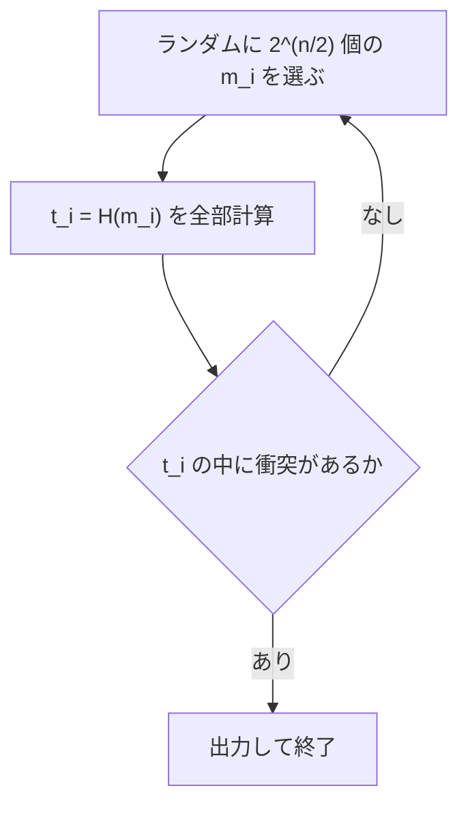

# 03. 標準ハッシュ関数と SHA-1

> 親: [README](./README.md) ｜ 前: [誕生日攻撃](./02_birthday-attack.md) ｜ 次: [Merkle–Damgård](./04_merkle-damgard.md) ｜ 出典: Crypto I ビデオ2 (0:00:00–0:06:07)

**この1ページで分かること**

- 誕生日攻撃の実行時間は `≈ 2 × 2^(n/2)` 回（1 世代 `2^(n/2)` 回 × 期待 2 世代）
- 衝突確率は `√B` 付近で急に立ち上がる**閾値現象**なので、`2^(n/2)` という一言が見積もりに使える
- SHA-1 は汎用攻撃 `2^80` に加え専用攻撃 `2^51` があり、新規には使わない

前ファイルの「`1.2√B` 個で 5 割超」を攻撃アルゴリズムの計算量として確定させ、その数字が標準ハッシュの出力長をどう決めるかを見る。

---

## 攻撃コストの確定

誕生日攻撃は次の **1 世代**を単位に回る。



`t_i` たちは一様分布とは限らないが**互いに独立**。一様から外れた分布ではむしろ少ないサンプルで衝突するので、`1.2·2^(n/2)` は安全側の上界であり、出力分布の形を気にしなくてよい。

1 世代の成功確率が約 1/2 なので、期待世代数は約 2:

```
誕生日攻撃の実行時間 ≈ 2 × 2^(n/2) = O(2^(n/2)) 回のハッシュ評価
```

**`n` bit 出力のハッシュには、設計によらず必ず `2^(n/2)` 時間の攻撃が存在する**。出力長が決める天井である。

> `2^(n/2)` 個のタグを保持するので**空間も** `2^(n/2)` 必要。実務では記憶容量が先に律速することもあるが、安全性の見積もりは保守的に時間だけで行う。

---

## 閾値としてのふるまい

値域 `B = 10^6` で数値を取ると、`√B = 1000` 付近を境に確率が急に立ち上がる。

| サンプル数 | `B = 10^6` での実数 | 衝突確率 |
|---|---|---|
| `√B` | 1,000 | 約 0.40 |
| `1.2√B` | 1,200 | 約 0.50 |
| `2√B` | 2,000 | 約 0.90 |

`√B` を下回れば急速に 0、上回れば急速に 1。境界が鋭いので「`2^(n/2)` で衝突する」という一言が実務の見積もりとして使える。

---

## 標準ハッシュ関数

| 関数 | 出力長 | 誕生日攻撃の計算量 | 位置づけ |
|---|---|---|---|
| SHA-1 | 160 bit | `2^80` | 米国連邦標準。新規利用は非推奨 |
| SHA-256 | 256 bit | `2^128` | SHA-2 ファミリ。現在の実務標準 |
| SHA-512 | 512 bit | `2^256` | SHA-2 ファミリ。より保守的 |
| Whirlpool | 512 bit | `2^256` | AES 設計者の手による ISO 標準 |

出力を長くするほど安全側だが**その分だけ遅い**。安全性の余裕はスループットで支払う。SHA-512 ではなく SHA-256 が既定なのは、`2^128` で十分に実行不能と判断されているから。

---

## SHA-1 を新規に使わない理由

講義の時点で SHA-1 の衝突は**未発見**だった。それでも「新規プロジェクトでは SHA-256 か SHA-512 を使え」と勧告された理由は 2 つ。

| 理由 | 内容 |
|---|---|
| 汎用攻撃の余裕がない | 160 bit なので `2^80`。資金と時間を積めば射程に入る |
| 専用攻撃が汎用攻撃を下回る | 内部構造を突いた衝突探索が `2^51` 程度で走ると知られていた |

> **講義後の追記**: この予測は的中した。2017 年 2 月に SHA-1 の実際の衝突が公表され(SHAttered、計算量は約 `2^63.1`)、SHA-1 は衝突耐性ハッシュ関数としては完全に退役した。ただし**衝突耐性が壊れても HMAC の中では別の話**になる。その理由は [06. HMAC](./06_hmac.md) で扱う。

> **講義後の追記(SHA-3)**: 本コースの当時は SHA-2 ファミリが唯一の連邦標準だったが、その後 2015 年に SHA-3(Keccak)が標準化された。重要なのは SHA-3 が **SHA-1/SHA-2 とは構成そのものが違う**点である。SHA-1/SHA-2 は次ファイルで扱う Merkle–Damgård 構成だが、SHA-3 はスポンジ構成という別系統であり、Merkle–Damgård に固有の弱点(長さ拡張攻撃)を構造的に持たない。SHA-2 に致命的な攻撃が出たときの保険として、系統の異なる標準を並立させる発想である。

---

## 問題

**Q1.** 誕生日攻撃の実行時間が `2^(n/2)` になる理由を、「1 世代のコスト」と「期待世代数」に分けて述べよ。

<details><summary>解答</summary>

1 世代は `2^(n/2)` 個のメッセージをハッシュするので、コストは `2^(n/2)` 回の評価。1 世代で衝突が見つかる確率が約 1/2 なので、成功までの期待世代数は約 2。よって全体は `2 × 2^(n/2) = O(2^(n/2))`。

</details>

**Q2.** ハッシュ出力の分布が一様でない場合、`1.2·2^(n/2)` という見積もりはどうなるか。

<details><summary>解答</summary>

上界としてそのまま成り立つ。一様から外れた分布では衝突がより起きやすくなるため、必要なサンプル数は一様の場合以下になる。したがって攻撃者にとっては有利に、防御側の見積もりとしては安全側に働く。前提として必要なのはサンプルの独立性だけである。

</details>

**Q3.** 講義の時点で SHA-1 の衝突は未発見だった。それでも新規利用が非推奨とされた理由を 2 つ挙げよ。

<details><summary>解答</summary>

(1) 出力 160 bit なので誕生日攻撃が `2^80` であり、資源を積めば到達しうる水準だったこと。(2) SHA-1 の構造を突いた理論的な衝突探索が `2^51` 程度で走ることが知られており、汎用攻撃よりはるかに速く、実際の衝突発見が時間の問題だったこと。

</details>

**Q4.** 128 bit 出力のハッシュ関数を新規に設計してはいけない理由を、数字を挙げて述べよ。また 128 bit 相当の強度が欲しい場合の出力長は。

<details><summary>解答</summary>

誕生日攻撃が `2^(128/2) = 2^64` で済み、現代の計算資源で到達可能だから。衝突耐性には目標強度の **2 倍**の出力長が要るので、128 bit 相当の強度を狙うなら 256 bit 出力にする。これが SHA-256 が標準である理由。

</details>

## 関連リンク

- [誕生日攻撃](./02_birthday-attack.md) — `1.2√B` の導出と確率評価(本ファイルはその結論だけを使う)
- [Merkle–Damgård](./04_merkle-damgard.md) — SHA-1/SHA-2 が共有する構成。ここから作り方の話に入る
- [06. HMAC](./06_hmac.md) — SHA-1 の衝突耐性が壊れても HMAC が安全でいられる理由
- [ハッシュ関数と MAC(topics)](../../../topics/02_cryptography/04_hash-and-mac.md) — 原像/第2原像/衝突の3耐性と出力長の関係
