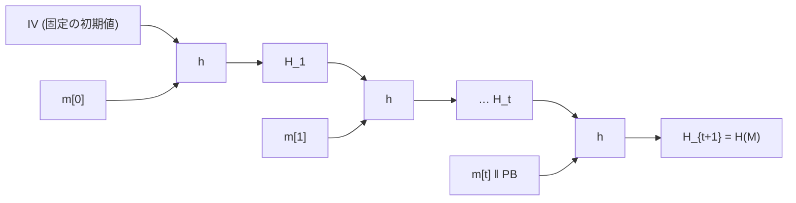

# 04. Merkle–Damgård

> 親: [README](./README.md) ｜ 前: [標準ハッシュ関数と SHA-1](./03_hash-standards.md) ｜ 次: [圧縮関数の構成](./05_compression-functions.md) ｜ 出典: Crypto I ビデオ2 (0:06:07–0:17:50)

**この1ページで分かること**

- 圧縮関数 `h : T × X → T` を鎖状に繋ぐと任意長ハッシュになる（Merkle–Damgård 構成）
- パディングブロックに**メッセージ長**を入れることが衝突耐性の証明の要
- 定理: `h` が衝突耐性なら `H` も衝突耐性。対偶で証明する

衝突耐性ハッシュ作りは 2 段に分かれる。本ファイルは前半「短い入力の関数から任意長入力の関数を組み上げる」。実在するハッシュは事実上すべてこの型に従う。

---

## 圧縮関数から任意長ハッシュへ

出発点は入力サイズが固定の**圧縮関数** (compression function):

```
h : T × X → T
    直前のチェイン変数 × メッセージブロック 1 個 → 次のチェイン変数
```

任意長メッセージ `M = m[0] ‖ m[1] ‖ … ‖ m[t]` を鎖状に処理する。



| 記号 | 意味 |
|---|---|
| `H_0 = IV` | 標準に埋め込まれた**固定の初期値**。秘密ではない |
| `H_i = h(H_{i-1}, m[i-1])` | **チェイン変数** (chaining variable) |
| `PB` | 最終ブロックにだけ連結する**パディングブロック** |

圧縮関数 `h : T × X → T` から、最大 `L` ブロックの可変長入力を扱うハッシュ `H : X^{≤L} → T` が得られる。

---

## パディングブロックと長さの符号化

```
PB = 1000…0 ‖ (メッセージ長を 64 bit で符号化)
     ↑ 実メッセージの終端    ↑ ここが証明の要
```

決定的に重要なのは**メッセージ長のフィールド**で、SHA ファミリでは 64 bit 固定。よって **SHA ファミリの最大メッセージ長は `2^64 − 1` bit**。

最終ブロックに `PB` が入らない場合（長さがちょうどブロック長の倍数など）は、**ダミーブロックを 1 つ足して**そこに `PB` を置く。

---

## 定理: 圧縮関数が衝突耐性なら MD も衝突耐性

> **定理**: 圧縮関数 `h` が衝突耐性ならば、Merkle–Damgård で得られる `H` も衝突耐性である。

この定理により、大きなハッシュを作る仕事が**圧縮関数を作る仕事だけ**に帰着する。

**証明(対偶)**: 「`H` の衝突を作れるなら `h` の衝突を作れる」を示す。

`H(M) = H(M')`、`M ≠ M'` が与えられたとする。チェイン変数に名前を付ける（長さが同じとは限らないので `t` と `r`）。

```
M  のチェイン: H_0 (= IV), H_1, …, H_t,  H_{t+1} = H(M)     ← t ブロック
M' のチェイン: H'_0 (= IV), H'_1, …, H'_r, H'_{r+1} = H(M')  ← r ブロック

H_{t+1}  = h( H_t , m[t] ‖ PB )
H'_{r+1} = h( H'_r, m'[r] ‖ PB' )      ← 衝突の仮定より両者は等しい
```

**ステップ 1**: 次の 3 つのうち**どれか 1 つでも成り立てば**、`h` への異なる 2 入力が同じ出力を出したことになり `h` の衝突が得られて終わり。

```
H_t ≠ H'_r    または    m[t] ≠ m'[r]    または    PB ≠ PB'
```

**ステップ 2**: 続けるのは 3 つすべて等しい場合だけ。ここで `PB = PB'` が効く。パディングブロックにはメッセージ長が入っているので:

```
PB = PB'  ⇒  |M| = |M'|  ⇒  t = r
```

**長さの符号化がなければこの一歩が踏めない。**以降は `r` を `t` と書く。

**ステップ 3**: `H_t = H'_t` なので 1 つ手前に同じ議論を適用する。

```
H_t  = h( H_{t-1} , m[t-1] )
H'_t = h( H'_{t-1}, m'[t-1] )        ← 両者は等しい
```

`H_{t-1} ≠ H'_{t-1}` または `m[t-1] ≠ m'[t-1]` なら `h` の衝突で終わり。両方等しければさらに 1 つ手前へ。

**ステップ 4**: 先頭まで繰り返す。結末は 2 つ。

| 結末 | 帰結 |
|---|---|
| 途中で `h` の衝突が見つかる | 目的達成 |
| 最後まで見つからない | 全 `i` で `m[i] = m'[i]`、長さも等しい（ステップ 2）⇒ `M = M'`。仮定 `M ≠ M'` に矛盾 |

結末 2 はありえないので必ず結末 1。`H` の衝突から常に `h` の衝突が取り出せる。∎

---

## 問題

**Q1.** パディングブロックからメッセージ長のフィールドを取り除くと、上の証明はどこで破綻するか。

<details><summary>解答</summary>

ステップ 2。`PB = PB'` から `|M| = |M'|`(したがって `t = r`)を導く一歩が踏めなくなる。ブロック数が揃わないと、1 ブロックずつ遡って対応させる議論が成立せず、最後の「全ブロック一致なら `M = M'`」という矛盾も導けない。

</details>

**Q2.** Merkle–Damgård の証明を「対偶」で行う理由を述べよ。示している命題を 2 通りの言い方で書け。

<details><summary>解答</summary>

示したいのは「`h` が衝突耐性 ⇒ `H` が衝突耐性」だが、「衝突耐性」は「効率的に衝突を見つけられない」という否定形の性質なので直接扱いにくい。対偶をとると「`H` の衝突を見つけられる ⇒ `h` の衝突を見つけられる」という構成的な主張になり、実際に `h` の衝突を作る手続きを書けばよくなる。

</details>

**Q3.** メッセージ長がちょうどブロック長の倍数だった場合、パディングブロックはどこに置かれるか。

<details><summary>解答</summary>

最終ブロックに `PB` を入れる隙間がないので、ダミーのブロックをもう 1 つ追加してそこに `PB` を置く。`1000…0` の区切りもその追加ブロックの先頭に合わせて配置する。

</details>

**Q4.** チェイン変数 `H_i` は秘密の値か。IV は秘密か。それぞれ答え、その帰結として何が起きるかを述べよ。

<details><summary>解答</summary>

どちらも秘密ではない。IV は標準に埋め込まれた公開の定数であり、チェイン変数も鍵を持たない関数の中間値にすぎない。さらに `H(M)` として出力される値は最終チェイン変数そのものなので、**タグを見た人は内部状態を知ったことになる**。これが次々ファイルで扱う長さ拡張攻撃の根本原因である。→ [06. HMAC](./06_hmac.md)

</details>

## 関連リンク

- [圧縮関数の構成](./05_compression-functions.md) — 残された後半。ブロック暗号から `h` そのものを作る
- [06. HMAC](./06_hmac.md) — MD 構成の副作用(長さ拡張)と、その正しい回避法
- [標準ハッシュ関数と SHA-1](./03_hash-standards.md) — SHA-3 が MD ではなくスポンジ構成である理由
- [ブロック暗号からのハッシュ(topics)](../../../topics/02_cryptography/02_symmetric-crypto/05_hashing-from-block-ciphers.md) — MD と圧縮関数の全体像
