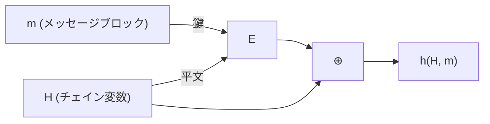

# 05. 圧縮関数の構成

> 親: [README](./README.md) ｜ 前: [Merkle–Damgård](./04_merkle-damgard.md) ｜ 次: [HMAC](./06_hmac.md) ｜ 出典: Crypto I ビデオ2 (0:17:50–0:25:42)

**この1ページで分かること**

- Davies–Meyer `h(H,m) = E(m,H) ⊕ H` はブロック暗号から圧縮関数を作る標準形
- 理想暗号なら衝突発見に `2^(n/2)` 回必要 = 誕生日攻撃が最善（達成可能な限界まで安全）
- `⊕ H` を落とすと復号 `D` で衝突が作れる。SHA-256 = MD + Davies–Meyer + SHACAL-2

残るのは圧縮関数そのものを作ること。手元のブロック暗号を流用できるが、組み方を間違えると即座に壊れる。

---

## Davies–Meyer 構成

`n` bit ブロックのブロック暗号 `E` から:

```
h(H, m) = E(m, H) ⊕ H       鍵 = メッセージブロック、平文 = 直前のチェイン変数
```



直観に反するのは、**攻撃者が完全に制御できる `m` を鍵として使う**点。それでも達成可能な限界まで安全である。

> **定理**: `E` が理想暗号(`|K|` 個のランダムな置換 `{0,1}^n → {0,1}^n` の集まり)ならば、`h(H,m) = E(m,H) ⊕ H` の衝突を見つけるには `E`/`D` の評価が `2^(n/2)` 回必要である。

出力が `n` bit なので[誕生日攻撃](./02_birthday-attack.md)により `2^(n/2)` の攻撃は必ず存在する。定理はその逆、**それより速い攻撃は存在しない**と言っている。SHA ファミリがこぞって Davies–Meyer を使う理由。

---

## `⊕ H` を落とすと壊れる

```
h'(H, m) = E(m, H)        ← ⊕ H を落としただけ
```

これは衝突耐性ではない。`H`, `m`, `m'`（`m ≠ m'`）を**好きに**選んだうえで、衝突相手の `H'` を作れる。

```
求めたいもの:  E(m', H') = E(m, H)

両辺に D(m', ·) を適用:
  D(m', E(m', H')) = D(m', E(m, H))
  ↓ 左辺は暗号化と復号が打ち消し合う
  H' = D(m', E(m, H))
```

`(H, m)` と `(H', m')` が同じ値に写る。鍵 `m'` を攻撃者が選べるので**復号 `D` が使い放題**。`⊕ H` はこの打ち消しを阻止するためにある。

---

## 他の安全な構成

| 構成 | 式 | 鍵 | 平文 | 採用 |
|---|---|---|---|---|
| Davies–Meyer | `E(m, H) ⊕ H` | `m` | `H` | SHA ファミリ |
| Miyaguchi–Preneel | `E(H, m) ⊕ H ⊕ m` | `H` | `m` | Whirlpool |

鍵と平文の役割が逆になっている点に注意。`H` と `m` の割り当てと XOR の組み合わせは 64 通りほど考えられるが、**衝突耐性が示せるのは 12 通りだけ**。残りは前節のように壊れる。思いつきの割り当てを試さず、既知の安全な構成から選ぶ。

---

## SHA-256 の全体像

```
SHA-256 = Merkle–Damgård  +  Davies–Meyer  +  ブロック暗号 SHACAL-2
```

| SHACAL-2 の要素 | サイズ | Davies–Meyer での役割 | 帰結 |
|---|---|---|---|
| 鍵 | 512 bit | メッセージブロック `m` | 入力を 512 bit ずつ処理 |
| ブロック | 256 bit | チェイン変数 `H_{i-1}` | 出力が 256 bit |

SHACAL-2 の内部設計を除けば、SHA-256 の仕組みはこれで全部である。

---

## 証明可能な圧縮関数(数論から作る)

数論の困難問題を土台にすると、**衝突を見つけられたら困難問題が解けてしまう**という形で衝突耐性を証明できる。

```
巨大な素数 p を選ぶ（2000 bit 程度、10 進で約 600 桁）
1 ≤ u, v ≤ p をランダムに選ぶ

h(H, m) = u^H · v^m  mod p      （2 つの数を 1 つに潰すので圧縮比 2:1）
```

> **事実**: この `h` の衝突を見つけられるなら、**離散対数問題**を解ける。

離散対数が困難だと信じられている以上、証明付きで衝突耐性。それでも SHA-256 に採用されないのは**遅すぎる**から。長いメッセージ 1 本に MAC や署名を付けるだけで時間に余裕がある状況なら選択肢になる。

証明と離散対数問題の定義は数論の回で扱う（→ [11. 数論](../11_number-theory/README.md)）。

---

## 問題

**Q1.** `h'(H,m) = E(m,H)`(Davies–Meyer から `⊕H` を落としたもの)の衝突を作る手順を書け。`H`, `m`, `m'` は任意に選んでよい。

<details><summary>解答</summary>

`m ≠ m'` となるように `H`, `m`, `m'` を任意に選び、`H' = D(m', E(m, H))` を計算する。すると `E(m', H') = E(m', D(m', E(m,H))) = E(m, H)` となるので、`(H, m)` と `(H', m')` が `h'` の衝突になる。鍵を攻撃者が選べるため復号 `D` が自由に使えることが原因。

</details>

**Q2.** Davies–Meyer の定理「衝突発見に `2^(n/2)` 回の評価が必要」は、何を主張していて何を主張していないか。

<details><summary>解答</summary>

主張しているのは「`2^(n/2)` より速い攻撃は存在しない」という**下界**。`2^(n/2)` の攻撃が存在すること自体は誕生日攻撃から自明であり、定理の内容ではない。両者を合わせると Davies–Meyer は達成可能な限界まで安全、すなわち汎用攻撃が最善だということになる。なお前提として `E` を理想暗号とみなすモデルを置いている。

</details>

**Q3.** SHA-256 が入力を 512 bit ずつ処理し、出力が 256 bit である理由を、SHACAL-2 のパラメータから説明せよ。

<details><summary>解答</summary>

Davies–Meyer ではメッセージブロックがブロック暗号の**鍵**になる。SHACAL-2 の鍵は 512 bit なので、1 回の圧縮で処理できるメッセージは 512 bit。一方チェイン変数はブロック暗号の**平文/暗号文**にあたり、SHACAL-2 のブロックは 256 bit。最終チェイン変数がそのまま出力なので、ハッシュ出力は 256 bit になる。

</details>

**Q4.** 離散対数ベースの圧縮関数は証明付きで衝突耐性なのに、なぜ標準ハッシュ関数に採用されないのか。どんな場面なら選択肢になるか。

<details><summary>解答</summary>

巨大な素数を法とする冪乗計算が必要で、ブロック暗号ベースの構成に比べて桁違いに遅いから。汎用ハッシュとしては実用にならない。長いメッセージ 1 本に MAC や署名を付けるだけで時間的な余裕がある、といった限定的な用途なら、証明付きの衝突耐性と引き換えに遅さを受け入れる選択はありうる。

</details>

## 関連リンク

- [Merkle–Damgård](./04_merkle-damgard.md) — 本ファイルの `h` を任意長ハッシュに引き上げる構成
- [01. ブロック暗号と PRF/PRP](../04_block-ciphers/01_block-cipher-and-prf-prp.md) — 素材となるブロック暗号の抽象化
- [11. 数論](../11_number-theory/README.md) — 離散対数問題の定義と、衝突⇒離散対数の証明
- [ブロック暗号からのハッシュ(topics)](../../../topics/02_cryptography/02_symmetric-crypto/05_hashing-from-block-ciphers.md) — Davies–Meyer/Miyaguchi–Preneel と PGV の 12 構成
