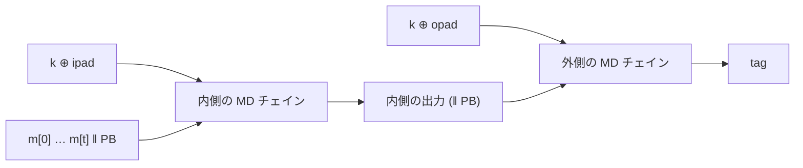

# 06. HMAC

> 親: [README](./README.md) ｜ 前: [圧縮関数の構成](./05_compression-functions.md) ｜ 次: [タイミング攻撃](./07_timing-attacks.md) ｜ 出典: Crypto I ビデオ2 (0:25:42–0:32:53)

**この1ページで分かること**

- `H(k ‖ m)` は**長さ拡張攻撃**で破れる。MD ハッシュの出力 = 内部状態だから
- HMAC = `H((k ⊕ opad) ‖ H((k ⊕ ipad) ‖ m))`。NMAC をハッシュ関数だけで実装した形
- HMAC の安全性は圧縮関数の PRF 性だけに依存。SHA-1 の衝突耐性が壊れても HMAC-SHA1 は直ちに危険ではない

手元の大きなハッシュ関数を、PRF を経由せず**そのまま MAC に転用**できないか。素直な方法は完全に破れ、正しい方法が HMAC である。

---

## 素朴な方法は壊れる: 長さ拡張攻撃

```
S(k, m) = H(k ‖ m)        ← 完全に安全でない
```

原因は Merkle–Damgård の構造。[前々ファイル](./04_merkle-damgard.md)のとおり**MD ハッシュの出力は最終チェイン変数そのもの**なので、タグを受け取った攻撃者は内部状態を丸ごと手に入れている。

```
攻撃者が知るもの:
  t = H(k ‖ m)                    ← MD チェインの最終チェイン変数

攻撃者の計算（鍵 k は不要）:
  t' = h( t , w ‖ PB' )           ← 圧縮関数をもう 1 回適用するだけ

得られるもの:
  t' = H( k ‖ m ‖ PB ‖ w )        ← 新しいメッセージに対する正しいタグ
```

問い合わせていないメッセージ `m ‖ PB ‖ w` の有効なタグが、鍵なしで得られた。存在的偽造そのもの。

> 講義の警告: 「この誤りを犯した製品は数えきれない。`H(k ‖ m)` は絶対に使ってはならない」。

---

## HMAC の構成

```
HMAC(k, m) = H( (k ⊕ opad) ‖ H( (k ⊕ ipad) ‖ m ) )
```

| 要素 | 内容 |
|---|---|
| `ipad` / `opad` | 標準で固定された公開定数。`0x36` / `0x5C` をブロック長ぶん繰り返したもの |
| `k ⊕ ipad` | 鍵を MD の 1 ブロック（SHA-256 なら 512 bit）に詰めて XOR |
| 内側の出力 | SHA-256 なら 256 bit。この前に `k ⊕ opad` を置いてもう一度ハッシュ |



---

## NMAC との対応

圧縮関数 `h` を**メッセージブロック側の入力を鍵とする PRF**とみなすと、2 つの値が現れる。

```
k1 = h(IV, k ⊕ ipad)      ← 固定値 IV に PRF を適用した擬似ランダム鍵
k2 = h(IV, k ⊕ opad)      ← 同上、別の定数から
```

`k1`, `k2` を鍵とみなせば、残りはカスケードして最後に独立鍵でもう 1 段という [NMAC](../06_message-integrity/03_cbc-mac-and-nmac.md) の骨格そのもの。**HMAC は NMAC をハッシュ関数だけで書き直したもの**。

| | NMAC | HMAC |
|---|---|---|
| `k1`, `k2` | 独立な 2 鍵 | 同じ `k` から定数違いで導出（**関連鍵**） |
| 必要な仮定 | `h` が PRF | `h` が**関連鍵に対しても** PRF |

この仮定を置けば NMAC とほぼ同じ解析が通り、HMAC は安全な MAC になる。

---

## 安全性の境界

NMAC と同じで、MAC したメッセージ数がタグ空間の平方根に達しなければ鍵を替えなくてよい。

| 構成 | タグ空間 | 鍵を替えるべき目安 |
|---|---|---|
| HMAC-SHA-256 | `2^256` | `√(2^256) = 2^128` — 実質無制限 |

---

## SHA-1 を HMAC の中で使ってよい理由

TLS の標準は **HMAC-SHA1-96**（SHA-1 の HMAC を上位 96 bit に切り詰め）のサポートを要求する。[03](./03_hash-standards.md) で SHA-1 は退役したのに、なぜ使えるのか。答えは**必要な仮定が違う**から。

| 用途 | 必要な性質 | SHA-1 の現状 |
|---|---|---|
| 衝突耐性ハッシュ | 衝突耐性 | 破れている |
| HMAC の素材 | 圧縮関数が**いずれの入力を鍵としても PRF** | 破れていない |

HMAC の解析は衝突耐性をどこにも使わない。衝突が見つかっても HMAC-SHA-1 は直ちに危険にはならない。

> ただし「直ちに危険ではない」と「新規に採用してよい」は別。新規設計では HMAC-SHA-256 を使う。TLS が HMAC-SHA-1 を保持しているのは互換性のためであり、推奨ではない。

---

## 問題

**Q1.** `S(k,m) = H(k ‖ m)` に対する長さ拡張攻撃を、攻撃者が計算する式とともに書け。偽造されるメッセージは何か。

<details><summary>解答</summary>

タグ `t = H(k ‖ m)` は MD の最終チェイン変数そのものなので、攻撃者は任意のブロック `w` について `t' = h(t, w ‖ PB')` を計算するだけでよい。これは `H(k ‖ m ‖ PB ‖ w)` に等しく、問い合わせていないメッセージ `m ‖ PB ‖ w` に対する有効なタグになる。鍵 `k` は不要。

</details>

**Q2.** `ipad` と `opad` は秘密の値か。その役割を述べよ。

<details><summary>解答</summary>

秘密ではない。標準で定められた公開の定数(`0x36` と `0x5C` の繰り返し)である。役割は、1 つの鍵 `k` から**異なる 2 つの内部鍵** `k1 = h(IV, k⊕ipad)`、`k2 = h(IV, k⊕opad)` を導き分けることにある。定数が違えば導かれる鍵も違うので、NMAC の 2 鍵構造を鍵 1 本で実現できる。

</details>

**Q3.** HMAC が NMAC と同型であることを示すには、圧縮関数にどんな仮定を置く必要があるか。NMAC より 1 つ強い仮定は何か。

<details><summary>解答</summary>

圧縮関数 `h` がいずれの入力を鍵としても PRF であること。NMAC より強い点は、`k1` と `k2` が同じ `k` から定数違いで導かれる**関連鍵**であるため、関連鍵に対しても PRF であることを要求せねばならない点。NMAC は 2 鍵が独立であることを前提にできる。

</details>

**Q4.** SHA-1 の衝突が見つかった今も HMAC-SHA-1 が直ちに破れない理由を述べよ。それでも新規採用を避けるべき理由は何か。

<details><summary>解答</summary>

HMAC の安全性解析は SHA-1 の衝突耐性を使わず、圧縮関数の PRF 性(いずれの入力を鍵としても)しか要求しないから。その性質は現時点で破られていない。ただし素材の一部がすでに壊れている構成を新規に選ぶ理由はなく、既存実装が保持しているのは互換性のためなので、新規設計では HMAC-SHA-256 を選ぶべきである。

</details>

## 関連リンク

- [Merkle–Damgård](./04_merkle-damgard.md) — 長さ拡張攻撃が成立する構造上の原因
- [CBC-MAC と NMAC](../06_message-integrity/03_cbc-mac-and-nmac.md) — HMAC の骨格である NMAC の本体
- [標準ハッシュ関数と SHA-1](./03_hash-standards.md) — SHA-1 の衝突耐性が破れた経緯
- [ハッシュ関数と MAC(topics)](../../../topics/02_cryptography/04_hash-and-mac.md) — HMAC と長さ拡張攻撃の整理
