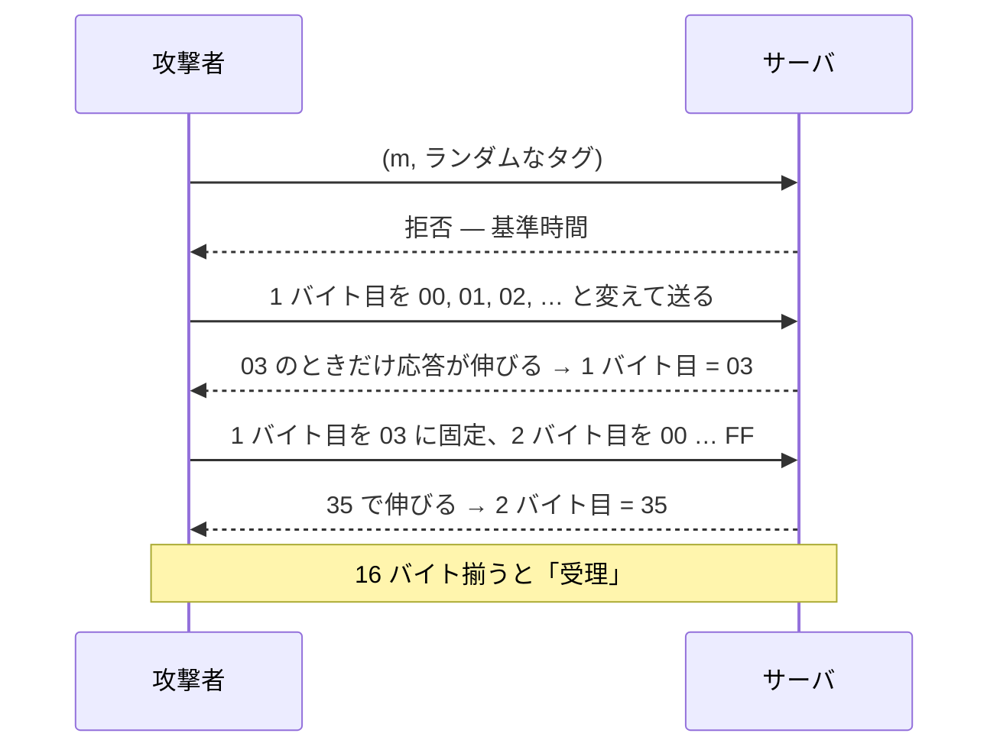

# 07. タイミング攻撃

> 親: [README](./README.md) ｜ 前: [HMAC](./06_hmac.md) ｜ 次: [08. 認証付き暗号](../08_authenticated-encryption/README.md) ｜ 出典: Crypto I ビデオ2 (0:33:16–0:41:23)

**この1ページで分かること**

- バイト単位比較の早期脱出が、応答時間に「何バイト一致したか」を漏らす
- 16 × 256 = 4,096 回の問い合わせでタグ全体を復元。総当たり `2^128` が線形に落ちる
- 防御は定数時間比較（コンパイラの最適化に注意）か、比較前の再ハッシュ。結論は「自分で実装するな」

数学的に正しい HMAC 実装が、**検証にかかる時間**だけで完全に破れる例。教訓は「暗号を自作するな」の一段深く、「暗号を**自分で実装するな**」。

---

## 問題のあるコード

Keyczar（Python の暗号ライブラリ）にあった HMAC 検証を要点だけにしたもの:

```python
def Verify(key, msg, sig_bytes):
    return HMAC(key, msg) == sig_bytes
```

仕様どおりで何もおかしく見えない。問題は `==` の中身。バイト列比較は**バイト単位のループ**で、**最初の不一致で抜ける**。

```
正しいタグ:   03 35 A1 7C …
攻撃者の入力: 03 00 xx xx …
              ↑  ↑
              │  ここで不一致 → 2 バイト目で終了（速い）
              一致
```

一致するバイトが 1 つ増えるごとにループが 1 周長く回り、応答がわずかに伸びる。

---

## 攻撃の手順

攻撃者はメッセージ `m` の有効なタグが欲しい。標的は秘密鍵を持つサーバで、(メッセージ, タグ) を受けて受理/拒否を返す。何度でも問い合わせできる。



講義の例では 1 バイト目は `3`、2 バイト目は `53` で応答が伸びた。

| 方法 | 必要な問い合わせ回数 |
|---|---|
| タグの総当たり(16 バイト) | `2^128` — 実行不能 |
| タイミング攻撃 | 16 × 256 = **4,096 回**(平均は約半分) |

秘密鍵は一切漏れていないのに、任意のメッセージに有効なタグを作れる。MAC として破綻。

---

## 防御 1: 定数時間比較

**どんな入力でも同じ時間で終わる比較**を書く。Keyczar の修正版:

```python
def Verify(key, msg, sig_bytes):
    if len(sig_bytes) != HMAC_LENGTH:
        return False                      # 長さだけは先に弾く（長さは秘密でない）
    h = HMAC(key, msg)
    result = 0
    for x, y in zip(h, sig_bytes):        # 必ず全バイト回す
        result |= ord(x) ^ ord(y)         # 不一致があれば非ゼロが立つ
    return result == 0
```

各バイトの XOR を `result` に OR で畳み込む。3 バイト目で違いを見つけても最後まで回るので所要時間が一定。

### 落とし穴: 最適化コンパイラ

コンパイラが「不一致が確定した時点で打ち切っても結果は同じ」と判断し、早期脱出に書き換えうる。定数時間性が静かに失われ、ソースを読んでも気づけない。

---

## 防御 2: 何を比較しているかを隠す

比較の前に両側をもう一度ハッシュする。

```python
def Verify(key, msg, sig_bytes):
    mac = HMAC(key, msg)
    return H(mac) == H(sig_bytes)     # 比較の前にもう一段ハッシュ
```

等しければハッシュ値も等しいので検証は正しく機能する。一方、1 バイト目だけ当てて残りを外した場合、ハッシュ後の 2 値は**無関係なビット列**になり、比較は 1 バイト目で抜ける。部分一致の情報が時間に出ない。

攻撃者が制御できるのは `sig_bytes` であって `H(sig_bytes)` ではないので、「1 バイトずつ合わせる」前提が崩れる。コンパイラにも左右されない。

---

## 教訓

Keyczar は専門家が書いたライブラリで、検証ロジックは数学的に正しい。それでも側チャネル（実行時間など、計算結果以外から漏れる情報）で全体が破綻した。

```
暗号を自作するな            ← ここまでは繰り返し言われてきた
暗号を自分で実装するな       ← この節が付け加えるもの
```

OpenSSL のような枯れた標準ライブラリを使い、比較にも言語が提供する定数時間関数を使う。

> Python の `hmac.compare_digest`、Go の `crypto/subtle.ConstantTimeCompare`、Node.js の `crypto.timingSafeEqual`。**MAC やトークンの比較に `==` を使わない**。

---

## 問題

**Q1.** 16 バイトのタグに対するタイミング攻撃の問い合わせ回数を見積もり、総当たりと比較せよ。

<details><summary>解答</summary>

1 バイトあたり最大 256 回(平均 128 回)、それを 16 バイトぶん繰り返すので最大 `16 × 256 = 4,096` 回、平均で約 2,048 回。タグ総当たりの `2^128` と比べて実行可能な水準に落ちている。

</details>

**Q2.** 定数時間比較のコードで、長さの検査だけは早期に `return` してよい理由は何か。

<details><summary>解答</summary>

タグの長さは秘密情報ではなく、HMAC の出力長として公開されているから。長さが違う入力はそもそもタグとして不正であり、そこで返しても攻撃者に新しい情報を与えない。秘密なのはタグの中身であって長さではない。

</details>

**Q3.** 定数時間比較を書いても安全とは限らない理由を述べよ。

<details><summary>解答</summary>

最適化コンパイラがループを解析し、「不一致が確定したら打ち切っても結果は同じ」と判断して早期脱出に書き換えうるから。ソースコード上は定数時間でも、生成されたコードはそうでなくなる可能性があり、しかもソースを読んでも気づけない。

</details>

**Q4.** 比較前に両者をハッシュする防御が、タイミング攻撃を成立させなくする理由を説明せよ。

<details><summary>解答</summary>

攻撃者が制御できるのは `sig_bytes` であって `H(sig_bytes)` ではない。1 バイトだけ正解して残りを外した場合でも、ハッシュを通した後の 2 つの値は無関係なビット列になるため、比較は 1 バイト目で抜けてしまう。「部分一致するほど時間が伸びる」という攻撃の足がかりが消え、しかもコンパイラの最適化に依存しない。

</details>

## 関連リンク

- [HMAC](./06_hmac.md) — ここで検証しているタグを作る側の構成
- [08. 認証付き暗号](../08_authenticated-encryption/README.md) — 復号側の情報漏れが同様に致命傷になる例(パディングオラクル)
- [ハッシュ関数と MAC(topics)](../../../topics/02_cryptography/04_hash-and-mac.md) — MAC の検証と実装上の注意
