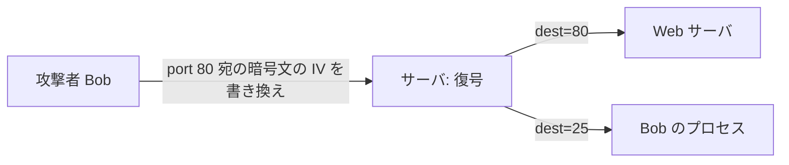

# 01. 能動的攻撃

> 親: [README](./README.md) ｜ 前: [07. 衝突耐性](../07_collision-resistance/README.md) ｜ 次: [認証付き暗号の定義](./02_ae-definition.md) ｜ 出典: Crypto I ビデオ2 (0:41:23–0:54:14)

**この1ページで分かること**

- CPA 安全性が守るのは盗聴だけ。改竄できる相手には**秘匿性まで壊れる**
- IPsec の例: CBC の IV を書き換えるだけで宛先ポートが化け、本文が攻撃者に届く
- TCP チェックサムの例: ACK の有無が 1 bit のオラクルになり、平文が復元される

---

## CPA 安全性が守る範囲

[CBC](../05_block-cipher-modes/03_cbc-mode.md) も [CTR](../05_block-cipher-modes/04_counter-mode.md) も、証明したのは「盗聴者は平文を学べない」ことだけ。改竄されないことは一言も保証していない。むしろ両モードとも**可鍛性 (malleability)** が高く、暗号文への XOR がそのまま平文への XOR として通る。

では暗号文をいじれる相手に秘匿性は生き残るのか。答えは **No** である。

---

## 実例 1: IPsec の宛先ポート書き換え

サーバの TCP スタックは受信パケットを復号し、**宛先ポート**を見て転送先を決める。



攻撃者 Bob は port 25 宛の平文なら合法的に受け取れる。ならば port 80 宛の暗号化パケットを捕まえ、**宛先ポートだけ 25 に化けさせて**サーバに渡せばよい。

### CBC(乱数 IV)なら IV だけで足りる

平文の第 1 ブロック `m1` に `dest = 80` が入っているとする。CBC の復号は `m1 = D(k, c1) ⊕ IV`。攻撃者は `c1` に触れる必要すらない。**IV だけ**を書き換える。

```
Δ  = 0…0 ‖ (80 ⊕ 25) ‖ 0…0     ← ポート欄の位置だけ非ゼロ
IV' = IV ⊕ Δ

m1' = D(k, c1) ⊕ IV' = D(k, c1) ⊕ IV ⊕ Δ = m1 ⊕ Δ
```

ポート欄は `80 ⊕ 80 ⊕ 25 = 25`、他の欄は `⊕ 0` で不変。`c1` の中身も鍵も知らないまま宛先だけを狙って書き換えられた。

**肝心な点**: 攻撃者が欲しかったのは宛先ではなく**本文**である。宛先は最初から 80 だと知っていた。CPA 安全な暗号を使っていたのに、本文の秘匿性が完全に失われた。

---

## 実例 2: TCP チェックサムがオラクルになる

サーバ上に攻撃者が居る必要すらなく、ネットワークを見られるだけでよい。

リモート端末アプリがキー入力 1 バイトごとに TCP パケットを [CTR モード](../05_block-cipher-modes/04_counter-mode.md)で暗号化して送るとする。TCP パケットの 16 bit チェックサムが合わなければサーバは黙って捨て、合えば ACK を返す。**ヘッダもチェックサムもキー入力 `d` もまとめて CTR で暗号化されている。**

CTR の性質より、暗号文に XOR した値は復号後の平文にそのまま乗る。

```
チェックサム欄の暗号文 ⊕ t   →   復号後のチェックサム = checksum ⊕ t
データ欄の暗号文     ⊕ s   →   復号後のデータ      = d ⊕ s
```

| サーバの反応 | 攻撃者が学ぶこと |
|---|---|
| ACK が返る | `checksum ⊕ t` は `d ⊕ s` に対する**正しい**チェックサム |
| 無反応 | 正しくない |

`(t, s)` の組ごとに「データを `s` で変えるとチェックサムが `t` だけ変わるか」という方程式が 1 本得られる。多数集めれば連立方程式から `d` を復元できる。

これが**選択暗号文攻撃 (chosen ciphertext attack)** の典型である。復号したい暗号文から派生した暗号文を投げ、応答から元の平文を学ぶ。

> 実際の TCP チェックサムで常に成立するとは限らないが、単純なチェックサムなら確実に成立する。設計として成立しうる時点で失格である。

---

## 結論: 秘匿性と完全性は束で提供する

2 例が示したのは同じ 1 点である。暗号文に完全性がないと受信側が**復号オラクル**として使われ、その結果として中身が読める。**完全性の欠如が秘匿性の喪失を招く。**

| 必要なもの | 使うもの |
|---|---|
| 完全性だけ（秘匿性は不要） | [MAC](../06_message-integrity/README.md) |
| 秘匿性と完全性の両方 | **認証付き暗号 (AE)** |

最も重要な帰結: **CPA 安全なだけのモードを単体で使ってはならない。** 乱数 IV の CBC も乱数化 CTR も、認証付き暗号を組む**部品**であって完成品ではない。

---

## 問題

**Q1.** 実例 1 で、攻撃者は `c1` の中身も鍵 `k` も知らない。それでも宛先を狙って書き換えられたのはなぜか。CBC 復号の式で説明せよ。

<details><summary>解答</summary>

CBC の第 1 ブロック復号は `m1 = D(k, c1) ⊕ IV` であり、`IV` は暗号文の一部として攻撃者が自由に触れる。`IV` に `Δ` を XOR すると復号結果はちょうど `m1 ⊕ Δ` になる。`D(k, c1)` が何であるかを知る必要はなく、その項は式から消えるからである。攻撃者は「変えたい差分」だけを知っていればよい。

</details>

**Q2.** 平文の 3 バイト目が `0x50`(=80) で、これを `0x19`(=25) に変えたい。16 バイトブロックで、新しい IV は元の IV とどこがどう違うか。16 進で示せ。

<details><summary>解答</summary>

`0x50 ⊕ 0x19 = 0x49`。よって差分は 3 バイト目だけが `0x49`、他は `0x00`:

```
Δ   = 00 00 49 00 00 00 00 00 00 00 00 00 00 00 00 00
IV' = IV ⊕ Δ      （3 バイト目だけ 0x49 が XOR される）
```

復号後の 3 バイト目は `0x50 ⊕ 0x49 = 0x19` となり、他のバイトは変化しない。

</details>

**Q3.** 実例 2 で、攻撃者が ACK の有無から得ているのは平文そのものではない。では何を得ていて、なぜそれが `d` の復元につながるのか。

<details><summary>解答</summary>

得ているのは「`(t, s)` の組が checksum の関係を保つか否か」という 1 bit の判定である。これは `checksum(d ⊕ s) = checksum(d) ⊕ t` という形の**制約式**を 1 本得ることに等しい。`(t, s)` を変えて多数の制約を集めると、チェックサム関数が線形なら連立方程式として `d` について解ける。1 bit ずつの漏洩が積み上がって全体が落ちる、という構図である。

</details>

**Q4.** 「本文の秘匿性が目的なのに、攻撃者が書き換えたのはヘッダだけ」という点が、この 2 例の核心である。ここから設計上どんな原則が導かれるか。

<details><summary>解答</summary>

**暗号化した領域は全体を認証しなければならない。** 一部（ヘッダ）だけが書き換え可能でも、受信側の挙動が変わることで残り（本文）が漏れる。したがって「本文だけ守れば十分」という切り分けは成立せず、秘匿性と完全性を同じ範囲に同時にかける必要がある。これが次ファイルで定義する認証付き暗号の動機である。

</details>

## 関連リンク

- [認証付き暗号の定義](./02_ae-definition.md) — この 2 例を封じる安全性の定義へ
- [CBC モード](../05_block-cipher-modes/03_cbc-mode.md) — 実例 1 で使った IV と復号式の本体
- [カウンタモード](../05_block-cipher-modes/04_counter-mode.md) — 実例 2 で使った「XOR がそのまま通る」性質の本体
- [利用モードと AEAD(topics)](../../../topics/02_cryptography/02_symmetric-crypto/04_modes-and-aead.md) — 実装で選ぶべきモードの整理
