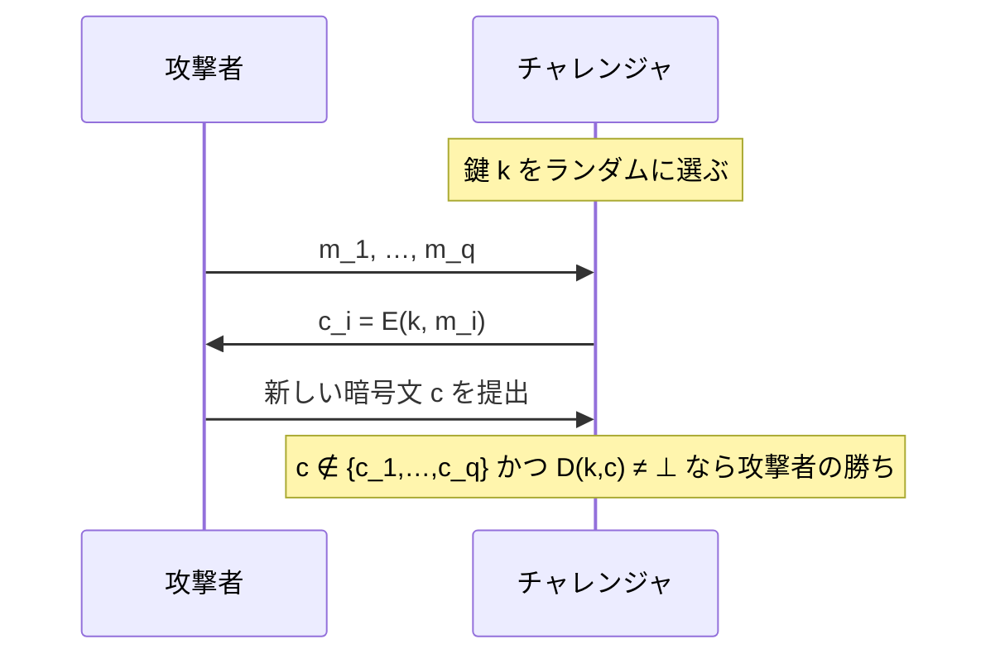

# 02. 認証付き暗号の定義

> 親: [README](./README.md) ｜ 前: [能動的攻撃](./01_active-attacks.md) ｜ 次: [CCA 安全性](./03_cca-security.md) ｜ 出典: Crypto I ビデオ2 (0:54:14–0:59:44)

**この1ページで分かること**

- AE = **意味論的 CPA 安全性 + 暗号文完全性**。2 条件は独立で、両方が要る
- 復号に `⊥`（無効）を導入する。CBC/CTR にはこの経路がなく、AE になれない
- AE は真正性を与えるが、**リプレイ攻撃は防げない**（定義の対象外）

---

## 復号に `⊥` を導入する

```
E: K × M × N → C          （N は nonce、なくてもよい）
D: K × C × N → M ∪ {⊥}
```

`⊥` は「この暗号文は無効なので捨てよ」の意味で、**メッセージ空間 `M` に属さない**ことが唯一の要件。これで「復号できない」という応答が表現できる。これまでのモードにはこの概念自体がなかった。

---

## AE の定義 = CPA 安全性 + 暗号文完全性

| 条件 | 内容 | 欠けると |
|---|---|---|
| 意味論的 CPA 安全性 | これまでどおり | 中身が読まれる |
| 暗号文完全性 | 新しい有効な暗号文を作れない | [前ファイル](./01_active-attacks.md)の攻撃が通る |

---

## 暗号文完全性のゲーム



攻撃者は選択平文攻撃で好きなだけ暗号文を集めてよい。そのうえで**手持ちにない新しい暗号文であって、しかも正しく復号されるもの**を 1 つ作れれば勝ち。

優位性 `Adv_CI[A, E] = Pr[チャレンジャが 1 を出力]` がすべての効率的攻撃者に対して無視できるとき、暗号文完全性を持つという。「鍵を知らない者は有効な暗号文を 1 つも新規に作れない」という要求で、MAC の存在的偽造不可能性を暗号文全体に課したものと読める。

---

## CBC(乱数 IV)が AE でない理由

反例は拍子抜けするほど簡単で、**でたらめなビット列**を暗号文として提出すればよい。

CBC の復号は `m_i = D(k, c_i) ⊕ c_{i-1}` をブロックごとに回すだけで、どんな入力にも何らかのビット列を吐く。`⊥` を返す経路が存在しない。

```
D(k, ランダムな c) = 何らかの m ≠ ⊥
```

攻撃者はクエリ 0 回・優位性 1 で勝つ。乱数化 CTR も同じ。**CPA 安全性と暗号文完全性はまったく別の話**である。

---

## 含意 1: 真正性 (authenticity)

AE が成り立つとき Bob はこう推論できる。

> `⊥` にならず復号できた → 暗号文完全性より鍵 `k` を知らない者には作れない → `k` を知る誰かが作った

`k` を知るのが Alice と Bob だけなら、Bob は「Alice が送った」と結論してよい。AE は秘匿性のついでに**送信元の保証**まで提供する。MAC を別途貼らなくてよいのはこのためである。

---

## 限界: リプレイ攻撃は防げない

```
Alice → Bob:    E(k, "Charlie に 100 ドル送金せよ")
                       ↓ 攻撃者 Charlie が記録
Charlie → Bob:  同じ暗号文をもう一度送る
                       ↓
Bob: 復号できる。Alice が作ったものだ。→ さらに 100 ドル送金
```

この暗号文は確かに Alice が作った有効なものなので、ゲームの「新しい暗号文」に当たらず攻撃者の勝ちにならない。**定義がそもそもリプレイを対象にしていない。**

したがって**リプレイ対策はプロトコル側で別に用意する**。典型はカウンタやシーケンス番号を認証範囲に含める方法で、[TLS レコードプロトコル](./05_tls-record-protocol.md)がまさにそれをやっている。

---

## 含意 2: CCA 安全性

AE のもう一つの帰結は、任意の暗号文を復号させられる攻撃者に対しても秘匿性が保たれること。これが AE を「正しい定義」たらしめる核心で、次ファイルで扱う。

---

## 問題

**Q1.** 暗号文完全性のゲームで、攻撃者が提出する `c` に `c ∉ {c1,…,cq}` という条件が付いているのはなぜか。この条件がないとどうなるか。

<details><summary>解答</summary>

条件がなければ、攻撃者は受け取った `c1` をそのまま提出するだけで勝ててしまう。`c1` は当然 `⊥` にならずに復号されるからである。これでは何の性質も測れない。ゲームが問いたいのは「鍵なしで**新規に**有効な暗号文を作れるか」なので、既に手渡したものを除外する必要がある。

</details>

**Q2.** 乱数化 CTR モードが暗号文完全性を持たないことを、CBC の場合と同じ論法で示せ。

<details><summary>解答</summary>

CTR の復号は `m_i = c_i ⊕ F(k, IV+i)` で、任意のビット列に対して必ず何らかの `m` を出力する。`⊥` を返す条件が定義に存在しない。よって攻撃者はランダムな `(IV, c)` を提出するだけで `D(k, c) ≠ ⊥` を満たし、クエリ 0 回・優位性 1 で勝つ。CBC とまったく同じ理由である。

</details>

**Q3.** AE が真正性を与えるのに、なぜ「リプレイ攻撃は防げない」といえるのか。暗号文完全性のゲームの定義に照らして説明せよ。

<details><summary>解答</summary>

リプレイで送られる暗号文は、Alice が正規に作った `c_i` そのものである。ゲームの勝利条件は `c ∉ {c1,…,cq}` を要求するので、`c_i` の再送は「攻撃者の勝ち」に数えられない。つまり定義がリプレイを攻撃として扱っていない。真正性が保証するのは「鍵を知る者が作った」ことまでで、「いつ・何回目に作られたか」は何も言っていない。時間軸の情報を守りたければ、カウンタや nonce を認証対象に含める必要がある。

</details>

**Q4.** 「AE = CPA 安全性 + 暗号文完全性」の 2 条件のうち、片方だけ満たして他方を満たさない例をそれぞれ挙げよ。

<details><summary>解答</summary>

- **CPA 安全だが完全性なし**: 乱数 IV の CBC、乱数化 CTR。本文で見たとおり任意の暗号文が復号できてしまう。
- **完全性はあるが CPA 安全でない**: 平文をそのまま送り、MAC タグを付けただけの方式。タグの偽造は困難なので暗号文完全性は満たすが、平文が丸見えなので意味論的安全性はまったくない。

2 条件が独立であること、したがって両方を明示的に要求する必要があることが分かる。

</details>

## 関連リンク

- [CCA 安全性](./03_cca-security.md) — AE がなぜ「正しい定義」なのかを示す定理
- [MAC の定義](../06_message-integrity/01_mac-definitions.md) — 存在的偽造不可能性。暗号文完全性はその暗号文版
- [能動的攻撃](./01_active-attacks.md) — この定義が封じようとしている具体的な攻撃
- [ハッシュ関数と MAC(topics)](../../../topics/02_cryptography/04_hash-and-mac.md) — 完全性プリミティブの全体像
