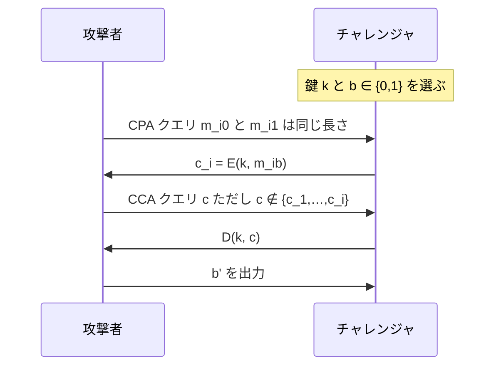

# 03. CCA 安全性

> 親: [README](./README.md) ｜ 前: [認証付き暗号の定義](./02_ae-definition.md) ｜ 次: [AE の構成法](./04_ae-constructions.md) ｜ 出典: Crypto I ビデオ2 (0:59:44–1:11:02)

**この1ページで分かること**

- CCA 安全性 = 「チャレンジ以外なら何でも復号してもらえる」相手にも秘匿性が保たれること
- 乱数 IV の CBC は 3 手で破れる（IV を 1 bit 反転して復号させる）
- **定理 AE ⇒ CCA**。暗号文完全性があると復号オラクルの応答が全部 `⊥` になり無力化する

AE の定義が「正しい」根拠は、**選択暗号文攻撃 (CCA)** という最強クラスの攻撃を自動的に封じる点にある。

---

## 現実の攻撃が CCA の形をしている

| 例 | 攻撃者が投げるもの | 返ってくるもの |
|---|---|---|
| IPsec | 宛先を 25 に書き換えた暗号文 | 平文そのもの |
| TCP チェックサム | `(t, s)` を XOR した暗号文 | ACK の有無 = 平文に関する 1 bit |

いずれも「復号したい暗号文から派生した別の暗号文を投げ、応答から元の平文を学ぶ」。これを一般化したのが CCA 安全性である。

---

## CCA 安全性のゲーム

選択平文クエリと選択暗号文クエリの両方を、好きな順序で好きなだけ許す。



制約は 1 つだけ。**チャレンジ暗号文そのものは復号を頼めない**。これがないと `c_i` を投げるだけで答えが分かる。実験 0 と実験 1 で攻撃者の振る舞いが区別できないとき **CCA 安全**という。

> 「チャレンジ以外なら何でも復号してもらえる」は現実より保守的な設定である。実際の攻撃者は特定の暗号文しか復号させられないことが多い。だからこの定義を満たせば実運用でも安全といえる。

---

## CBC(乱数 IV)は CCA 安全でない

1 ブロックのメッセージで、攻撃は 3 手で終わる。

```
1.  攻撃者 → (m0, m1)          相異なる 1 ブロックのメッセージ
    受け取る c = (IV, c1)      c1 = E(k, m_b ⊕ IV)

2.  c' = (IV ⊕ 1, c1)          IV の最下位ビットだけ反転。c' ≠ c なので合法

3.  D(k, c') = D(k, c1) ⊕ (IV ⊕ 1)
             = (m_b ⊕ IV) ⊕ IV ⊕ 1  =  m_b ⊕ 1

    返ってきた値 ⊕ 1 が m0 なら b = 0、m1 なら b = 1
```

優位性は 1。これは[能動的攻撃](./01_active-attacks.md)の IPsec の例を抽象化したもので、暗号文を少し変えて復号させ本来自分宛でない平文を読む、という同じ動きである。

---

## 定理: AE ⇒ CCA 安全

**方式が認証付き暗号なら、それは CCA 安全である。** `q` 回のクエリを発行する CCA 攻撃者 `A` に対し、効率的な `B1`, `B2` が存在して:

```
Adv_CCA[A, E]  ≤  2q · Adv_CI[B1, E]  +  Adv_CPA[B2, E]
```

第 1 項は暗号文完全性、第 2 項は CPA 安全性より無視できる。よって左辺も無視できる。

### 絵による証明

実験 0 と実験 1 を並べ、3 段階で書き換える。

| 段階 | チャレンジャ | 使う仮定 |
|---|---|---|
| 1 | CCA クエリに `D(k,c)` を正直に返す | — |
| 2 | CCA クエリに**常に `⊥`** を返す | 暗号文完全性 |
| 3 | CCA クエリを**丸ごと削除** | 応答が定数なので情報量ゼロ |

段階 2 が要である。攻撃者はこの差し替えに気づけない。暗号文完全性より、`{c_1,…,c_i}` 以外で `⊥` にならない暗号文を作れないからである。もし区別できたなら、その瞬間に暗号文完全性が破れている。

段階 3 の後に残るのは CPA 安全性の定義そのままのゲームで、上下は区別できない。各段階で区別不能なので鎖をつないで元の 2 つも区別不能。すなわち CCA 安全である。∎

**強力に見えた CCA クエリが、AE のもとでは何も与えなくなる**——これが定理の核心である。

---

## AE で守れるもの・守れないもの

守れるのは、暗号文の一部を復号できる攻撃者にも一般の CCA 攻撃者にも意味論的安全性が破れないこと。守れないものは 2 つある。

1. **リプレイ攻撃** — [前ファイル](./02_ae-definition.md)のとおり。プロトコル側でカウンタ等を用意する。
2. **復号失敗の理由が漏れる場合** — `⊥` だけでなく「なぜ拒否したか」（アラート種別やタイミングを含む）を返すと AE の保証は崩壊しうる。机上の話ではなく、[パディングオラクル攻撃](./06_padding-oracle.md)として実際に TLS を破っている。

---

## 問題

**Q1.** CCA ゲームで「チャレンジ暗号文の復号は頼めない」という制約を外すと、どんな方式でも破れてしまう。その手順を書け。

<details><summary>解答</summary>

CPA クエリで `(m0, m1)` を出してチャレンジ暗号文 `c` を受け取り、その `c` をそのまま CCA クエリとして投げる。返る平文が `m0` なら `b = 0`、`m1` なら `b = 1`。優位性 1 で勝つ。方式の中身に一切依存しないので、この制約がなければ CCA 安全な方式は存在しえない。

</details>

**Q2.** CBC への CCA 攻撃で、IV の最下位ビットではなく先頭ブロックの 3 バイト目に `0xAB` を XOR したとする。復号結果はどうなるか。また `b` はどう判定するか。

<details><summary>解答</summary>

`Δ` を「3 バイト目だけ `0xAB`、他は 0」とすると、`c' = (IV ⊕ Δ, c1)` の復号は:

```
D(k, c') = D(k, c1) ⊕ (IV ⊕ Δ) = m_b ⊕ Δ
```

返ってきた値に再び `Δ` を XOR すれば `m_b` が得られる。それが `m0` か `m1` かを見て `b` を判定する。XOR する差分は何でもよく、`c' ≠ c` になりさえすればよい。

</details>

**Q3.** 定理の証明の段階 2 で「攻撃者はこの差し替えに気づけない」と主張した。もし気づけたとすると何が導けるか。

<details><summary>解答</summary>

気づけたということは、ある CCA クエリで「正直な復号」と「常に `⊥`」の応答が食い違ったということ。すなわち攻撃者は、手持ちの `{c_1,…,c_i}` に含まれない暗号文で `⊥` にならないものを作れたことになる。これはそのまま暗号文完全性のゲームでの勝利であり、`Adv_CI` が無視できないことを意味する。仮定に反する。

</details>

**Q4.** 「AE ⇒ CCA」は成り立つが、逆（CCA ⇒ AE）は成り立たない。直感的な理由を述べよ。

<details><summary>解答</summary>

CCA 安全性が要求するのは**秘匿性**（実験 0 と 1 を区別できないこと）だけで、「有効な暗号文を新規に作れないこと」は要求していない。攻撃者が復号可能な暗号文を作れたとしても、それが `b` の判定に役立たなければ CCA ゲームには勝てない。したがって暗号文完全性を持たない CCA 安全な方式は構成しうる。真正性が欲しければ AE を要求する必要がある、というのが実務上の帰結である。

</details>

## 関連リンク

- [AE の構成法](./04_ae-constructions.md) — 実際に AE を組み立てる 3 方式と標準
- [能動的攻撃](./01_active-attacks.md) — CBC への CCA 攻撃が抽象化している現実の攻撃
- [パディングオラクル攻撃](./06_padding-oracle.md) — 「復号失敗の理由を漏らす」ことで AE が崩れる実例
- [利用モードと AEAD(topics)](../../../topics/02_cryptography/02_symmetric-crypto/04_modes-and-aead.md) — CCA 安全なモードの実装上の選択肢
