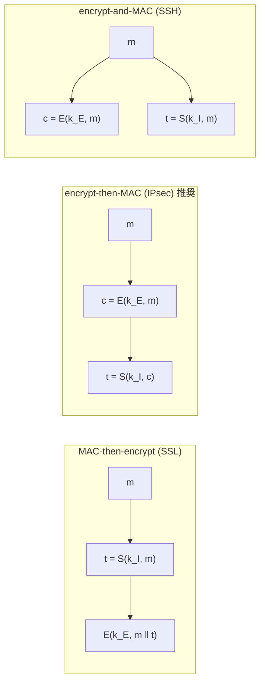

# 04. AE の構成法

> 親: [README](./README.md) ｜ 前: [CCA 安全性](./03_cca-security.md) ｜ 次: [TLS レコードプロトコル](./05_tls-record-protocol.md) ｜ 出典: Crypto I ビデオ2 (1:11:02–1:31:48)

**この1ページで分かること**

- **encrypt-then-MAC** はどんな CPA 安全な暗号・安全な MAC の組でも必ず AE になる（推奨）
- MAC の「同じ `m` に別タグを作れない」という強い条件が、ここで効く
- 標準は GCM / CCM / EAX。nonce は一意であればよく乱数不要。すべて AEAD

CPA 安全な暗号と安全な MAC の**組み合わせる順序**だけで、安全にも危険にもなる。

---

## 鍵は必ず 2 本用意する

**暗号鍵 `k_E` と MAC 鍵 `k_I` は独立**でなければならない。同じ鍵を両方に使ってはいけない。セッション確立時に 2 本まとめて導出する（→[鍵導出関数](../09_odds-and-ends/01_key-derivation.md)）。

---

## 3 つの組み合わせ方



| 方式 | 採用 | タグの計算対象 | 安全性 |
|---|---|---|---|
| MAC-then-encrypt | SSL | 平文 | 一般には AE でない |
| **encrypt-then-MAC** | IPsec | **暗号文** | **常に AE** |
| encrypt-and-MAC | SSH | 平文（タグは平文で送出） | 推奨されない |

---

## encrypt-and-MAC が推奨されない理由

SSH 方式は平文のタグを**そのまま平文で**送る。MAC の安全性定義は偽造不可能性しか要求しておらず、**秘匿性は一切要求していない**。「タグの末尾にメッセージの数ビットを付ける」MAC も MAC としては正当である。それを使えば平文のビットが露出し CPA 安全性が崩れる。

SSH の実際のインスタンス化は問題ないが、安全性が MAC の付加的性質に依存する構成は避けるべきである。

---

## encrypt-then-MAC が常に安全な理由

暗号文が MAC で固定されるので、攻撃者は**有効に見える別の暗号文を作れない**。改竄すれば必ず MAC 検証に落ち、復号器は中身を見る前に `⊥` を返す。暗号文完全性が MAC からそのまま降ってくる。**新規設計では常にこれを選ぶ。**

---

## MAC-then-encrypt の位置づけ

一般には AE を与えない（両者の相互作用で CCA 攻撃が成立する病的な反例がある）。ただし例外がある。

- **乱数化 CTR または乱数化 CBC** を使う場合に限れば AE を与える
- さらに乱数化 CTR なら MAC は**ワンタイム安全**で足りる。[ワンタイム MAC](../06_message-integrity/05_one-time-mac-carter-wegman.md) は大幅に速いので性能上の利点が出る

それでも推奨は変わらない。この後の TLS のパディングオラクルも SSH の長さ攻撃も、encrypt-then-MAC なら生じなかった問題である。

---

## なぜ MAC に「強い」偽造不可能性が要るか

[MAC の定義](../06_message-integrity/01_mac-definitions.md)の「同じ `m` に対する**別の**タグを作れない」という条件がここで効く。なければ encrypt-then-MAC に CCA 攻撃が通る。

```
1. 攻撃者 → (m0, m1)、受け取る (c0, t)      c0 = E(k_E, m_b),  t = S(k_I, c0)
2. 同じ c0 に対する別のタグ t' ≠ t を作る    ← この性質がない MAC なら可能
3. (c0, t') は有効かつ受領物と異なる → CCA クエリとして合法
4. チャレンジャは復号せざるを得ず m_b を返す → b が判明。優位性 1
```

これまでに扱った MAC はすべてこの強い性質を満たしている。

---

## 標準: GCM / CCM / EAX

| 標準 | 暗号化 | 認証 | 順序 | 備考 |
|---|---|---|---|---|
| **GCM** | CTR | Carter–Wegman | encrypt-then-MAC | ハッシュが非常に速く実行時間は CTR が支配的。Intel は専用命令 `PCLMULQDQ` を追加 |
| **CCM** | CTR | CBC-MAC | MAC-then-encrypt | 推奨順序でないが CTR なので安全。**すべて AES だけ**で実装でき小さい。Wi-Fi (802.11i) が採用 |
| **EAX** | CTR | CMAC | encrypt-then-MAC | 素直な構成 |

3 つに共通する性質:

- **nonce ベース**（乱数を使わない）。nonce は鍵ごとに一意であればよく**乱数である必要はない**。カウンタで構わない。ただし `(鍵, nonce)` の組は絶対に繰り返してはならない
- すべて **AEAD** である

---

## AEAD — 関連データ

**AEAD (authenticated encryption with associated data)** は、メッセージの一部だけを暗号化し**全体を認証する**拡張である。

```
┌──────────────┬──────────────────────┐
│   ヘッダ      │      ペイロード        │
│ 認証のみ      │   暗号化 + 認証        │
│ (平文で送る)   │                      │
└──────────────┴──────────────────────┘
        ↑ 経路上のルータが宛先を読む必要がある
```

宛先を暗号化するとルータが転送できず、かといって改竄は許せない。ヘッダは平文のまま認証だけ掛け、ペイロードは両方掛ける。両者は認証で**束ねられて**おり組み替えられない。

```
init(key, nonce)                 nonce は一意であればよい（乱数不要）
encrypt(aad, data) → ciphertext  aad は認証のみ。平文で別途送るので戻り値に含まれない
```

---

## OCB と性能

MAC と暗号を組み合わせると 1 平文ブロックあたりブロック暗号を **2 回**呼ぶ。PRP から直接 AE を作り 1 回で済ませたのが **OCB** である。完全に並列化でき、追加コストは nonce・鍵・ブロック番号から作る単純な関数 `P` を暗号化の前後で XOR するだけ。

```
                        速い ←──────────────→ 遅い
   OCB  <  CTR/CBC 単体  <  GCM  <<  CCM ≈ EAX
   ↑                       ↑            ↑
  最速                CTR + 高速ハッシュ  ブロック暗号 2 回/ブロック
```

CTR 単体・CBC 単体は**単独で使ってはならない**（CPA 安全性しかない）。OCB が最速だが**特許の問題で普及しなかった**。GCM の弱点はコードサイズで、組込みやスマートカードでは AES だけで済む CCM が向く。**制約がなければ GCM が第一選択**である。

---

## 結論

暗号化するときは必ず認証付き暗号モードを使う。そして **GCM / CCM / EAX のいずれかの標準を使い、encrypt-then-MAC を自分で実装しない**。次の 3 ファイルで、自作した実装がどう壊れたかを見る。

---

## 問題

**Q1.** encrypt-and-MAC(SSH 方式)が一般に推奨されないのは、MAC のどんな性質が「保証されていない」からか。

<details><summary>解答</summary>

**秘匿性**。MAC の安全性定義は存在的偽造不可能性しか要求しておらず、タグが平文の情報を漏らさないことは要求していない。したがって「タグに平文の数ビットを含める」MAC も正当な MAC であり、それを encrypt-and-MAC に使うとタグが平文で送られる以上 CPA 安全性が崩れる。安全性が MAC の定義外の性質に依存する構成は避けるべき、というのが原則である。

</details>

**Q2.** encrypt-then-MAC がどんな CPA 安全な暗号・安全な MAC の組でも AE になるのはなぜか。暗号文完全性の観点から説明せよ。

<details><summary>解答</summary>

タグが**暗号文全体**に対して計算されているため、攻撃者が新しい暗号文 `c' ∉ {c_1,…,c_q}` を作って有効と判定させるには、`c'` に対する正しいタグ `S(k_I, c')` を作る必要がある。これは MAC の存在的偽造にほかならず、MAC が安全なら無視できる確率でしか成功しない。よって暗号文完全性が MAC からそのまま従う。CPA 安全性は元の暗号方式がそのまま提供する。2 条件が揃うので AE である。

</details>

**Q3.** GCM と CCM で nonce に求められる条件は何か。「乱数でなければならない」は正しいか。

<details><summary>解答</summary>

正しくない。求められるのは **`(鍵, nonce)` の組が二度と繰り返されないこと**、つまり鍵ごとの一意性だけである。予測不能性は不要なので、単純なカウンタで構わない。逆にいえば、nonce の再利用は乱数であろうとなかろうと致命的で、CTR ベースのモードでは two-time pad を生む。

</details>

**Q4.** AEAD で「ヘッダは認証のみ、ペイロードは暗号化と認証」とするとき、ヘッダとペイロードを別々の AEAD 呼び出しで処理してはいけない。なぜか。

<details><summary>解答</summary>

別々に処理すると両者を**束ねる**認証がなくなり、攻撃者があるパケットのヘッダと別のパケットのペイロードを組み替えて、どちらの認証も通る偽パケットを作れてしまう。AEAD は MAC を「関連データ + 暗号文」の全体に掛けることでこの組み替えを防いでいる。認証の範囲が結合を保証している、という点が要である。

</details>

## 関連リンク

- [TLS レコードプロトコル](./05_tls-record-protocol.md) — MAC-then-encrypt を実際に採用したプロトコルの中身
- [ワンタイム MAC と Carter–Wegman](../06_message-integrity/05_one-time-mac-carter-wegman.md) — GCM の認証部が使う高速 MAC
- [CBC-MAC と NMAC](../06_message-integrity/03_cbc-mac-and-nmac.md) — CCM の認証部
- [利用モードと AEAD(topics)](../../../topics/02_cryptography/02_symmetric-crypto/04_modes-and-aead.md) — 実装で選ぶモードの整理
