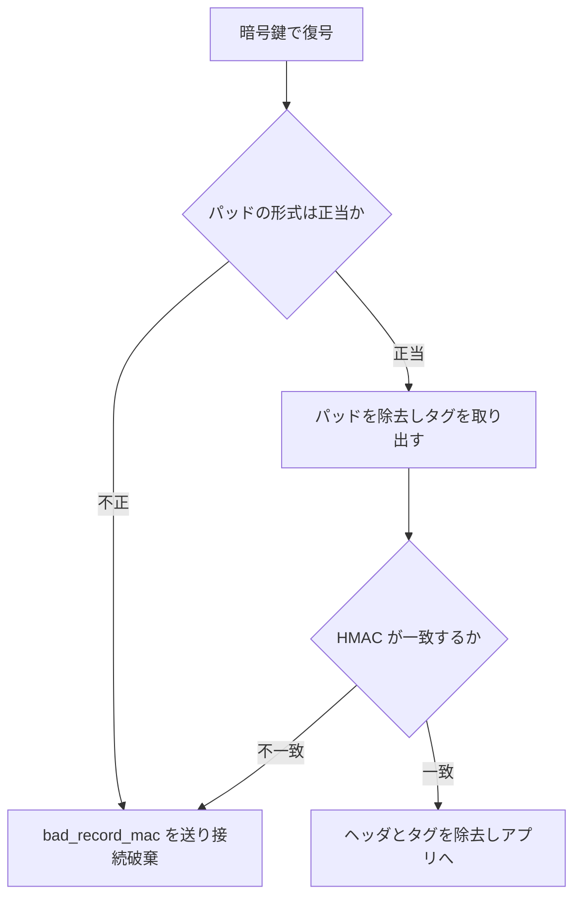

# 05. TLS レコードプロトコル

> 親: [README](./README.md) ｜ 前: [AE の構成法](./04_ae-constructions.md) ｜ 次: [パディングオラクル攻撃](./06_padding-oracle.md) ｜ 出典: Crypto I ビデオ2 (1:31:48–1:49:36)

**この1ページで分かること**

- 方向ごとに鍵 4 本。64 bit カウンタは**タグに含めるがレコードには入れない**（暗号文長ゼロでリプレイ対策）
- MAC-then-CBC が AE なのは「**復号失敗の理由を漏らさない場合に限る**」
- WEP の CRC は線形なので改竄後の正しい値に補正でき、完全性を与えない

---

## 鍵は方向ごとに分ける

TLS はデータを**レコード**単位（最大 16 KB）で送る。鍵は**一方向**である。

```
ブラウザ ⇄ サーバ で計 4 本

  ブラウザ→サーバ :  MAC 鍵 k_I    暗号鍵 k_E
  サーバ→ブラウザ :  MAC 鍵 k_I'   暗号鍵 k_E'
```

両者が 4 本すべてを知り、送信には自分の方向、受信には相手方向の鍵を使う。生成はセッション確立時の鍵交換による（本コースの範囲外）。

---

## 状態を持つ暗号化 — 64 bit カウンタ

両側が方向ごとに 64 bit カウンタを保持し、レコードを送るたび・受けるたびに +1 する。

使い方が肝心である。**タグの計算には含めるが、レコードには一切入れない。** 受信側は自分の側で同じ値を持っているので送る必要がない。結果として**リプレイ対策のコストが暗号文長ゼロ**で済む。リプレイされたレコードは受信側のカウンタが進んでいるため、タグ検証に必ず落ちる。

---

## レコードの構造と暗号化

必須の暗号スイートは AES-128 CBC + HMAC-SHA1、順序は MAC-then-encrypt。

```
┌──────────────────────┬────────────┬───────┬──────┐
│ 型 │ バージョン │ 長さ  │   データ    │  タグ  │ パッド │
└──────────────────────┴────────────┴───────┴──────┘
   ← ヘッダ（平文で送る）→  ←──── CBC で暗号化 ────→
```

```
1. タグを計算   t = HMAC(k_I,  ヘッダ ‖ データ ‖ カウンタ)   ← カウンタは送らない
2. 連結        データ ‖ t
3. パディング   AES ブロック長に揃える。長さ 5 なら  05 05 05 05 05
4. CBC 暗号化   毎レコード新しいランダム IV を使い、IV は暗号文に埋め込む
5. ヘッダを平文で前置して送信
```

長さフィールドが平文で送られる点を覚えておきたい（[SSH の設計](./07_ssh-length-attack.md)と対比される）。

---

## 復号の手順と、その順序



この `bad_record_mac` アラートが [AE の定義](./02_ae-definition.md)でいう `⊥` に対応する。

**決定的な点**: この構成が AE であるのは、**復号が失敗した理由を一切漏らさない場合に限る**。パッド不正と MAC 不正を区別できると、次ファイルで見るとおり全体が崩壊する。

---

## TLS 1.0 以前の 2 つの誤り

| 誤り | 内容 | 帰結 | TLS 1.1 での修正 |
|---|---|---|---|
| 連鎖 IV | 次レコードの IV に現レコードの最終暗号文ブロックを流用 | IV が予測可能 → CPA 安全でない → **BEAST 攻撃** | レコードごとに明示的なランダム IV |
| アラートの区別 | パッド不正 `decryption_failed` / MAC 不正 `bad_record_mac` | パディングオラクルになる | どちらも `bad_record_mac` に統一 |

> **教訓: 復号が失敗したとき、理由を説明してはならない。** ネットワークの作法では失敗理由を伝えるのが親切だが、暗号ではそれがほぼ確実に攻撃の入口になる。ただ拒否する、それだけでよい。

---

## 対比: WEP の CRC は完全性を与えない

802.11b の WEP は平文に CRC を連結してからストリーム暗号 RC4 で暗号化する。

```
送信内容 :  IV ‖ RC4(IV ‖ k) ⊕ (m ‖ CRC(m))
```

鍵の使い回しと関連鍵という致命的欠陥は [OTP への攻撃](../03_stream-ciphers/03_attacks-on-otp.md)で見た。ここで見たいのは、改竄検知のために置かれた **CRC そのものが無意味**な点である。原因は CRC の**線形性**にある。公開かつ既知の関数 `F` を使って:

```
CRC(m ⊕ p) = CRC(m) ⊕ F(p)
```

平文への XOR による CRC の変化を、平文を知らなくても計算できる。

### 宛先ポート 80 → 25 の書き換え

```
1. 狙う差分は  xx = 80 ⊕ 25

2. ストリーム暗号なので暗号文のポート欄に xx を XOR すると、復号後も同じ位置で XOR:
      80 ⊕ xx = 80 ⊕ 80 ⊕ 25 = 25          ← 宛先が化けた

3. このままでは CRC が合わない。CRC 欄にも F(xx) を XOR する。線形性より復号後には
      CRC(m) ⊕ F(xx) = CRC(m ⊕ 差分)       ← 改竄後の平文に対する正しい CRC
```

攻撃者は **CRC の値を一度も知らないまま正しい値に補正した**。

**結論: CRC は能動的攻撃に対して完全性をまったく提供しない。** 完全性が欲しいなら暗号学的 MAC を使う。

---

## 問題

**Q1.** TLS の 64 bit カウンタは、タグの計算に含まれるがレコードには入らない。なぜ入れなくてよいのか。また、この設計の利点は何か。

<details><summary>解答</summary>

受信側も同じカウンタを保持しており、次に受け取るレコードのカウンタ値を**既に知っている**ため、送信する必要がない。利点は 2 つ。(1) 暗号文長がまったく増えない。(2) それでいてリプレイを検出できる — 再送されたレコードは受信側のカウンタが進んでいるので、タグ検証時に別の値で HMAC を計算することになり必ず不一致になる。

</details>

**Q2.** TLS 1.0 の連鎖 IV がなぜ CPA 安全性を壊すのか、[CBC モード](../05_block-cipher-modes/03_cbc-mode.md)の議論を踏まえて説明せよ。

<details><summary>解答</summary>

連鎖 IV では、次レコードの IV が現レコードの最終暗号文ブロックであり、これは既に送信済みで攻撃者に見えている。つまり IV が**予測可能**になる。CBC の CPA 安全性の証明は IV が予測不能であることに依存しており、予測できると攻撃者はブロック暗号 `E` への入力を狙って過去の入力と一致させられる。暗号文ブロックが一致するかどうかを見れば `b` が判定でき、意味論的安全性が破れる。

</details>

**Q3.** WEP で、平文の 5 バイト目を `0x50`(80) から `0x19`(25) に変えたい。暗号文にどんな操作をすればよいか。CRC 欄も含めて答えよ。

<details><summary>解答</summary>

差分は `xx = 0x50 ⊕ 0x19 = 0x49`（5 バイト目のみ、他は 0）。操作は 2 つ:

1. 暗号文の 5 バイト目に `0x49` を XOR する。ストリーム暗号なので復号後の平文の 5 バイト目が `0x50 ⊕ 0x49 = 0x19` になる。
2. 暗号文の CRC 欄に `F(xx)`（`xx` は 5 バイト目だけ `0x49` のビット列）を XOR する。線形性 `CRC(m ⊕ xx) = CRC(m) ⊕ F(xx)` より、復号後には改竄後の平文に対する正しい CRC が現れる。

`F` は公開関数なので攻撃者は計算できる。元の CRC 値を知る必要はない。

</details>

**Q4.** 「TLS の MAC-then-CBC は AE である」という主張には条件が付いていた。その条件は何か。条件が破れた実例は何か。

<details><summary>解答</summary>

条件は「**復号が失敗した理由を一切漏らさないこと**」。パッド不正と MAC 不正の区別が付けば AE の保証は成立しない。実例は TLS 1.0 以前のアラート種別の使い分け（`decryption_failed` と `bad_record_mac`）で、これがパディングオラクルとなった。さらにアラートを統一した後も、パッド検査で早期に打ち切る実装は**応答時間**で理由を漏らしており、タイミングによるオラクルが残った（次ファイル）。

</details>

## 関連リンク

- [パディングオラクル攻撃](./06_padding-oracle.md) — 「理由を漏らさない」条件が破れたときに何が起きるか
- [CBC モード](../05_block-cipher-modes/03_cbc-mode.md) — 連鎖 IV とパディング規則の本体
- [OTP への攻撃](../03_stream-ciphers/03_attacks-on-otp.md) — WEP の鍵使い回しと関連鍵の問題
- [無線セキュリティ(topics)](../../../topics/06_systems-security/06_wireless-security.md) — WEP から WPA2/WPA3 への実務上の変遷
