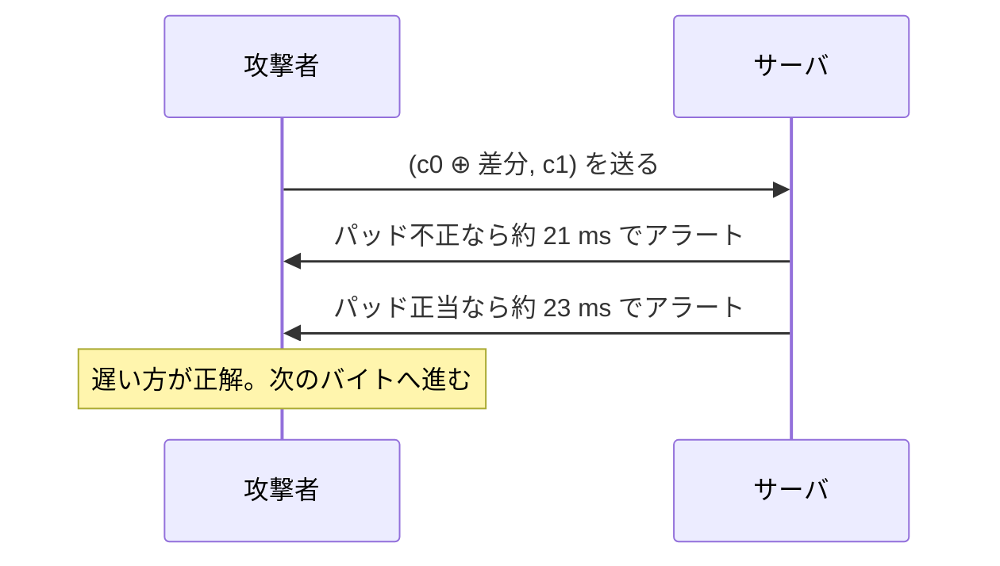

# 06. パディングオラクル攻撃

> 親: [README](./README.md) ｜ 前: [TLS レコードプロトコル](./05_tls-record-protocol.md) ｜ 次: [SSH の長さフィールド攻撃](./07_ssh-length-attack.md) ｜ 出典: Crypto I ビデオ2 (1:49:36–2:04:07)

**この1ページで分かること**

- 漏れるのは「パディングは正しかったか」の 1 bit。それだけで暗号文が丸ごと復号される
- アラートを統一しても**応答時間の差 2 ms** でオラクルは残る
- encrypt-then-MAC ならオラクルになる場所自体が存在しない。CTR にはパディングがなく無関係

---

## 復号の 2 種類のエラー

[TLS の復号手順](./05_tls-record-protocol.md)は「復号 → パッド検査 → MAC 検証」の順だった。エラーが 2 種類あり、**どちらかを攻撃者に知られてはならない**。

| サーバの反応 | 攻撃者が知ること |
|---|---|
| パディングエラー | 復号結果の末尾が正しいパッドの形をしていない |
| MAC エラー | パッドは**正しかった**（でたらめな暗号文なので MAC は当然落ちる） |

つまりサーバが**「復号後の末尾が `01` か `02 02` か `03 03 03` か…の形か」を判定してくれる装置**になる。これを**パディングオラクル**と呼ぶ。

---

## アラートを統一してもタイミングで漏れる

TLS 1.0 以前はアラート種別が違ったので自明に漏れていた。攻撃の公表後、実装は同じアラートを返すようになった。それでもオラクルは残る。Canvel らが指摘したのは**応答時間**である。

```
パッド不正 → 即座に打ち切ってアラート            ≈ 21 ms
パッド正当 → MAC も検証してからアラート          ≈ 23 ms
                ↑ この 2 ms が 1 bit を漏らす
```

アラートの中身が同じでも、**いつ返ってきたか**で判定できる。実装の制御フローがそのまま情報になっている。

---

## 攻撃: 1 バイトずつ復号する

暗号文 `(c0, c1, c2, …)` のうち 2 番目の平文ブロック `m1` を復号したい。CBC の復号は `m1 = D(k, c1) ⊕ c0` で、**`c0` は攻撃者が自由に触れる**。ここが突破口になる。



### 最終バイトを当てる

```
1. c2 以降を捨て、暗号文を (c0, c1) の 2 ブロックにする
   → c1 が最終ブロックになるので、パッド検査は m1 の末尾に対して行われる

2. m1 の最終バイトの推測値を g とする（g = 0x00 … 0xFF）
   c0 の最終バイトに  g ⊕ 0x01  を XOR して送る

3. 復号結果の最終バイトは  (m1 の最終バイト) ⊕ g ⊕ 0x01

   g が正解なら  →  0x01        ← 長さ 1 の正当なパッド！
   g が外れなら  →  0x01 以外   ← ほぼ確実に不正なパッド

4. オラクルが「パッド正当」と答えた瞬間の g が、m1 の最終バイト
```

256 通り試せば必ず当たる（平均 128 回）。

### 次のバイトへ

最終バイトが分かったので、今度は**長さ 2 のパッド `02 02`** を狙う。`c0` を調整して復号後の最終バイトを `0x02` に固定し、最終から 2 番目のバイトを `g'` で推測して `g' ⊕ 0x02` を XOR する。復号後が `02 02` になれば正解。

```
16 バイト × 256 通り = 最大 4096 クエリ で 1 ブロック全体が復号できる
```

鍵は最後まで一切分からないまま、平文だけが落ちる。

---

## TLS では 1 回しか撃てない — はずだった

**TLS はパッド不正でも MAC 不正でも接続を破棄し鍵を再交渉する。** 攻撃者の手元には古い鍵の暗号文だけが残り、クエリは 1 回しか撃てない。

ところが攻撃を成立させる設定が現実にあった。**IMAP over TLS** である。

```
IMAP クライアントは 5 分ごとに接続し  login <ユーザ名> <パスワード>  を送る
        ↓
5 分ごとに「まったく同じ平文」の暗号文が観測できる
        ↓
5 分に 1 回の推測を積み重ねられる
```

パスワードが 8 文字なら必要な推測回数は現実的な範囲に収まり、Canvel らは**数時間でパスワードを復元**できることを示した。1 回 1 bit でも、同じ平文が繰り返し流れる設定では致命的になる。

---

## 対策と、そこから得られる 2 つの教訓

直接の対策は**パッドの正誤にかかわらず必ず MAC を検証する**こと。応答時間が揃いタイミングオラクルが消える。だが本質的な教訓は別にある。

### 教訓 1: encrypt-then-MAC ならこの問題は起きない

[encrypt-then-MAC](./04_ae-constructions.md) では検証の順序が逆で、まず MAC を検証し、落ちたらその場で捨てる（復号もパッド検査もしない）。改竄された暗号文は**パッド検査に到達しない**。オラクルになる場所そのものが存在しない。

### 教訓 2: MAC-then-CBC の AE 性は条件付きだった

「MAC-then-CBC は AE を与える」の条件は**復号失敗の理由を漏らさないこと**だった。パディングオラクルはこの条件を破り AE の性質を無効化した。定理が成り立つ前提を実装が満たしていなければ、定理は何も守ってくれない。

---

## CTR モードなら成立しない

TLS が MAC-then-CTR を使っていたらこの攻撃は可能か。答えは **No**。[カウンタモード](../05_block-cipher-modes/04_counter-mode.md)は**パディングを一切使わない**ので、検査すべきパッドが存在しない。パディングオラクル攻撃は CBC 系に固有の問題である。

---

## 問題

**Q1.** 攻撃の第 1 段階で、`c0` の最終バイトに `g ⊕ 0x01` を XOR するのはなぜか。`g` だけ、あるいは `0x01` だけではいけないのか。

<details><summary>解答</summary>

復号結果の最終バイトは `(m1 の最終バイト) ⊕ (c0 に XOR した値)` になる。狙いは「`g` が正解のときにこれが `0x01` になる」ことなので、XOR する値は `g ⊕ 0x01` でなければならない。実際 `g` が正解なら `m1 の最終バイト = g` なので `g ⊕ g ⊕ 0x01 = 0x01` となる。`g` だけなら結果は `0x00` になり正当なパッドにならず、`0x01` だけでは `g` を試したことにならない。

</details>

**Q2.** 16 バイトブロックの 1 ブロックを完全に復号するのに必要なクエリ数を、最大値と平均値で見積もれ。

<details><summary>解答</summary>

1 バイトあたり最大 256 回（平均 128 回）。16 バイトなので:

- 最大: `16 × 256 = 4096` クエリ
- 平均: `16 × 128 = 2048` クエリ

鍵の全数探索 `2^128` と比べれば無視できる回数である。オラクルが 1 bit 返すだけで指数から線形に落ちる、という点がこの攻撃の恐ろしさである。

</details>

**Q3.** TLS は失敗時にセッションを破棄するため、原理的にはクエリを 1 回しか撃てない。それでも IMAP over TLS で攻撃が成立したのはなぜか。

<details><summary>解答</summary>

IMAP クライアントが 5 分ごとに自動で再接続し、**毎回まったく同じ平文（ログインとパスワード）** を送るため。セッションが破棄されても 5 分後にまた同じ平文の新しい暗号文が観測でき、そこで次の 1 回の推測を撃てる。1 セッションあたり 1 クエリという制約が、時間をかければ回避できてしまう。攻撃可能性は「1 回のクエリ数」ではなく「同じ平文が何度流れるか」で決まる、という教訓でもある。

</details>

**Q4.** この攻撃を根本的に封じる設計変更を 1 つ挙げ、それがなぜ効くかを説明せよ。

<details><summary>解答</summary>

**encrypt-then-MAC に変更する**こと。この順序では受信側がまず暗号文全体の MAC を検証し、改竄されていれば復号もパディング検査も行わずに捨てる。攻撃者が投げる細工された暗号文は MAC 検証で必ず止まるので、パディングの正誤という情報が生成される機会自体がない。オラクルを「隠す」のではなく「存在させない」点が、応答時間を揃える対症療法との違いである。

</details>

## 関連リンク

- [SSH の長さフィールド攻撃](./07_ssh-length-attack.md) — 別の実装ミスによる同種の情報漏洩
- [AE の構成法](./04_ae-constructions.md) — encrypt-then-MAC がなぜこの問題を消すか
- [CBC モード](../05_block-cipher-modes/03_cbc-mode.md) — 攻撃が突くパディング規則と復号式
- [カウンタモード](../05_block-cipher-modes/04_counter-mode.md) — パディングを持たないためこの攻撃が成立しないモード
