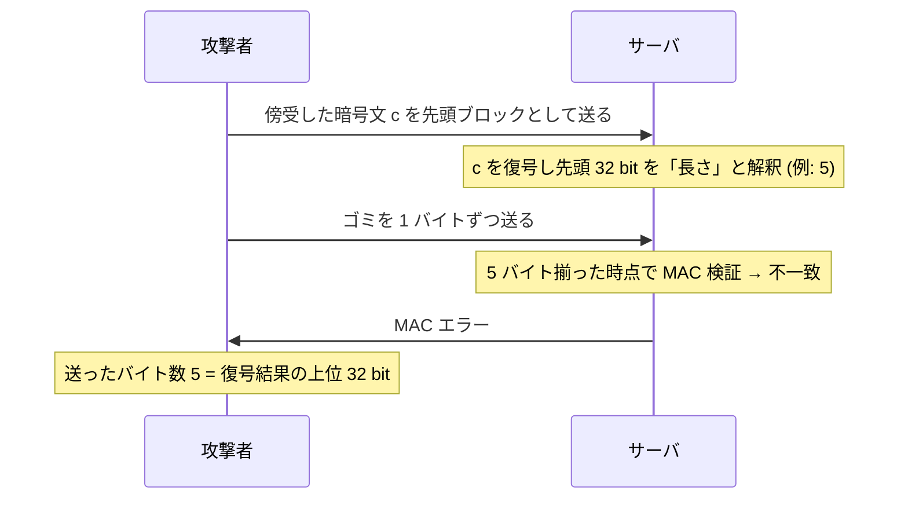

# 07. SSH の長さフィールド攻撃

> 親: [README](./README.md) ｜ 前: [パディングオラクル攻撃](./06_padding-oracle.md) ｜ 次: [09. 対称暗号の補遺](../09_odds-and-ends/README.md) ｜ 出典: Crypto I ビデオ2 (2:04:07–2:13:27)

**この1ページで分かること**

- 漏れるのは**サーバが何バイト待つか**。それが復号結果の上位 32 bit をそのまま教える
- 誤りは 2 つ: **非アトミックな復号**と**認証前のフィールド使用**
- encrypt-then-MAC への変更だけでは直らない。長さを平文で送るか別 MAC を付ける

長さフィールドを暗号化した SSH は、平文で送る TLS より安全に見えて実際は逆だった。

---

## SSH バイナリパケットプロトコルの構造

```
┌───────────┬─────────┬─────────┬──────────┬────────┐  ┌───────┐
│シーケンス番号│パケット長 │ パッド長 │ ペイロード │  パッド  │  │  MAC   │
└───────────┴─────────┴─────────┴──────────┴────────┘  └───────┘
              ←────────── CBC で暗号化（連鎖 IV）──────────→      ↑
              ←──────── 平文に対して MAC を計算 ─────────→   平文で送る
```

SSH は **encrypt-and-MAC** である（[AE の構成法](./04_ae-constructions.md)で「推奨されない」とした順序）。しかも [TLS 1.0 と同じ連鎖 IV](./05_tls-record-protocol.md) まで使っている。だが問題はそこではない。**パケット長が暗号化されている**点に注目したい。

---

## 復号が非アトミックである

```
1. 暗号化されたパケット長フィールド「だけ」を復号する
2. その長さぶんのバイトをネットワークから読み込む
3. 残りの暗号文ブロックを CBC で復号する
4. 平文の MAC を検証し、不正ならエラーを返す
```

ここに 2 つの問題が同居している。

- **復号がアトミックでない** — 「パケット全体を受け取って平文か `⊥` を返す」形になっていない。途中で止まり、外部入力を待ち、また再開する
- **認証前のフィールドを使っている** — 長さを信じて読み込み量を決めるが、その時点ではパケット全体が揃っておらず MAC を検証できない

そして「サーバが何バイト待つか」は外から観測できる。

---

## 攻撃: 待ちバイト数から 32 bit を読む



**サーバの「待つのをやめた瞬間」が、復号結果の上位 32 bit をそのまま教えている。**

攻撃者は任意の暗号文ブロックにこれを適用できるので、長いメッセージの**すべてのブロックについて先頭 32 bit を復元**できる。1 ブロック 128 bit のうち 32 bit、つまり 4 分の 1 が落ちる。鍵は最後まで不要である点も、前ファイルのパディングオラクルと同じである。

---

## 設計上の誤りは 2 つ

| 誤り | 内容 |
|---|---|
| **非アトミックな復号** | 復号が「暗号文 → 平文 or `⊥`」の 1 手になっていない。部分復号して外部入力を待つ構造そのものが危険 |
| **認証前のフィールド使用** | 長さを MAC 検証より先に信じて使った。その値が挙動として外に漏れる |

---

## どう直すか — 修正案の比較

| 修正案 | 有効か | 理由 |
|---|---|---|
| 長さを**平文で送る**（TLS 方式） | **有効** | 長さは復号されないので、細工した暗号文を長さとして解釈させる経路が消える |
| 長さフィールドに**別の MAC を付ける** | **有効** | 長さを読み、その MAC を検証してから読み込み量を決められる。認証済みの値しか使わない |
| encrypt-and-MAC を **encrypt-then-MAC に変える** | **無効** | 順序を変えても長さを認証前に使う構造は残り、同じ攻撃が通る |
| 毎回パケット全体を読んでから処理 | 実質不可 | 長さが分からないと「全体」が定義できない。無制限に読むと DoS を招く |

3 つ目が重要である。**encrypt-then-MAC は万能ではない。** パディングオラクルのような「復号後の検査が漏らす」問題は消すが、「認証前の値を使う」という別種の誤りは消さない。

---

## まとめ

```
第一選択 : 認証付き暗号の標準（GCM / CCM / EAX）を使う。自作しない
やむを得ず自作する場合:
    ・encrypt-then-MAC を使う
    ・復号は アトミック にする（平文か ⊥ か、途中状態を外に見せない）
    ・認証前の値を絶対に使わない ← 長さフィールドを含め、例外なし
```

TLS のパディングオラクルと SSH の長さ攻撃は、どちらも**数学的には正しい実装**だった。壊れたのはそのまわりの制御フローである。だからこそ「自分で実装するな」という結論になる。

---

## 問題

**Q1.** SSH は長さフィールドを暗号化しており、平文で送る TLS より安全に見える。実際には逆だった。なぜか。

<details><summary>解答</summary>

暗号化しているからこそ、サーバは**復号してからその値を使う**必要がある。攻撃者は任意の暗号文ブロックを送り込んで「復号結果を長さとして解釈させる」ことができ、サーバがその値ぶん待つという挙動から復号結果を読み取れる。平文で送っていれば復号という工程が存在せず、攻撃者が細工した暗号文を長さに化けさせる経路もない。「隠す」ことが「攻撃者の入力を信頼して処理する」ことにすり替わった、という構図である。

</details>

**Q2.** 攻撃者が傍受した 1 ブロックの復号結果の上位 32 bit が `0x00000003` だったとする。攻撃者から見た観測はどうなるか。

<details><summary>解答</summary>

サーバは長さフィールドを 3 と解釈するので、3 バイトを受け取った時点で「パケットが揃った」と判断し MAC 検証に進む。攻撃者が送るのはゴミなので MAC は必ず落ち、エラーが返る。攻撃者は 3 バイト送った直後にエラーを観測するので、上位 32 bit が 3 だと分かる。バイトを 1 つずつ送って「何バイト目でエラーが返ったか」を数えるだけでよい。

</details>

**Q3.** encrypt-then-MAC への変更だけではこの攻撃を防げない。その理由を、パディングオラクル攻撃との違いに触れて説明せよ。

<details><summary>解答</summary>

パディングオラクルは「**復号したあとの検査**が結果を漏らす」問題だったので、MAC を先に検証して改竄暗号文を復号前に捨てれば消える。一方この攻撃は「**長さフィールドを認証前に使う**」という構造に起因する。encrypt-then-MAC にしても、パケット全体を受け取るには長さが必要で、その長さは MAC 検証前に読まざるを得ない。順序の変更では触れられない層の問題である。したがって修正には「長さを平文で送る」「長さに独立の MAC を付ける」といった、認証の粒度そのものを変える対処が要る。

</details>

**Q4.** 「認証前の値を使うな」を一般原則として述べたとき、これに違反している設計を本モジュールから 2 つ挙げよ。

<details><summary>解答</summary>

1. **SSH の長さフィールド** — MAC 検証前に復号した長さを信じて読み込み量を決めている（本ファイル）。
2. **TLS の MAC-then-CBC におけるパディング検査** — MAC 検証前に復号結果のパッドを検査し、その結果で分岐している（[前ファイル](./06_padding-oracle.md)）。

いずれも「認証されていない復号結果を使って制御フローを変えた」ことが漏洩源になっている。分岐が観測できる以上、認証前の値に基づく分岐は必ず情報を漏らすと考えるべきである。

</details>

## 関連リンク

- [パディングオラクル攻撃](./06_padding-oracle.md) — 同じく認証前の検査が漏らした実例
- [AE の構成法](./04_ae-constructions.md) — 標準（GCM / CCM / EAX）を使うべき理由の総まとめ
- [CBC モード](../05_block-cipher-modes/03_cbc-mode.md) — SSH が使う連鎖 IV の問題
- [インフラのセキュリティ(topics)](../../../topics/06_systems-security/04_infrastructure-security.md) — SSH を実運用で使うときの設定面
