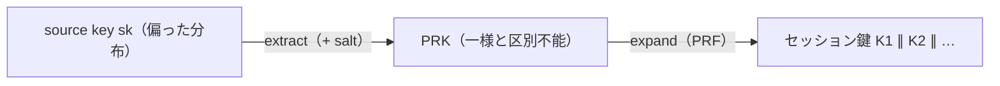

# 01. 鍵導出関数

> 親: [README](./README.md) ｜ 前: [08. 認証付き暗号](../08_authenticated-encryption/README.md) ｜ 次: [決定的暗号](./02_deterministic-encryption.md) ｜ 出典: Crypto I ビデオ2 (2:13:27–2:27:00)

**この1ページで分かること**

- source key 1 本から多数のセッション鍵を作るのが KDF。`context` でアプリを分離する
- source key が一様でないときは extract-then-expand（HKDF）で均してから展開する
- パスワードは低エントロピーなので、salt + 遅いハッシュ（PBKDF）で辞書攻撃の単価を上げる

1 セッションには MAC 鍵・暗号鍵・IV と鍵が何本も要るが、手元にあるのは `source key` 1 本。この 1 本から多数の鍵を安全に展開するのが**鍵導出関数（KDF）**の役目。

---

## source key はどこから来るか

| 出どころ | 内容 |
|---|---|
| ハードウェア乱数生成器 | 物理現象からエントロピー（予測不能さの量）を集める |
| 鍵交換プロトコル | [10. 鍵交換の基礎](../10_basic-key-exchange/README.md) で扱う |

どちらも「攻撃者が知らない値」を 1 本作るだけ。**source key をそのままセッション鍵に使うことはない。**

---

## source key が一様な場合

`sk` が PRF `F` の鍵空間上で**一様**なら、PRF を PRG として使えばよい。

```
KDF(sk, context, ℓ) = F(sk,(context,0)) ∥ F(sk,(context,1)) ∥ … ∥ F(sk,(context,ℓ))
    → 先頭から切り分ける: [送信 MAC 鍵][送信 暗号鍵][受信 MAC 鍵][受信 暗号鍵][IV]
```

**context** はアプリを一意に識別する文字列。1 台のマシンで ssh・web サーバ・IPsec が**同じ `sk`** を引くことは起こりうる。`context` が違えば鍵列は独立に見え、なければ 3 サービスが同じ鍵列を共有し、1 つの漏洩が全部を道連れにする。

---

## source key が一様でない場合

| 出どころ | 偏りの理由 |
|---|---|
| 鍵交換の出力 | 高エントロピーだが、鍵空間の**部分集合に偏る** |
| ハードウェア乱数 | 出力に偏りが残りうる |

PRF の安全性は「鍵が一様」を前提にする。偏った `sk` を直接使うと、出力が乱数と区別できない保証が消え、セッション鍵を先読みされうる。

---

## extract-then-expand



| 段 | 役目 | 使うもの |
|---|---|---|
| extract | `sk` から擬似ランダム鍵 `PRK` を絞り出す | extractor（一様と区別できなければ十分 = 計算量的 extractor） |
| expand | `PRK` を必要な本数に展開 | PRF（一様な場合と同じ手順） |

### salt が公開・固定でよい理由

| 性質 | 内容 |
|---|---|
| 秘密か | **秘密でない**。攻撃者が知っていてよい |
| 生成 | 最初に一度だけランダムに選ぶ |
| 更新 | **永久に固定** |

salt は秘密を守るためではなく、**敵対的に選ばれた入力分布**から extractor を守るためにある。先に無作為に決めておけば、`sk` の分布がその salt を狙い撃ちすることはない。

---

## HKDF

標準化された extract-then-expand。両段とも HMAC で作る。

```
extract:  PRK = HMAC(key = salt, data = sk)          ← 公開値 salt を「鍵」の位置に置く
expand:   K1 ∥ K2 ∥ … = HMAC(key = PRK, data = context ∥ counter)
```

`sk` に十分なエントロピーがあれば、HMAC の抽出性により `PRK` は乱数と区別できない — という議論に基づく。

---

## パスワードからの鍵導出（PBKDF）

パスワードのエントロピーは 20 bit 程度。**この用途に HKDF を使ってはならない**（導出鍵が辞書攻撃に晒される）。

```
PBKDF1(pwd, salt, c):
    x ← pwd ∥ salt
    repeat c times:  x ← H(x)        ← c = 10^5 〜 10^6（遅いハッシュ）
    return x
```

| | HKDF | PBKDF |
|---|---|---|
| 入力 | 高エントロピーの `sk` | 低エントロピーのパスワード |
| 手段 | extract-then-expand | salt + **遅いハッシュ**（反復） |
| 目的 | 偏りを均す | 辞書攻撃の**単価を上げる** |

反復の単価は双方等しいが、**支払う回数**が違う。利用者は 1 回、攻撃者は辞書の語数だけ。PKCS#5（PBKDF1/PBKDF2）として全ライブラリにあるので自作しない。導出鍵は推測可能なままで、PBKDF は「推測を高くつかせる」だけである。

---

## 問題

**Q1.** `context` 文字列は何のためにあるか。同一マシンの 3 サービスが同じ `sk` を引いた場合、`context` がないと何が起きるか。

<details><summary>解答</summary>

アプリケーションの分離のためにある。`context` がなければ 3 サービスは完全に同じ鍵列を得てしまい、1 つのサービスから鍵が漏れれば残り 2 つも同時に破れる。`context` を変えれば、同じ `sk` からでも互いに独立に見える鍵列が得られる。

</details>

**Q2.** 鍵交換で得た値をそのまま PRF の鍵にしてはいけないのはなぜか。

<details><summary>解答</summary>

鍵交換の出力は高エントロピーだが、鍵空間の部分集合に偏った分布であり一様ではない。PRF の安全性は鍵が一様であることを前提にしているため、偏った鍵では出力が乱数と区別できない保証が失われる。extract 段で一様に均してから expand する必要がある。

</details>

**Q3.** salt は公開されていて、しかも永久に固定でよい。それでも意味があるのはなぜか。

<details><summary>解答</summary>

salt は秘密を守るためではなく、extractor が特定の悪い入力分布で破綻しないようにするためにある。最初に一度無作為に選んでおけば、入力分布がその salt を狙って作られることはないので、敵対的な分布に対しても出力が一様と区別できなくなる。よって攻撃者に知られても問題ない。

</details>

**Q4.** 反復回数 `c = 10^5`、SHA-256 1 回が `1 μs` とする。(a) 1 パスワードの導出時間は。(b) 2×10^9 語の辞書を総当たりする攻撃者の所要時間は。(c) 反復がない場合と比較せよ。

<details><summary>解答</summary>

(a) `10^5 × 1 μs = 0.1 秒`。利用者はほぼ気づかない。

(b) `2×10^9 × 0.1 秒 = 2×10^8 秒 ≈ 6.3 年`。

(c) 反復なしなら `2×10^9 × 1 μs = 2000 秒 ≈ 33 分`。単価を `10^5` 倍にすることで、辞書攻撃を 33 分から 6 年へ押し上げている。利用者側の負担は 0.1 秒に過ぎない。

</details>

## 関連リンク

- [決定的暗号](./02_deterministic-encryption.md) — 次の話題。乱数を置く場所がないときの暗号化
- [06. メッセージ完全性](../06_message-integrity/README.md) — HKDF が土台にする HMAC の構成
- [04. ブロック暗号と PRF/PRP](../04_block-ciphers/01_block-cipher-and-prf-prp.md) — expand 段が依拠する PRF の定義と安全性
- [ハッシュ関数と MAC(topics)](../../../topics/02_cryptography/04_hash-and-mac.md) — HMAC・PBKDF が実務のどこで使われるか
