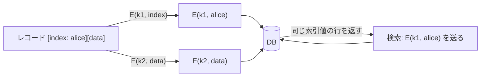

# 02. 決定的暗号

> 親: [README](./README.md) ｜ 前: [鍵導出関数](./01_key-derivation.md) ｜ 次: [決定的暗号の構成](./03_deterministic-constructions.md) ｜ 出典: Crypto I ビデオ2 (2:27:00–2:41:54)

**この1ページで分かること**

- 暗号化した索引で検索するには「同じ平文 → 同じ暗号文」（決定的暗号）が必要
- 決定的暗号は通常の CPA 安全性を満たせない。解決は「同じ鍵で同じメッセージを 2 度暗号化しない」という**用途の制限**
- その制限をゲームに組み込んだのが**決定的 CPA 安全性**。固定 IV の CBC/CTR はこれも満たさない

CPA 安全性は「同じ平文でも毎回違う暗号文」を要求するが、乱数を置けない・置いては困る場面がある。そこで使う**決定的暗号**には、安全性の定義を作り直す必要がある。

---

## 動機 —— 暗号化データベース



DB は索引の平文も中身も知らずに検索に応じられる。成り立つのは**同じ索引が必ず同じ暗号文になる**からで、乱数化すると過去の行と一致せず検索できない。

---

## 決定的暗号は CPA 安全になれない

暗号文が一致すれば平文も一致すると攻撃者に分かる。CPA ゲームで advantage（識別成功の優位度）1 を取れる。

```
1. 攻撃者 → (m0, m0)          左右とも同じメッセージ
   challenger → c0 = E(k, m0)  どちらの実験でも m0 の暗号文

2. 攻撃者 → (m0, m1)
   challenger → c = E(k, mb)

3. c == c0 なら b=0、c ≠ c0 なら b=1 と出力      → advantage = 1
```

| 実害の例 | 漏れるもの |
|---|---|
| 1 バイトのキーストロークを 1 つずつ暗号化 | 256 通りの暗号文辞書を作れば以後すべて復号できる |
| DB の索引 | 暗号文が一致する 2 行は「同じ索引を持つ」 |

平文そのものは分からなくても、「等しさ」は確かに漏れる。

---

## 解決は「用途の制限」

暗号方式ではなく**使い方**に制約を課す。

> 1 つの鍵で、同じメッセージを 2 度暗号化しない。`(鍵, メッセージ)` の組が二度と繰り返されない。

| 自然に成り立つ場面 | なぜ繰り返さないか |
|------|------------------|
| メッセージが乱数の鍵 | 128 bit 鍵なら同じ値が再登場する確率は無視できる |
| 索引が一意な識別子 | 1 ユーザ 1 行なら user id は重複しない |

---

## 決定的 CPA 安全性

通常の CPA ゲームに**追加条件が 1 つ**付く。

```
challenger: k ← K
攻撃者 → (m_1,0 , m_1,1)   challenger → E(k, m_1,b)
          ⋮                            ⋮
攻撃者 → (m_q,0 , m_q,1)   challenger → E(k, m_q,b)
攻撃者 → b' を出力

【追加条件】 m_1,0 , … , m_q,0 はすべて相異なる
             m_1,1 , … , m_q,1 もすべて相異なる
```

`b` がどちらでも「同じメッセージを同じ鍵で 2 度暗号化する」問い合わせはできない。実験 0 と 1 が区別できなければ**決定的 CPA 安全**。前節の攻撃はステップ 1 で `m0` を 2 度暗号化させているので、この定義では**反則**になる。

---

## 固定 IV の CBC は破れる

「乱数がないなら IV を固定すればよい」は誤り。`E` を `n` bit ブロックの PRP、IV を固定値とする。

```
1. 問い合わせ (0^n ∥ 1^n , 0^n ∥ 1^n)     ← 左右同じなので条件を満たす
   暗号文の 1 ブロック目:  c1 = E(k, IV ⊕ 0^n) = E(k, IV)

2. 問い合わせ (0^n , 1^n)                  ← 左右とも新しく、相異なる
   b=0 なら c1' = E(k, IV ⊕ 0^n) = E(k, IV) = c1
   b=1 なら c1' = E(k, IV ⊕ 1^n)          ≠ c1

3. c1' == c1 なら 0、そうでなければ 1 を出力   → advantage = 1
```

ステップ 1 を 2 ブロックにしたのは、ステップ 2 の `0^n` と**別のメッセージ**にして条件を満たしつつ、同じ `E(k,IV)` を手に入れるため。

---

## 固定 IV の CTR も破れる

固定 IV の CTR はワンタイムパッドの使い回し（[two-time pad](../03_stream-ciphers/03_attacks-on-otp.md)）そのもの。

```
1. 問い合わせ (m, m)      → c  = m  ⊕ F(k,IV)
2. 問い合わせ (m0, m1)    → c' = mb ⊕ F(k,IV)      m, m0, m1 は相異なる
3. c ⊕ c' = m ⊕ mb
   これが m ⊕ m0 に等しければ b=0、そうでなければ b=1   → advantage = 1
```

| 構成 | 決定的 CPA 安全か | 崩れ口 |
|---|---|---|
| 固定 IV の CBC | ✗ | 1 ブロック目が完全に決定的 |
| 固定 IV の CTR | ✗ | パッドが相殺され平文の XOR が露出 |

要件を満たす構成は次のファイルで見る。

---

## 問題

**Q1.** 決定的暗号が CPA 安全になれないことを、ゲームの手順で示せ。

<details><summary>解答</summary>

攻撃者はまず `(m0, m0)` を問い合わせて `c0 = E(k,m0)` を得る。次に `(m0, m1)` を問い合わせて `c` を得る。決定的なので `b=0` なら `c = c0`、`b=1` なら `c ≠ c0`。`c` と `c0` を比較して出力すれば advantage は 1 になる。

</details>

**Q2.** 暗号化データベースの索引に決定的暗号を使うとき、DB 側は何を知り、何を知らないか。

<details><summary>解答</summary>

知らないこと: 索引の平文、レコードの中身、検索されている索引が何であるか。

知ること: どの 2 行が同じ索引を持つか（暗号文が一致するため）。また検索の頻度分布。平文そのものは分からないが「等しさ」の情報は漏れる。

</details>

**Q3.** 固定 IV の CBC への攻撃で、ステップ 1 が `0^n ∥ 1^n` という 2 ブロックのメッセージなのはなぜか。1 ブロックの `0^n` ではいけないのか。

<details><summary>解答</summary>

ステップ 2 で `0^n` を問い合わせるため。ステップ 1 でも `0^n` を使うと、左側のメッセージ列に `0^n` が 2 度現れて「すべて相異なる」条件に違反し、決定的 CPA ゲームの反則になる。2 ブロックにすればメッセージとしては別物でありながら、1 ブロック目の暗号化結果 `E(k,IV)` は共有できる。

</details>

**Q4.** 決定的 CPA 安全性のゲームが「左のメッセージ群がすべて相異なる」ことを要求するのはなぜか。この制約を外すとどうなるか。

<details><summary>解答</summary>

決定的暗号を運用する際の前提「1 つの鍵で同じメッセージを 2 度暗号化しない」を定義に写したもの。制約を外すと同じメッセージを 2 度問い合わせられ、暗号文の一致を見るだけで advantage 1 の攻撃が成立してしまう。つまり満たしうる方式が一つも存在しない空虚な定義になる。

</details>

## 関連リンク

- [決定的暗号の構成](./03_deterministic-constructions.md) — この定義を実際に満たす SIV と PRP 直接利用
- [03. OTP への攻撃](../03_stream-ciphers/03_attacks-on-otp.md) — 固定 IV の CTR が陥る two-time pad
- [02. CPA 安全性と nonce](../05_block-cipher-modes/02_cpa-security-and-nonces.md) — 通常の CPA 安全性が乱数化を要求する理由
- [利用モードと AEAD(topics)](../../../topics/02_cryptography/02_symmetric-crypto/04_modes-and-aead.md) — 決定的暗号が実務で置かれる位置
