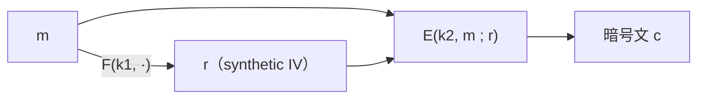

# 03. 決定的暗号の構成

> 親: [README](./README.md) ｜ 前: [決定的暗号](./02_deterministic-encryption.md) ｜ 次: [Tweakable 暗号](./04_tweakable-encryption.md) ｜ 出典: Crypto I ビデオ2 (2:41:54–3:02:19)

**この1ページで分かること**

- **SIV**: 乱数 `r` をメッセージから PRF で導く。決定的 CPA 安全で、復号時の IV 再計算だけで**完全性もただで付く**
- **短いメッセージ**（16 バイト未満）は PRP をそのまま使ってよい。ゼロ埋めで完全性を足せる
- 長いブロックの PRP が要るなら **EME**（ただしブロックあたり `E` 2 回で SIV より遅い）

決定的 CPA 安全な構成は 2 通りあり、メッセージ長で使い分ける。

---

## SIV —— 乱数をメッセージから導く

CPA 安全な暗号 `E` が必要とする乱数 `r` を、**メッセージ自身から PRF で導く**。



```
E_det((k1,k2), m):
    r ← F(k1, m)              ← ここが SIV の全て
    c ← E(k2, m ; r)
    return c
```

同じメッセージなら同じ `r` なので決定的。一方、決定的 CPA ゲームでは**相異なるメッセージしか問い合わせられない**ので `F` は毎回異なる点で評価され、PRF の出力は独立な乱数と区別できない。つまり `E` は常に「真の乱数 `r`」で使われており、`E` の CPA 安全性がそのまま効く。`E` がランダム化 CTR なら `r` は IV そのものなので暗号文に含めて送る。

---

## SIV は完全性まで無料で付く

復号時にひと手間加えると**暗号文完全性**が得られ、**決定的認証付き暗号（DAE）** = 決定的 CPA 安全性 + 暗号文完全性になる。

```
暗号化 SIV-CTR:
    IV ← F(k1, m)
    c  ← m ⊕ ( F_ctr(k2,IV) ∥ F_ctr(k2,IV+1) ∥ … )
    return (IV, c)

復号:
    m  ← c ⊕ ( F_ctr(k2,IV) ∥ … )        ← まず平文を復元
    IV' ← F(k1, m)                        ← PRF を「再計算」
    if IV' ≠ IV: return ⊥                 ← 一致しなければ拒否
    return m
```

暗号文完全性ゲームで攻撃者は、問い合わせた暗号文と異なる**有効な**暗号文を作らねばならない。

| 偽造暗号文の復号結果 | なぜ失敗するか |
|---|---|
| 全く新しいメッセージ | `F(k1, m)` は攻撃者に未知の乱数。書いた `IV` と一致する確率は無視できる → 拒否 |
| 問い合わせ済みのメッセージ | 決定的なので暗号文は渡したものと完全一致 → 「新しい暗号文」でない |

MAC を別途付けずに完全性が出るのは、IV がメッセージ全体の関数だからである。

> **定理**: `F` が安全な PRF で、`F_ctr` から作るカウンタモードが CPA 安全なら、SIV-CTR は DAE である。

---

## 短いメッセージ —— PRP を直接使う

16 バイト未満なら、安全な PRP `E` を**そのまま暗号化に使う**だけでよい。真の乱択置換（ランダムに選んだ可逆関数）で考えると明らか。

```
f を X 上の真の乱択可逆関数とする。

実験 0: 相異なる m_1,0 … m_q,0 を問い合わせ、f の像 q 個を見る → X 上の「相異なる q 個の一様な値」
実験 1: 相異なる m_1,1 … m_q,1 を問い合わせ、f の像 q 個を見る → X 上の「相異なる q 個の一様な値」

2 つの分布は完全に同一 → 区別不能
```

真の乱択置換で区別できないなら PRP でも区別できない。**16 バイトの索引なら AES で直接暗号化してよい**。ただし完全性はない。

### ゼロ埋めで完全性を足す

```
暗号化:  c ← PRP(k, m ∥ 0^n)
復号:    x ← PRP⁻¹(k, c)
         下位 n bit が 0^n でなければ ⊥、そうでなければ上位部分を m として返す
```

偽造成功確率は `1/2^n`。真の乱択置換 `π` なら、攻撃者の新しい `c` に対し `π⁻¹(c)` は一様な元で、下位 `n` bit が全て 0 になる確率がちょうど `1/2^n`。`1/2^n` が無視できる `n` を取れば DAE。

---

## 長いブロックが要るとき —— EME

PRP 直接利用は「PRP のブロック長を超えられない」。**狭いブロックの PRP から広いブロックの PRP を作る**のが EME。

```
入力 x を n ブロックに分割
   ↓ 各ブロックに鍵 L 由来のパッド P(L,i) を XOR
   ↓ 各ブロックに E(k,·)  ────────────► PPP_0 , PPP_1 , … （並列）
   ↓ 全 PPP を XOR   ──►  MP  ──[E(k,·)]──►  MC
   ↓ M = MP ⊕ MC から新たなパッドを導き、全 PPP に XOR ──► CCC_i
   ↓ 各ブロックに再び E(k,·) とパッド ────────────────► 出力（並列）
```

並列処理できるが**ブロックあたり `E` を 2 回**評価する。高速な PRF で `r` を導く SIV は EME の約 2 倍速くなりうる。

---

## 使い分け

| 状況 | 使うもの | 完全性 | `E` の評価回数 |
|------|---------|--------|---|
| 短い索引（16 バイト未満） | PRP を直接 | ゼロ埋めで付く | 1 |
| 長いメッセージ | SIV | IV 再計算で付く | ブロックあたり 1 + PRF |
| 長い「ブロック」として PRP が要る | EME | 別途必要 | ブロックあたり 2 |

---

## 問題

**Q1.** SIV で IV をメッセージから導くとき、単なるハッシュではなく鍵付きの PRF を使うのはなぜか。

<details><summary>解答</summary>

鍵なしハッシュだと攻撃者が自分で IV を計算できてしまう。決定的 CPA 安全性の議論は「相異なるメッセージに対し `r` が互いに独立な乱数に見える」ことに依存しており、これは秘密鍵 `k1` を持つ PRF だから成り立つ。また暗号文完全性の議論も「攻撃者が `F(k1,m)` を予測できない」ことが前提であり、鍵なしでは偽造が自由になる。

</details>

**Q2.** SIV-CTR の復号で行う「IV の再計算と照合」が、なぜ暗号文完全性になるのか。

<details><summary>解答</summary>

偽造暗号文が新しいメッセージに復号されるなら、`F(k1,m)` は攻撃者に未知の乱数で、書き込んだ IV と一致する確率は無視できる。一方、既に問い合わせたメッセージに復号されるなら、決定的なのでその暗号文は渡した暗号文と同一になり「新しい暗号文」ではない。どちらの経路でも有効な偽造にならない。

</details>

**Q3.** `PRP(k, m ∥ 0^n)` 方式で `n = 64` のときの偽造成功確率を求めよ。`n = 16` は実用に耐えるか。

<details><summary>解答</summary>

`n = 64` なら `1/2^64 ≈ 5.4 × 10^-20`。無視できるので安全。

`n = 16` なら `1/2^16 = 1/65536 ≈ 1.5 × 10^-5`。ランダムな暗号文を約 6.5 万回投げれば 1 回は通る計算になり、オンライン攻撃で現実的に破られる。実用に耐えない。

</details>

**Q4.** 短いメッセージには PRP 直接、長いメッセージには SIV を勧めるのはなぜか。

<details><summary>解答</summary>

PRP はブロック長を超えられないため、長いメッセージには EME のような広ブロック化が必要になり、ブロックあたり `E` を 2 回評価するコストがかかる。SIV は PRF を 1 回通してから CTR で流すだけなので、長いメッセージでは EME の約半分の計算量で済む。逆に 16 バイト未満なら PRP を 1 回呼ぶだけで終わり、SIV より単純で速い。

</details>

## 関連リンク

- [Tweakable 暗号](./04_tweakable-encryption.md) — 次の話題。乱数も完全性も置けないディスク暗号化へ
- [08. 認証付き暗号](../08_authenticated-encryption/README.md) — DAE が満たす暗号文完全性の定義
- [04. カウンタモード](../05_block-cipher-modes/04_counter-mode.md) — SIV-CTR の土台となるランダム化カウンタモード
- [ブロック暗号の構造(topics)](../../../topics/02_cryptography/02_symmetric-crypto/02_block-cipher-architecture.md) — PRP を直接暗号として使う場面の整理
