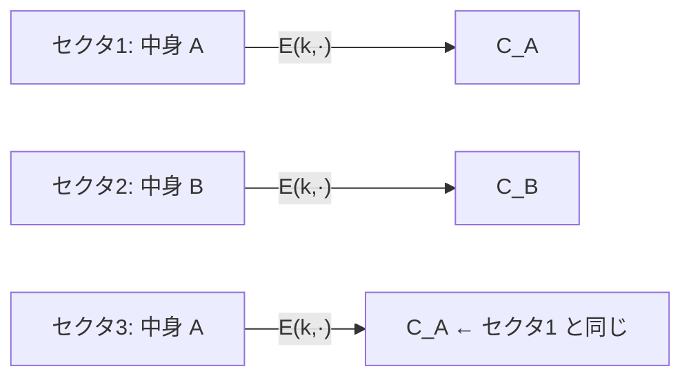

# 04. Tweakable 暗号

> 親: [README](./README.md) ｜ 前: [決定的暗号の構成](./03_deterministic-constructions.md) ｜ 次: [書式保存暗号](./05_format-preserving-encryption.md) ｜ 出典: Crypto I ビデオ2 (3:02:19–3:16:45)

**この1ページで分かること**

- ディスク暗号化は暗号文を拡張できない → 乱数も MAC も置けない → 使える暗号は**必ず PRP**
- 全セクタを同じ鍵で暗号化すると「どのセクタが同じ内容か」が漏れる。セクタごとに独立な PRP が要る
- それを 1 本の鍵から安価に取り出すのが **tweakable ブロック暗号**。実用構成が **XTS**（ブロックあたり `E` 1 回）

セクタが 4 KB なら暗号文も 4 KB。この制約から「1 本の鍵で多数の独立な PRP を作る仕組み」が自然に要求される。

---

## 拡張できないという制約

| 置けないもの | 理由 | 失うもの |
|---|---|---|
| IV | 書く場所がない | 乱数化 |
| MAC タグ | 書く場所がない | 完全性 |

到達できる最善は**決定的 CPA 安全性**だけ。ここに補題が効く。

> **補題**: 平文空間と暗号文空間が等しい（拡張しない）決定的 CPA 安全な暗号は、必ず **PRP** である。

ディスク暗号化で使えるのは、前ファイルの「PRP を直接使う」構成だけ。

---

## 全セクタを同じ鍵で暗号化すると漏れる



`C_A` が 2 回現れ「セクタ 1 と 3 は同じ内容」と分かる。特に**空のセクタ（全ゼロ）の位置**が全部露見し、ディスクの使用状況の地図を渡すことになる。

---

## セクタごとに鍵を変える

セクタごとに独立な鍵 `k1, k2, k3, …` を使えば、同じ内容でも暗号文は異なる。残る漏洩は 1 種類だけ:

| 操作 | 暗号文 | 攻撃者が知ること |
|---|---|---|
| 1 ビット書き換え | 全く別のランダム値に変わる | 変更された |
| 元に戻す | 元の値に戻る | 「変更して戻した」 |

性能を犠牲にしない限り消せない漏洩なので許容する。

鍵は全部保存せず、マスタ鍵 `k` から PRF で導く: `k_t = E(k, t)`（`t` はセクタ番号）。PRF は乱択関数と区別できないので各 `k_t` は独立な一様鍵に見える。だが**セクタごとに PRF を 1 回余分に評価**する。これを減らしたいという問いが次の概念を生む。

---

## Tweakable ブロック暗号

「1 本のマスタ鍵から多数の独立な PRP を安価に取り出す」仕組み。取り出す番号を **tweak** と呼ぶ。

```
Ẽ : K × T × X → X          T が tweak 空間
D̃ : K × T × X → X

鍵 k を固定すると、tweak ごとに X 上の可逆関数が 1 つ定まる:
    Ẽ(k, t1, ·) , Ẽ(k, t2, ·) , Ẽ(k, t3, ·) , …
これらが互いに独立な PRP に見えることを要求する
```

| | 通常のブロック暗号 | tweakable ブロック暗号 |
|---|---|---|
| 実験 1（理想） | `X` 上の真の乱択置換 **1 本** | `X` 上の真の乱択置換 **`\|T\|` 本** |
| 攻撃者の問い合わせ | `x_i` → `π(x_i)` | `(t_i, x_i)` → `π_{t_i}(x_i)` |

両実験を区別できなければ**安全な tweakable ブロック暗号**。

---

## 自明な構成 vs XTS

```
自明:  Ẽ(k, t, x) = E( E(k, t) , x )          ← tweak を暗号化して鍵にする

XTS:   Ẽ((k1,k2), (t,i), m):
           N ← E(k2, t)                        ← セクタごとに 1 回だけ
           c ← E(k1, m ⊕ P(N,i)) ⊕ P(N,i)      ← ブロックごとに E は 1 回
           return c
```

XTS（Rogaway の XEX に基づく）は tweak を `(t, i)` = (セクタ番号, セクタ内ブロック番号) の対にするのが要点。`P` は有限体の乗算による軽いパッド生成で、計算量は無視できる。

| `n` ブロックのセクタ | `E` の評価回数 |
|---|---|
| 自明な構成 | `2n`（tweak の暗号化 `n` + データ `n`） |
| XTS | `n + 1`（`N` に 1 + データ `n`） |

---

## tweak を暗号化しないと破れる

`N = E(k2,t)` を省いて `P(t,i)` を直接使うと安全でない。

```
仮の構成:  c = E(k1, m ⊕ P(t,i)) ⊕ P(t,i)

1. tweak (t,1) で m = P(t,1) を問い合わせる
       m ⊕ P(t,1) = 0        → c = E(k1, 0) ⊕ P(t,1)      ← E(k1,0) を c0 と置く
       応答 r1 = c0 ⊕ P(t,1)

2. tweak (t,2) で m = P(t,2) を問い合わせる
       応答 r2 = c0 ⊕ P(t,2)

3. r1 ⊕ r2 = P(t,1) ⊕ P(t,2)      ← c0 が相殺される
```

`P` は公開関数なので攻撃者は右辺を自分で計算でき、等号の成否で擬似乱択と真の乱択を advantage 1 で区別できる。**tweak を先に暗号化して `N` にする一手間が、この相殺を防ぐ。**

---

## XTS の使われ方

セクタ `t` を 16 バイトブロックに分割し、ブロック `i` を tweak `(t,i)` で暗号化する。注意点は XTS が**ブロック単位の PRP であってセクタ単位の PRP ではない**こと。セクタ全体を 1 つの広ブロックとして扱いたければ [EME](./03_deterministic-constructions.md) が要るが、`E` を 2 回使うため XTS の 2 倍遅く、あまり使われない。XTS はディスク暗号化製品で広く採用されている。

---

## 問題

**Q1.** ディスク暗号化で乱数も完全性も置けない理由と、そこから「暗号は必ず PRP になる」が導かれる筋道を述べよ。

<details><summary>解答</summary>

セクタサイズが固定で暗号文を拡張できないため、IV を書く場所も MAC タグを書く場所もない。よって平文空間と暗号文空間が一致し、乱数化できないので到達できる最善は決定的 CPA 安全性になる。そして「拡張しない決定的 CPA 安全な暗号は PRP である」という補題により、選べる構成は PRP に限られる。

</details>

**Q2.** 全セクタを同じ鍵の PRP で暗号化すると何が漏れるか。セクタごとに鍵を変えても残る漏洩は何か。

<details><summary>解答</summary>

同じ鍵の場合: 内容が同じセクタは暗号文も同じになるため、どのセクタが同一内容かが分かる。特に空のセクタ（全ゼロ）の位置が完全に露見する。

鍵を変えても残る漏洩: あるセクタを書き換えてから元に戻すと暗号文も元の値に戻るため、「変更して戻した」という事実が観測される。性能を犠牲にしない限り消せない。

</details>

**Q3.** XTS で tweak を暗号化せず `P(t,i)` を直接使うと破れる。攻撃を式で示せ。

<details><summary>解答</summary>

tweak `(t,1)` で `m = P(t,1)` を問い合わせると入力が `0` になり、応答は `E(k1,0) ⊕ P(t,1)`。同様に tweak `(t,2)` で `m = P(t,2)` を問い合わせると応答は `E(k1,0) ⊕ P(t,2)`。2 つの応答を XOR すると `E(k1,0)` が相殺され `P(t,1) ⊕ P(t,2)` が残る。`P` は公開関数なので攻撃者はこの値を自分で計算でき、一致するかどうかで擬似乱択と真の乱択を advantage 1 で区別できる。

</details>

**Q4.** `n` ブロックのセクタを暗号化するとき、自明な構成 `E(E(k,t),x)` と XTS でブロック暗号 `E` の評価回数はそれぞれ何回か。

<details><summary>解答</summary>

自明な構成: ブロックごとに tweak の暗号化 1 回とデータの暗号化 1 回で `2n` 回。

XTS: セクタ先頭で `N = E(k2,t)` を 1 回、各ブロックのデータ暗号化に 1 回ずつで `n + 1` 回。`n` が大きければおよそ半分になる。

</details>

## 関連リンク

- [書式保存暗号](./05_format-preserving-encryption.md) — 次の話題。任意サイズの集合上に PRP を作る
- [決定的暗号の構成](./03_deterministic-constructions.md) — PRP を直接使う構成と EME による広ブロック化
- [04. ブロック暗号と PRF/PRP](../04_block-ciphers/01_block-cipher-and-prf-prp.md) — tweakable 版が拡張している PRP の定義
- [利用モードと AEAD(topics)](../../../topics/02_cryptography/02_symmetric-crypto/04_modes-and-aead.md) — XTS が実務のどのモードに位置づくか
