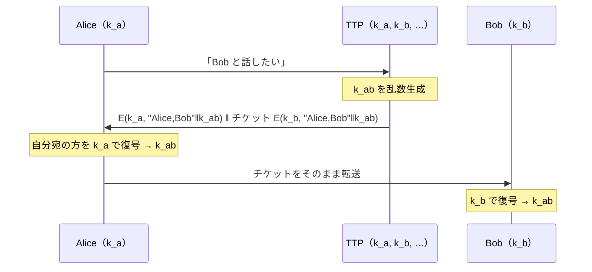

# 01. 信頼できる第三者

> 親: [README](./README.md) ｜ 前: [09. 対称暗号の補遺](../09_odds-and-ends/README.md) ｜ 次: [Merkle パズル](./02_merkle-puzzles.md) ｜ 出典: Crypto I ビデオ2 (3:29:11–3:39:00)

**この1ページで分かること**

- 全ペアが鍵を持つと 1 人 `n−1` 本。**信頼できる第三者（TTP）**を置けば 1 人 1 本で済む
- TTP は Bob 宛の暗号文（**チケット**）を Alice に預け、Alice が運ぶ。盗聴に対する安全性は CPA 安全性から直ちに従う
- 弱点は「常時オンライン」「全鍵を知る」。さらに**リプレイ攻撃**で壊れるので実運用してはならない

ここまでは「2 者がすでに共通鍵を持つ」前提だった。その鍵はどこから来るのか。最も素朴な答えが「全員が信頼する第三者に配ってもらう」である。

---

## n² 鍵問題

`n` 人の任意の 2 人が安全に通信したい。素朴には**全ペアが共通鍵を持つ**。

```
n = 4 の場合
      u1 ──k12── u2
      │ ╲      ╱ │
    k13   k14    k23      鍵の総数 = C(n,2) = n(n−1)/2 = 6
      │ ╱  k24  ╲ │       1 人が保管する鍵 = n−1 = 3
      u3 ──k34── u4
```

| 方式 | 鍵の総数 | 1 人あたり | `n = 100` |
|---|---|---|---|
| 全ペア | `n(n−1)/2` | `n−1` | 4,950 本 / 99 本 |
| TTP | `n` | 1 | 100 本 / 1 本 |

新しい参加者が増えるたびに全員が鍵を追加する必要もある。

---

## オンライン TTP を置く

**信頼できる第三者（trusted third party, TTP）**を導入し、各利用者は TTP とだけ鍵を共有する。Alice は `k_a`、Bob は `k_b`、TTP は全員分を持つ。



| 設計上の工夫 | 理由 |
|---|---|
| **チケット**を Bob でなく Alice に渡す | Alice は `k_b` を持たず読めないが運べる。TTP と Bob が同時にオンラインでなくてよい |
| `"Alice,Bob"` を鍵と一緒に暗号化 | Bob が「誰との鍵か」を判断できる |

---

## 盗聴に対する安全性

盗聴者が見るのは `k_a` と `k_b` で暗号化された 2 本の暗号文だけで、どちらの鍵も持たない。暗号 `(E, D)` が **CPA 安全**なら、`k_ab` の暗号文と無関係なゴミの暗号文を区別できず、`k_ab` について何一つ学べない。**盗聴に対する安全性は CPA 安全性から直ちに従う。** 手順を繰り返して多数の鍵を作っても結論は変わらない。

---

## TTP の 2 つの弱点

利点は**対称鍵暗号しか使わない**こと。重い演算がなく高速で、Kerberos はこの発想を基礎にしている。

| 弱点 | 内容 |
|---|---|
| 常時オンライン | TTP なしには一切の鍵交換ができない。落ちれば全員の通信開始が止まる |
| 全セッション鍵を知る | `k_ab` を生成したのは TTP。悪意・侵入で全セッションの鍵が一度に流出する単一障害点 |

企業内のように信頼の中心が 1 つある環境では現実的だが、「誰が全世界の TTP を務めるのか」に答えられない Web では成り立たない。

---

## リプレイ攻撃で壊れる

この方式は**能動的攻撃者にまったく安全でない**。

Alice がオンライン書店 Bob に本を注文し決済したとする。攻撃者は通信を丸ごと記録し、後日そのまま再送する。Bob には Alice が再注文したように見え、Alice はもう一度課金される。暗号文をひとつも解読せず、**同じメッセージがいつ送られたか**だけで攻撃が成立する。

よってこれは鍵交換の形を掴む toy であり、実運用してはならない。防ぐには nonce・カウンタ・タイムスタンプのような「セッションごとに変わる値」をメッセージに含めて認証する。

---

## 問題

**Q1.** `n = 100` のとき、全ペアが鍵を共有する方式と TTP 方式で、それぞれ鍵の総数と 1 人あたりの保管数を求めよ。

<details><summary>解答</summary>

全ペア方式: 総数 `100·99/2 = 4,950` 本、1 人あたり `99` 本。
TTP 方式: 総数 `100` 本、1 人あたり `1` 本。

</details>

**Q2.** TTP は Bob 宛のチケットを Bob に直接送らず Alice に渡す。この設計の利点は何か。また Alice がチケットを読めないのはなぜか。

<details><summary>解答</summary>

利点は、TTP と Bob が同時にオンラインである必要がなくなること。TTP は Alice の要求に応じるときだけ動けばよく、Bob は自分の都合のよいときに Alice からチケットを受け取ればよい。

チケットは `k_b` で暗号化されており、Alice は `k_b` を持たないので中身を読めない。Alice が復号できるのは `k_a` で暗号化された自分宛の方だけである。

</details>

**Q3.** 盗聴者に対する安全性が CPA 安全性から従うことを、盗聴者が実際に見る値に即して述べよ。

<details><summary>解答</summary>

盗聴者が見るのは `E(k_a, "Alice,Bob"‖k_ab)` と `E(k_b, "Alice,Bob"‖k_ab)` の 2 本だけで、`k_a` も `k_b` も持たない。CPA 安全な暗号では、`k_ab` を含む平文の暗号文と、同じ長さの無関係な平文の暗号文を区別できない。区別できないなら `k_ab` に関する情報を一切得ていないことになるので、`k_ab` はセッション鍵として使ってよい。

</details>

**Q4.** リプレイ攻撃を防ぐには、このプロトコルに何を足せばよいか。既習のどの仕組みと同じ発想か。

<details><summary>解答</summary>

セッションごとに必ず変化する値 — nonce、単調増加カウンタ、タイムスタンプなど — をメッセージに含め、それも含めて認証する。受信側は同じ値を二度受け付けない。

TLS レコードプロトコルが方向ごとのカウンタを MAC の入力に含めてリプレイを弾いているのと同じ発想である。→ [08. 認証付き暗号](../08_authenticated-encryption/README.md)

</details>

## 関連リンク

- [Merkle パズル](./02_merkle-puzzles.md) — TTP を取り除けるか、という次の問い
- [06. 意味論的安全性](../03_stream-ciphers/06_semantic-security.md) — 本ファイルで援用した CPA 安全性の定義本体
- [08. 認証付き暗号](../08_authenticated-encryption/README.md) — カウンタでリプレイを防ぐ実例と、能動的攻撃への一般的な対処
- [鍵管理(topics)](../../../topics/02_cryptography/05_protocols/02_key-management.md) — 鍵配送・鍵階層の実務的な整理
