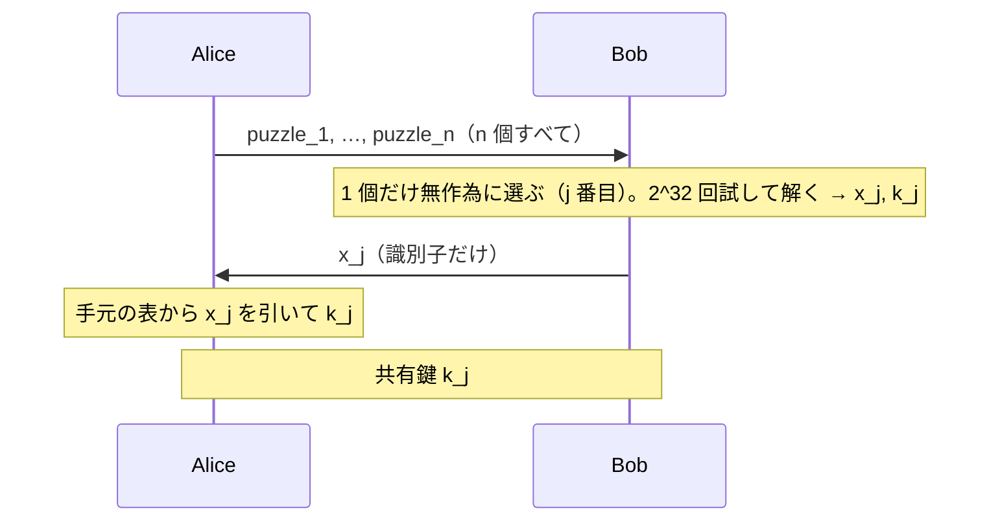

# 02. Merkle パズル

> 親: [README](./README.md) ｜ 前: [信頼できる第三者](./01_trusted-third-party.md) ｜ 次: [Diffie–Hellman](./03_diffie-hellman.md) ｜ 出典: Crypto I ビデオ2 (3:39:00–3:51:45)

**この1ページで分かること**

- 対称暗号**だけ**で第三者なしの鍵交換は作れる。道具は「解けるが手間がかかる」**パズル**
- 当事者 `O(n)`、盗聴者 `O(n²)` という**二次のギャップ**しか生まれず、`2^64` の安全性に数十 GB の送信が要る
- 対称プリミティブをブラックボックスとして使う限り二次が上限（2009 年の結果）→ **代数**が必要

TTP の弱点（常時オンライン・全鍵を握る）を取り除けないか。結論は「作れるが実用にならない」で、その理由が公開鍵暗号の必要性を示す。

---

## パズルとは何か

意図的に「解けるが手間がかかる」ように作った問題。ここでは鍵空間を狭めた暗号文で作る。

```
128 bit 鍵のうち、上位 96 bit を 0 に固定し、下位 32 bit だけを乱数にする
  p = 0000…0000 ‖ r        （96 個の 0 ‖ 32 bit の乱数 r）
  puzzle = E(p, 固定の平文)
```

鍵の候補は `2^32` 通りなので `2^32` 回の試行で必ず解ける。逆に `2^32` 回**は**かかる。

---

## プロトコル

Alice は `n = 2^32` 個のパズルを作り、`i` 番目に**識別子** `x_i` と**鍵** `k_i`（各 128 bit 乱数）を埋め込む。

```
Alice が作るもの（i = 1 … n）:
    p_i ←$ 32 bit 乱数
    x_i, k_i ←$ 128 bit 乱数
    puzzle_i = E( p_i, "puzzle" ‖ x_i ‖ k_i )     ← "puzzle" で「解けた」と自己判定できる
```



Bob は残りのパズルを見る必要すらない。Alice は自分の表を引くだけで解読作業は不要。

---

## 仕事量のギャップ

| 主体 | 仕事量 | 内訳 |
|---|---|---|
| Alice | `O(n)` | `n` 個のパズルを作る（1 個あたり定数時間） |
| Bob | `O(n)` | 1 個のパズルを解く（`2^32 = n` 回の試行） |
| 盗聴者 | `O(n²)` | どのパズルが選ばれたか分からず、全 `n` 個を各 `n` の手間で解く |

流れたのは `n` 個のパズルと `x_j` だけで、`x_j` は各パズルの**中に暗号化されている**。「どのパズルが `x_j` を含むか」を知るには片端から解いて覗くしかない。第三者なしに、対称暗号だけで、非対称性が生まれた。

---

## なぜ実用にならないか

| `n` | 攻撃者の仕事 `n²` | 当事者の仕事 `n` | 送信量（1 パズル数十バイト） |
|---|---|---|---|
| `2^32` | `2^64`（安全とは見なされない） | `2^32`（数秒） | 数十〜数百 GB |
| `2^64` | `2^128`（安全） | `2^64`（**実行不能**） | 現実的でない |

安全性を上げようとすると、当事者のコストが攻撃者のコストと同じ桁で膨らむ。攻撃者に要求したはずの計算量を正直な参加者が肩代わりすることになり、プロトコルとして成立しない。

---

## 二次が上限であるという結果

対称プリミティブをもっと巧妙に使えば二次を超えられないか。2009 年に否定的な結果が示された。

> ブロック暗号やハッシュ関数を「ブラックボックスのオラクル」（点で問い合わせて結果を受け取るだけ、内部構造を使わない）として扱う限り、常に `O(n²)` の攻撃が存在する。

この枠組みでは Merkle パズルは**最適**。指数的なギャップが欲しければ、**内部の代数的構造を使う**しかない。次の Diffie–Hellman は、群の冪乗という代数的性質を正面から使い、当事者 `O(n)` に対し攻撃者を部分指数時間へ突き放す。

歴史的な余談: この方式は 1974 年に Ralph Merkle が学部生のときに考案した。担当教員には価値が理解されなかったが、彼は後に Martin Hellman の学生となり、公開鍵暗号の誕生に関わる。

---

## 問題

**Q1.** 盗聴者が `O(n^2)` の仕事を強いられる理由を、ネットワーク上を流れた値に即して説明せよ。

<details><summary>解答</summary>

流れたのは `n` 個のパズルと識別子 `x_j` だけである。`x_j` は各パズルの内部に暗号化されているため、どのパズルが `x_j` を含むかを外から判定できない。よって盗聴者は `x_j` を含むパズルに当たるまで片端から解くしかなく、1 個あたり `n = 2^32` の手間で最大 `n` 個、合計 `O(n^2)` となる。

</details>

**Q2.** `n = 2^32` のとき、Alice・Bob・盗聴者の仕事量と、Alice が送るデータ量を見積もれ。

<details><summary>解答</summary>

Alice・Bob ともに約 `2^32 ≈ 43 億` ステップ。盗聴者は `(2^32)^2 = 2^64`。

送信量はパズル 1 個を数十バイト（`"puzzle"` + 128 bit × 2 を暗号化）とすると `2^32 × 数十バイト` で **数十〜数百 GB** のオーダーになる。

</details>

**Q3.** `2^128` の安全性を得るには `n` をいくつにすべきか。そしてそれが成立しない理由を述べよ。

<details><summary>解答</summary>

攻撃者の仕事が `n^2` なので `n^2 = 2^128`、すなわち `n = 2^64`。

しかし当事者の仕事は `O(n) = 2^64` であり、これは攻撃者に要求している `2^128` と比べれば小さいものの、絶対値として実行不能である。加えて `2^64` 個のパズルを送信する必要があり、通信量も現実的でない。安全性を上げるほど正直な参加者の負担が破綻するため、この方式は使えない。

</details>

**Q4.** 「だから代数が必要だ」という結論は、どの事実から導かれるか。

<details><summary>解答</summary>

対称プリミティブをブラックボックスのオラクルとして扱う限り、必ず `O(n^2)` の攻撃が存在することが 2009 年に示されている。つまり二次のギャップがこの枠組みの上限であり、Merkle パズルはすでに最適である。

指数的なギャップを得るには枠組みそのものを変えるしかなく、プリミティブの内部構造 — 群における冪乗のような代数的性質 — を直接利用する方向へ進むことになる。

</details>

## 関連リンク

- [信頼できる第三者](./01_trusted-third-party.md) — 取り除こうとしている TTP の弱点
- [Diffie–Hellman](./03_diffie-hellman.md) — 代数を使って指数的なギャップを得る次の一手
- [02. XOR と誕生日パラドックス](../02_discrete-probability/02_xor-and-birthday-paradox.md) — `n` 個から 1 個を選ぶ確率的議論の道具立て
- [公開鍵暗号の全体像(topics)](../../../topics/02_cryptography/03_public-key-crypto/README.md) — この限界の先に何があるか
