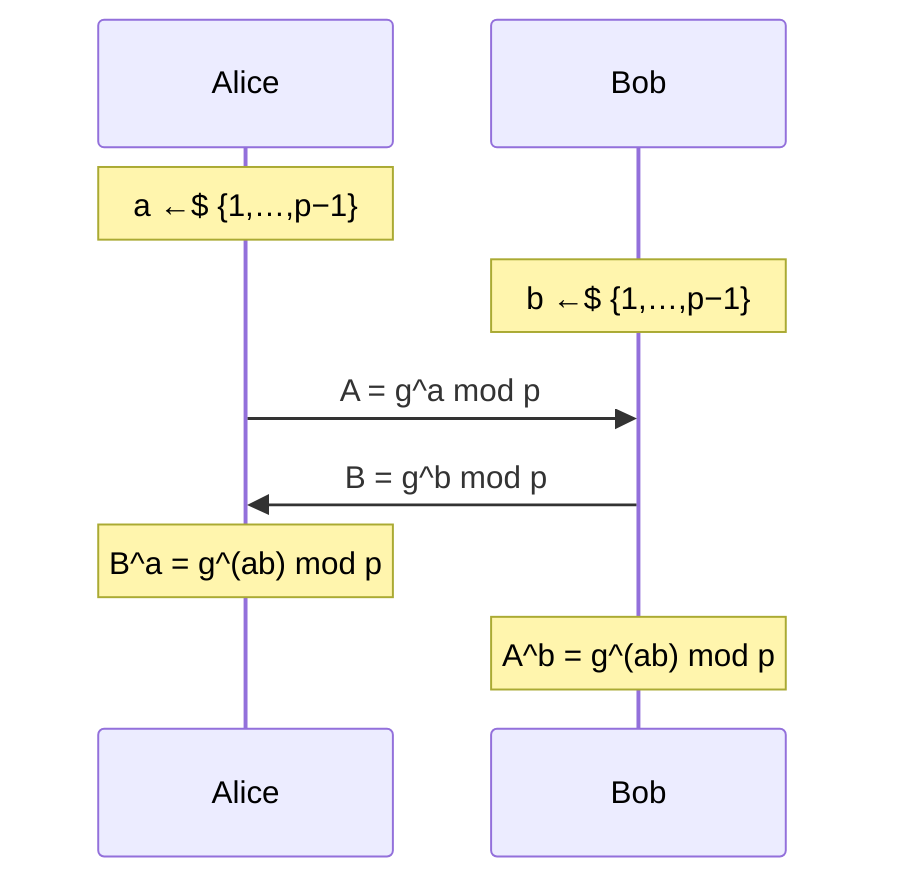

# 03. Diffie–Hellman

> 親: [README](./README.md) ｜ 前: [Merkle パズル](./02_merkle-puzzles.md) ｜ 次: [公開鍵暗号による鍵交換](./04_public-key-exchange.md) ｜ 出典: Crypto I ビデオ2 (3:51:45–4:10:35)

**この1ページで分かること**

- 指数法則 `(g^b)^a = (g^a)^b` だけで、公開の場から共有鍵が生まれる
- `Z_p^*` は部分指数時間で解かれるため法が巨大になる。楕円曲線なら小さく済む
- 守れるのは盗聴のみ。中間者攻撃には無力で、このままでは実運用できない

前ファイルの結論は「対称プリミティブだけでは二次のギャップが上限」だった。代数を使うと、当事者は多項式時間・攻撃者は部分指数時間という実用的なギャップが得られる。

---

## プロトコル

巨大素数 `p`（600 桁 ≈ 2000 bit）と整数 `g` を固定する。両方とも全世界に公開されたパラメータで、一度決めたら変えない。



両者が同じ値に着くのは指数法則ひとつによる。

```
Alice:  B^a = (g^b)^a = g^(b·a) mod p
Bob:    A^b = (g^a)^b = g^(a·b) mod p
                     ↓
        k_ab = g^(ab) mod p     ← 同じ値
```

流れたのは `g^a` と `g^b` だけ。指数 `a`, `b` は各自の手元に残り、`g^(ab)` はネットワークに一度も現れない。1976 年に Diffie と Hellman が示した着想である。

小さい数で確かめる（`p = 11`, `g = 2`, `a = 3`, `b = 4`）。

```
A = 2^3 mod 11 = 8
B = 2^4 mod 11 = 16 mod 11 = 5

Alice:  B^a = 5^3 = 125 = 4  (mod 11)
Bob:    A^b = 8^4 = 4096 = 4 (mod 11)      ← 一致
検算:   g^(ab) = 2^12 = 2^10 · 2^2 = 1 · 4 = 4  (mod 11)
```

---

## 安全性 — Diffie–Hellman 関数

攻撃者が見るのは `p`, `g`, `g^a`, `g^b` の 4 つ。ここから `g^(ab)` を求める問題を **Diffie–Hellman 関数**と呼ぶ。

```
DH_g( g^a , g^b )  =  g^(ab)   mod p
```

この計算が困難であることが安全性の根拠になる。`p` が `n` bit のとき、最良のアルゴリズムは**一般数体篩**（合成数や離散対数を解く最速の汎用手法）で、実行時間は

```
exp( O( n^(1/3) ) )        ← 指数が n ではなく n の立方根
```

指数が `n` に比例しないので、真の指数時間ではなく**部分指数時間 (sub-exponential)** と呼ぶ。この立方根が鍵長を押し上げる。

---

## 鍵長 — 立方根効果の代償

セッション鍵をブロック暗号に渡すなら、鍵交換の強度もその鍵長に見合う必要がある。

| 対称鍵の強度 | `Z_p^*` の法 `p` | 楕円曲線群 |
|---|---|---|
| 80 bit | 1024 bit | 160 bit |
| 128 bit | 3072 bit | 256 bit |
| 256 bit | 15360 bit | 512 bit |

`Z_p^*` の列だけが異常に伸びる。強度を 2 倍にするには指数の立方根を 2 倍にする必要があり、`n` 自体は `2^3 = 8` 倍しなければならない。実際の推奨値が 3072 → 15360 と約 5 倍に留まるのは、実行時間の式に含まれる定数項のおかげである。

**楕円曲線群**では最良のアルゴリズムが `2^(n/2)` — 真の指数時間になる。立方根効果がないので `t` bit の強度に `2t` bit の曲線で足りる。同じ強度をはるかに小さいパラメータで得られるため、`Z_p^*` からの移行が進んでいる。

---

## 中間者攻撃 — このままでは実運用できない

Diffie–Hellman が守るのは**盗聴に対してのみ**。通信を書き換えられる攻撃者の前では無力になる。

```
Alice                   攻撃者（a', b' を自分で用意）                Bob

 g^a  ────────────▶  横取りして破棄
                     g^(a')  ──────────────────────────────▶
                                                        ◀──  g^b
                     横取りして破棄
 ◀──────────────  g^(b')

Alice の鍵:  (g^b')^a = g^(a·b')          両方とも攻撃者が計算できる
Bob   の鍵:  (g^a')^b = g^(a'·b)          （a', b' を知っているため）
```

Alice と Bob は鍵交換が成功したと信じているが、実際には**それぞれ攻撃者と鍵を共有している**。以後 Alice の暗号文は攻撃者が復号し、読み、改竄し、Bob 用の鍵で再暗号化して転送できる。両者は気づかない。

防ぐには「その `g^a` が本当に相手のものか」を確認する手段 — 署名や証明書による認証 — が要る。認証付き鍵交換は本コースの範囲外である。

---

## 非対話性という際立った性質

Diffie–Hellman では**両者の寄与を互いに独立に作れる**。Alice は Bob を見ずに `g^a` を作れるし、Bob も同様で、順序の依存がない。

したがって全員が `g^a` を掲示板に貼っておけば、任意の 2 人は**一度も通信せずに**共有鍵を持てる。互いの掲示を読むだけで `g^(ac)` が決まる。

3 人までは双線形写像（ペアリング）を使う Joux の方式で同じことができる。**4 人以上は長年未解決**で、各自 1 つの値を掲示するだけで 4 人共通の鍵を得る方法は知られていない。

---

## 問題

**Q1.** `p = 23`, `g = 5`, `a = 6`, `b = 15` として、`A`, `B`, および両者が得る共有鍵を計算し、一致することを確かめよ。

<details><summary>解答</summary>

```
A = 5^6 mod 23 = 15625 mod 23 = 8     （23·679 = 15617, 15625−15617 = 8）
B = 5^15 mod 23 = 19
   （5^2=2, 5^4=4, 5^8=16, 5^15 = 5^8·5^4·5^2·5^1 = 16·4·2·5 = 640 = 19 mod 23）

Alice: B^a = 19^6 mod 23 = 2
   （19^2 = 361 = 16, 19^4 = 16^2 = 256 = 3, 19^6 = 3·16 = 48 = 2）
Bob:   A^b = 8^15 mod 23 = 2
   （8^2=18, 8^4=2, 8^8=4, 8^15 = 8^8·8^4·8^2·8 = 4·2·18·8 = 1152 = 2 mod 23）

共有鍵 = 2 で一致。検算: g^(ab) = 5^90 mod 23 = 2。
```

</details>

**Q2.** 128 bit の対称鍵に釣り合わせるのに `Z_p^*` では 3072 bit、楕円曲線では 256 bit で足りる。この差はどこから来るか。

<details><summary>解答</summary>

アルゴリズムの実行時間の形が違う。`Z_p^*` の離散対数には一般数体篩があり `exp(O(n^(1/3)))` — 指数が `n` の立方根にしか比例しない部分指数時間である。強度を上げるには `n` を大きく膨らませねばならない。

楕円曲線群では汎用アルゴリズムしか知られておらず `2^(n/2)` の真の指数時間。`t` bit の強度に `2t` bit の群で足りるので、パラメータが小さくて済む。

</details>

**Q3.** 中間者攻撃を受けたとき、Alice と Bob がそれぞれ持つ鍵を式で書け。攻撃者が両方を計算できる理由も述べよ。

<details><summary>解答</summary>

Alice が持つのは `g^(a·b')`、Bob が持つのは `g^(a'·b)`。

攻撃者は自分で選んだ `a'`, `b'` を知っている。Alice から受け取った `g^a` に `b'` を掛けて `(g^a)^(b') = g^(a·b')` を、Bob から受け取った `g^b` に `a'` を掛けて `(g^b)^(a') = g^(a'·b)` を計算できる。どちらの鍵も指数の一方を自分で選んでいるため、両方が手に入る。

</details>

**Q4.** Diffie–Hellman では全員が `g^a` を掲示板に貼るだけで任意の 2 人が共有鍵を持てる。この非対話性はプロトコルのどの性質に由来するか。

<details><summary>解答</summary>

両者の寄与 `g^a` と `g^b` を、互いを参照せずに独立に生成できることに由来する。Alice は相手が誰かを知らなくても `g^a` を作れるので、あらかじめ公開しておける。順序の制約がないため「送る」必要すらなく、掲示を読み合うだけで鍵が決まる。

次ファイルで見る公開鍵暗号ベースの鍵交換にはこの性質がない（Bob は Alice の公開鍵を受け取るまで動けない）。

</details>

## 関連リンク

- [Merkle パズル](./02_merkle-puzzles.md) — 二次のギャップという限界。ここを代数で突破した
- [公開鍵暗号による鍵交換](./04_public-key-exchange.md) — もう一つの鍵交換方式と、非対話性の差
- [Diffie–Hellman(topics)](../../../topics/02_cryptography/03_public-key-crypto/02_dh.md) — 群論的な定式化と安全性仮定の整理
- [楕円曲線暗号(topics)](../../../topics/02_cryptography/03_public-key-crypto/03_ecc.md) — なぜ小さいパラメータで済むのか
