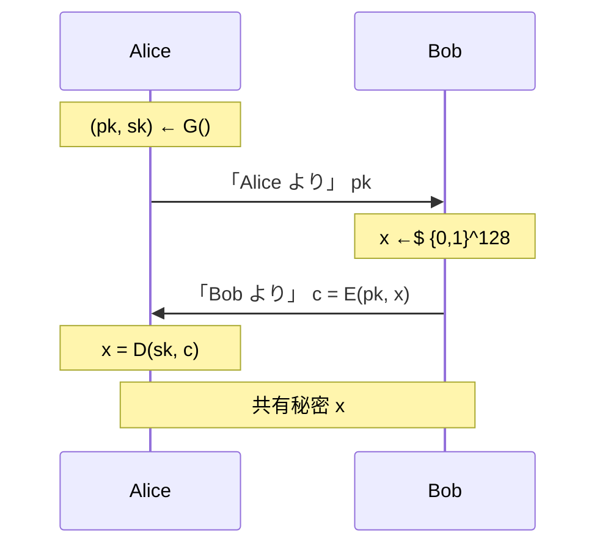

# 04. 公開鍵暗号による鍵交換

> 親: [README](./README.md) ｜ 前: [Diffie–Hellman](./03_diffie-hellman.md) ｜ 次: [11. 数論](../11_number-theory/README.md) ｜ 出典: Crypto I ビデオ2 (4:10:35–4:21:08)

**この1ページで分かること**

- 公開鍵暗号は `(G, E, D)` の 3 アルゴリズム。公開鍵で施錠し、秘密鍵でだけ開く
- 公開鍵では CPA クエリが内在するので、一回限りの安全性が多数回の安全性を含意する
- 鍵交換は作れるが順序が強制され、DH のような非対話性は得られない

第三者なしの鍵交換にはもう一つの道がある。**公開鍵暗号**を使う方法である。安全性は DH と同程度だが、非対話性の点で性質が異なる。

---

## 公開鍵暗号の定義

公開鍵暗号は 3 つのアルゴリズムの組 `(G, E, D)` である。

```
G()            → (pk, sk)      鍵生成。公開鍵と秘密鍵の対を出力する
E(pk, m)       → c             公開鍵で暗号化
D(sk, c)       → m             秘密鍵で復号
```

`pk` は**公開鍵**で世界中に配ってよい。`sk` は**秘密鍵**で生成した本人だけが持つ。整合性条件は次のとおり。

```
∀ (pk, sk) ← G(),  ∀ m ∈ M :   D( sk, E(pk, m) ) = m
```

比喩としては**南京錠のかかった箱**が近い。誰でも入れて施錠できるが、開けられるのは鍵を持つ一人だけ。なお `G` は実際には鍵長を指定する安全性パラメータを取る。

---

## 意味論的安全性 — CPA クエリが要らない理由

挑戦者が鍵対を生成して**公開鍵を攻撃者に渡し**、攻撃者が同じ長さの平文 `m0, m1` を出す。挑戦者は片方だけ暗号化して返す。

```
EXP(b):   挑戦者が (pk,sk) ← G() を生成し pk を A に渡す
          A が m0, m1 （|m0| = |m1|）を出す
          挑戦者が c = E(pk, mb) を返す
          A が b' を出力

Adv[A] = | Pr[EXP(0) → 1] − Pr[EXP(1) → 1] |     が negligible なら意味論的安全
```

対称鍵では「鍵を 1 回使う場合」と「何度も使う場合」を分けて定義し、両者に明確な差があった（ワンタイムパッドは前者で安全、後者で破れる）。**公開鍵ではこの区別が消える。**

攻撃者は `pk` を持つので、好きな平文を好きなだけ自分で暗号化できる。選択平文クエリを与える必要がない。選択平文攻撃は公開鍵の設定に**内在**しており、一回限りの安全性がそのまま多数回の安全性を含意する。この性質を「選択平文攻撃に対する識別不可能性」と呼ぶ。

---

## 鍵交換への応用



Alice が鍵対を作って公開鍵を送り、Bob が乱数 `x` を暗号化して返す。Alice は秘密鍵で復号して `x` を得る。

安全性は意味論的安全性から直ちに従う。攻撃者が見るのは `pk` と `E(pk, x)` だけ。意味論的安全なら `x` の暗号文と無関係な値の暗号文を区別できず、攻撃者から見て `x` は一様な値と識別不可能になる。

---

## Diffie–Hellman との違い — 順序の強制

同じ「盗聴に安全な鍵交換」でも、**メッセージの順序が強制される**点が決定的に違う。Bob は `E(pk, x)` の計算に `pk` が要るので、Alice の公開鍵を受け取るまで動けない。DH では `g^a` と `g^b` が互いを見ずに作れた。

| | Diffie–Hellman | 公開鍵暗号ベース |
|---|---|---|
| 寄与の生成 | 互いに独立 | Bob は `pk` を待つ |
| 掲示板だけで鍵共有 | できる | できない |
| 盗聴に対する安全性 | あり | あり |
| 中間者攻撃 | 破れる | 破れる |

全員が公開鍵を掲示しても、`E(pk, x)` を送る一往復が必ず要る。

---

## 中間者攻撃

こちらも能動的攻撃者の前では無力である。

```
Alice                    攻撃者（(pk', sk') を自分で生成）              Bob

 pk  ──────────────▶  横取りして破棄
                      pk'  ─────────────────────────────────▶
                                                    ◀────  c' = E(pk', x)
                      sk' で復号 → x を入手
                      pk で再暗号化 c = E(pk, x)
 ◀──────────────  c

 Alice: D(sk, c) = x          Bob: x          攻撃者: x
```

攻撃者は `x` を書き換えていない。書き換えれば両者の鍵が食い違い、通信が失敗して異常に気づかれる。**鍵交換を成功させたうえで自分も同じ鍵を知っている**状態が最も発見されにくく、以後の通信はすべて平文で読まれる。

防ぐには `pk` が本当に Alice のものだと Bob が確認できねばならない。その道具がデジタル署名と証明書で、本コースの範囲外である。ここまでの鍵交換はすべて**盗聴に対してのみ安全**であり、そのまま実運用してはならない。

---

## ここから先

残る問いは「公開鍵暗号をどう作るか」。ここまで定義しただけで構成は一つも与えていない。

その構成には数論が要る。次のモジュールでユークリッドの互除法から Fermat・Euler を経て離散対数と素因数分解までを揃え、その上で落とし戸付き関数と RSA、ElGamal を組み立てる。

---

## 問題

**Q1.** 公開鍵暗号の意味論的安全性ゲームでは、対称鍵の場合と違って選択平文クエリを攻撃者に与えない。なぜ与えなくてよいのか。

<details><summary>解答</summary>

攻撃者は公開鍵 `pk` を渡されているので、任意の平文を自分で好きなだけ暗号化できる。挑戦者に暗号化を依頼する必要がない。選択平文攻撃の能力は公開鍵の設定に内在しており、明示的にクエリを追加しても攻撃者の力は増えない。結果として、一回限りの安全性がそのまま多数回の安全性を含意する。

</details>

**Q2.** 中間者は `x` を自分の好きな値に書き換えることもできる。それでも書き換えず、そのまま再暗号化するのはなぜか。

<details><summary>解答</summary>

書き換えると Alice と Bob が別々の鍵を持つことになり、以後の暗号通信が復号できずセッションが失敗する。異常が表面化して攻撃が露見しやすい。

`x` をそのまま通せば鍵交換は正常に完了したように見え、しかも攻撃者自身も `x` を知っている。以後の通信を読み・改竄し・転送できる状態を、気づかれずに維持できる。

</details>

**Q3.** Diffie–Hellman では全員が値を掲示するだけで任意の 2 人が鍵を共有できるが、この方式ではできない。理由を述べよ。

<details><summary>解答</summary>

このプロトコルでは Bob のメッセージ `E(pk, x)` の計算に Alice の公開鍵 `pk` が必要で、Bob は `pk` を受け取るまで動けない。メッセージの順序が強制される。

Diffie–Hellman では `g^a` と `g^b` が互いを参照せず独立に作れるため順序の依存がなく、掲示を読み合うだけで鍵が決まる。

</details>

**Q4.** Alice が 1 つの鍵対を生成し、長期間・多数の相手に対して使い回すとする。この方式の安全性定義の観点から、問題ないと言えるのはなぜか。また別途注意すべき点は何か。

<details><summary>解答</summary>

公開鍵は公開されており、攻撃者はもともと自分で好きなだけ暗号化できる。同じ鍵対で何回暗号化されようと攻撃者の得る情報は増えず、意味論的安全性はそのまま多数回の安全性を含意する。この意味で使い回しは問題ない。

別途注意すべきは、秘密鍵 `sk` が一度漏れると、その鍵で交換した**過去のセッションすべて**が遡って復号されることである（記録されていれば）。これは安全性定義とは別の運用上の論点で、前方秘匿性の話題につながる。

</details>

## 関連リンク

- [Diffie–Hellman](./03_diffie-hellman.md) — もう一方の鍵交換。非対話性の有無を対比した
- [06. 意味論的安全性](../03_stream-ciphers/06_semantic-security.md) — 本ファイルの安全性ゲームの原型
- [11. 数論](../11_number-theory/README.md) — 公開鍵暗号を実際に構成するための道具
- [公開鍵暗号の全体像(topics)](../../../topics/02_cryptography/03_public-key-crypto/README.md) — 構成法と安全性定義の体系的な整理
