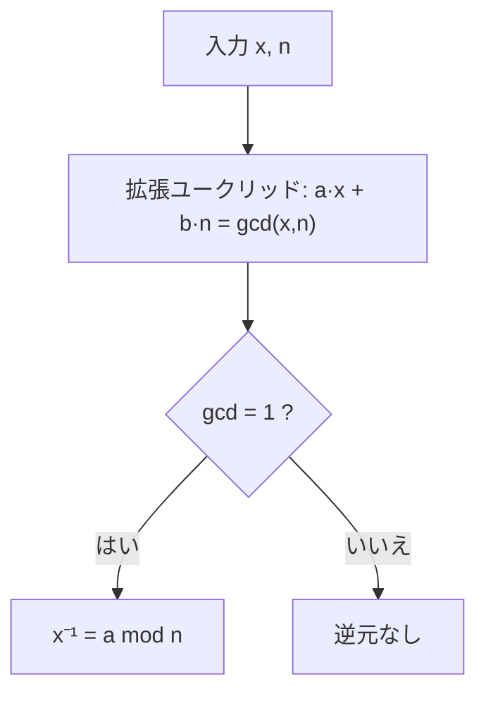

# 01. modular 演算と逆元

> 親: [README](./README.md) ｜ 前: [10. 鍵交換の基礎](../10_basic-key-exchange/README.md) ｜ 次: [Fermat と Euler](./02_fermat-euler.md) ｜ 出典: Crypto I ビデオ2 (4:21:08–4:36:00)

**この1ページで分かること**

- `Z_n` では通常の算術法則がそのまま成り立つ。例外は割り算だけ
- `x` が可逆 ⇔ `gcd(x, n) = 1`。証明がそのまま逆元計算アルゴリズムになる
- gcd・逆元・線形合同式はすべて `O(log² n)` で解ける「簡単な側」

公開鍵暗号はすべて「`n` を法とする整数の演算」の上に立つ。この回の主題は**どの元が割り算できて、それを効率的に計算できるか**である。

合同式・gcd・拡張ユークリッドの導出は [合同算術(topics)](../../../topics/01_prerequisites/01_math-for-crypto/01_modular-arithmetic/README.md) が本体。ここでは暗号で使う結論と**計算量**に絞る。

---

## Z_n — 法 `n` の整数の世界

以降 `n` は正整数、`p` は素数を表す。

```
Z_n = {0, 1, 2, …, n-1}
```

単なる集合ではなく、加法と乗法を **mod n** で行う演算体系（代数でいう環）である。`n = 12` で確かめる。

| 式 | 素の値 | mod 12 |
|---|---|---|
| `9 + 8` | 17 | **5** |
| `5 × 7` | 35 = 36 − 1 | **11** (= −1) |
| `5 − 7` | −2 | **10** |

負の数は `n` を足して `0…n-1` に収める。重要なのは**通常の算術法則がそのまま成り立つ**点である。

```
x · (y + z) = x·y + x·z     （Z_n でも成立）
```

整数や実数で知っている式変形は原則そのまま持ち込んでよい。**唯一の例外が割り算**で、これが以降の主題になる。

---

## 最大公約数と Bézout の等式

`gcd(x, y)` は両方を割り切る最大の整数。`gcd(12, 18) = 6`。

```
任意の整数 x, y に対して、ある整数 a, b が存在して
        a·x + b·y = gcd(x, y)
```

gcd は `x` と `y` の**整数係数の線形結合**として書ける。先の例なら `2·12 + (−1)·18 = 6` で、`a = 2`, `b = −1`。

この `a, b` は存在するだけでなく**効率的に求まる**。**拡張ユークリッドの互除法**が `O(log²)` 時間（桁数の 2 乗）で出力する。紀元前の Euclid のアルゴリズムがそのまま現代暗号の実装に載っている。

`gcd(x, y) = 1` のとき `x` と `y` は**互いに素 (relatively prime)** という。

---

## 逆元が存在する条件

有理数なら `2` の逆数は `1/2` だが、`Z_n` に分数はない。

```
x ∈ Z_n の逆元とは、  x · y = 1  (in Z_n)  を満たす y ∈ Z_n
        この y を x⁻¹ と書く（存在すれば一意）
```

**例**: `n` が奇数のとき `2` の逆元は `(n+1)/2`。`n+1` が偶数なので整数になる。検算は `2 · (n+1)/2 = n + 1 = 1 (in Z_n)`。

どの元に逆元があるかは gcd が完全に決める。

> **定理**: `x ∈ Z_n` が可逆 ⇔ `gcd(x, n) = 1`

**(⇒)** `gcd(x, n) = 1` とする。Bézout より `a·x + b·n = 1`。mod n で見ると `b·n` は 0 に落ちる。

```
a·x = 1  (in Z_n)      すなわち  x⁻¹ = a
```

**(⇐)** 対偶を示す。`gcd(x, n) = d > 1` とする。`d = 2` なら `2 | x` より `a·x` は**偶数**、`2 | n` より `b·n + 1` は**奇数**。等しくなり得ないので `a·x = 1 (mod n)` は不可能。一般の `d > 1` でも `gcd(a·x, n) ≥ d > 1` なので `a·x = 1` にならない。∎

---

## 構成的な証明 = 逆元計算アルゴリズム

(⇒) の証明は存在を言うだけでなく、**逆元そのものを与えている**。`x⁻¹` は Bézout の係数 `a` であり、拡張ユークリッドで `O(log² n)` で求まる。



証明を読むだけでアルゴリズムが手に入る — 計算機科学的な証明の好例である。手順は [拡張ユークリッド(topics)](../../../topics/01_prerequisites/01_math-for-crypto/01_modular-arithmetic/05_extended-euclidean.md) と [逆元(topics)](../../../topics/01_prerequisites/01_math-for-crypto/01_modular-arithmetic/06_modular-inverse.md) にある。

---

## `Z_n^*` — 可逆元の集合

```
Z_n^* = { x ∈ Z_n : gcd(x, n) = 1 }   （= Z_n の可逆元全体）
```

| `n` | `Z_n^*` | 大きさ |
|---|---|---|
| 素数 `p` | `Z_p \ {0}`（0 以外すべて） | `p − 1` |
| 12 | `{1, 5, 7, 11}` | 4 |

`3, 4, 6` などは 12 と 1 でない公約数を持つので入らない。**`Z_p^*` では 0 以外すべてに逆元がある**という事実は以降ずっと効く。

---

## 線形合同式を解く

`Z_n` で `a·x + b = 0` を解くには、移項して `a⁻¹` を掛ければよい。

```
x = −b · a⁻¹  (in Z_n)
```

`a⁻¹` は拡張ユークリッドで求まるので全体で `O(log² n)`。これが**現時点で知られている最良のアルゴリズム**である。

二次以上 — `x² = c` や `x³ = c` — が解けるかは [03. modular な e 乗根](./03_modular-roots.md) の主題になる。

---

## 計算量まとめ

| 演算 | 計算量 | 手段 |
|---|---|---|
| `gcd(x, n)` | `O(log² n)` | ユークリッドの互除法 |
| Bézout 係数 `a, b` | `O(log² n)` | 拡張ユークリッド |
| 逆元 `x⁻¹ mod n` | `O(log² n)` | 拡張ユークリッド |
| 線形合同式 `ax + b = 0` | `O(log² n)` | 逆元 1 回 + 乗算 |

いずれも**効率的に計算できる側**にある。困難な側は [05. 困難な問題](./05_hard-problems.md) で扱う。

---

## 問題

**Q1.** `Z_12` で `7 × 11` と `3 − 9` を計算せよ。

<details><summary>解答</summary>

`7 × 11 = 77 = 72 + 5 = 5 (mod 12)`。`3 − 9 = −6 = 6 (mod 12)`。

</details>

**Q2.** `Z_26` で `5` の逆元を求めよ（拡張ユークリッドの結果 `21·5 + (−4)·26 = 1` を使ってよい）。

<details><summary>解答</summary>

Bézout の式を mod 26 で見ると `21·5 = 1 (mod 26)` なので `5⁻¹ = 21`。検算: `5 × 21 = 105 = 4·26 + 1` ✓。`gcd(5, 26) = 1` なので逆元は確かに存在する。

</details>

**Q3.** `Z_12` で `4` に逆元が存在しないことを、偶奇の議論で示せ。

<details><summary>解答</summary>

`gcd(4, 12) = 4 > 1`。`4 | 4` かつ `4 | 12` なので、任意の `a` に対し `a·4` は 4 の倍数、`b·12 + 1` は 4 で割ると 1 余る数。4 の倍数が「4 で割って 1 余る数」に等しくなることはないので `a·4 = 1 (mod 12)` を満たす `a` は存在しない。

</details>

**Q4.** `Z_n` で `3x + 7 = 0` を解く手順を、計算量つきで述べよ（`gcd(3, n) = 1` とする）。

<details><summary>解答</summary>

`x = −7 · 3⁻¹ (mod n)`。`3⁻¹` は拡張ユークリッドで `O(log² n)`、その後の乗算も `O(log² n)`。全体で `O(log² n)`。

</details>

## 関連リンク

- [Fermat と Euler](./02_fermat-euler.md) — 冪乗による別の逆元計算と、その汎用性・効率の差
- [05. 困難な問題](./05_hard-problems.md) — この回の「簡単な側」と対をなす困難性仮定
- [合同算術(topics)](../../../topics/01_prerequisites/01_math-for-crypto/01_modular-arithmetic/README.md) — 余りの定義から CRT までを概念ごとに積み上げた本体
- [逆元(topics)](../../../topics/01_prerequisites/01_math-for-crypto/01_modular-arithmetic/06_modular-inverse.md) — 拡張ユークリッドによる逆元計算の手順
