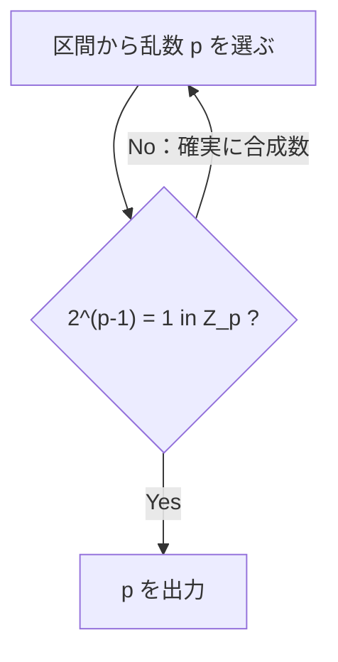

# 02. Fermat と Euler

> 親: [README](./README.md) ｜ 前: [modular 演算と逆元](./01_modular-arithmetic.md) ｜ 次: [modular な e 乗根](./03_modular-roots.md) ｜ 出典: Crypto I ビデオ2 (4:36:00–4:53:44)

**この1ページで分かること**

- `x^(p-1) = 1`（Fermat）から逆元計算と確率的な素数生成が出る
- `Z_p^*` は巡回群。生成元の冪乗が群全体を尽くし、位数は `p−1` を割る（Lagrange）
- `x^φ(n) = 1`（Euler）は Fermat の合成数版であり、RSA の正当性そのもの

前ファイルの Euclid は紀元前の道具だった。ここで時代は 17〜19 世紀に跳ぶ。「冪乗すると 1 に戻る」という構造が、素数生成から RSA まで公開鍵暗号のほぼすべてを支える。

---

## Fermat の小定理

> `p` を素数とする。すべての `x ∈ Z_p^*` に対して `x^(p-1) = 1 in Z_p`

**例**: `p = 5`, `x = 3` なら `3^4 = 81 = 80 + 1 = 1 (mod 5)` ✓

Fermat 自身は証明していない。証明はおよそ 100 年後の Euler を待つ（しかもより一般の形で。後述）。

---

## 系: 冪乗による逆元計算

`x^(p-1) = 1` を次のように分ける。

```
x^(p-1) = x · x^(p-2) = 1        よって   x⁻¹ = x^(p-2)  (in Z_p)
```

逆元の第 2 のアルゴリズムだが、Euclid に対して**二重に劣る**。

| | 拡張ユークリッド | `x^(p-2)` |
|---|---|---|
| 適用範囲 | 任意の法 `n`（合成数も可） | **素数を法とする場合のみ** |
| 計算量 | `O(log² p)` | `O(log³ p)`（冪乗が立方時間） |

冪乗が立方時間である理由は [04. 算術アルゴリズム](./04_arithmetic-algorithms.md) で見る。汎用性でも効率でも Euclid の勝ち。それでも小定理自体は以降で決定的な役割を果たす。

---

## 応用: 確率的な素数生成

1024 bit 程度の素数が欲しいとする。素朴だが機能するアルゴリズム。



No の側は確実である（対偶で、素数なら必ず条件を満たす）。問題は Yes の側で、**通過しても素数とは限らない**。

通過してしまう合成数 = 偽素数 (false prime) の集合は極めて小さく、1024 bit の範囲で乱数が偽素数に当たる確率は `2^-60` 未満。つまり出力が素数であることは**保証されない**。「素数でないのは無視できる確率の事象が起きたときだけ」という主張である。

何回で見つかるかは**素数定理**が答え、期待値で数百回程度。現在はより良いアルゴリズムがあり、真に素数であることを疑いなく証明する決定的判定法も存在するので、実務でこの検査だけを使うことはない。

---

## `Z_p^*` は巡回群

Euler が（現代の言葉で）示したこと: **`Z_p^*` は巡回群である**。ある元 `g` が存在して、その冪乗が `Z_p^*` 全体を尽くす。

```
{ g^0, g^1, g^2, …, g^(p-2) }  =  Z_p^*
```

`g^(p-1) = 1`（Fermat）なので `p-1` 乗以降は巡回するだけ。指数は `p-2` で止めれば十分である。このような `g` を **生成元 (generator)**（その冪で群のすべての元を作れる元）と呼ぶ。

**例**: `p = 7` で `g = 3` の冪乗。

| `k` | 0 | 1 | 2 | 3 | 4 | 5 |
|---|---|---|---|---|---|---|
| `3^k mod 7` | 1 | 3 | 2 | 6 | 4 | 5 |

`{1,2,3,4,5,6} = Z_7^*` を尽くすので **3 は生成元**。一方 `g = 2` では:

| `k` | 0 | 1 | 2 | 3 |
|---|---|---|---|---|
| `2^k mod 7` | 1 | 2 | 4 | **1** |

`2^3 = 8 = 1` で早々に一周し、得られるのは `{1, 2, 4}` だけ。**2 は生成元ではない**。

---

## 位数と Lagrange の定理

`g` の冪乗全体を `⟨g⟩` と書き、その大きさを **`g` の位数 (order)** と呼ぶ。

```
ord(g) = |⟨g⟩| = g^a = 1 を満たす最小の正整数 a
```

2 つが一致するのは、`⟨g⟩ = {1, g, g², …, g^(ord(g)-1)}` で `g^ord(g)` が 1 に戻り以降は繰り返しになるからである。`p = 7` なら `ord(3) = 6`、`ord(2) = 3`、`ord(1) = 1`。

> **Lagrange の定理**（の特別な場合）: `ord(g)` は必ず `p − 1` を割り切る。

確かに `6 | 6`、`3 | 6`、`1 | 6`。ここから **Fermat の小定理が直ちに従う**。`p−1 = k·ord(g)` と書けるので

```
g^(p-1) = (g^ord(g))^k = 1^k = 1
```

Lagrange は 19 世紀の仕事。紀元前 → 17 世紀 → 19 世紀と、暗号の土台は時代を跨いで積み上がっている。

---

## Euler の φ 関数

```
φ(n) = |Z_n^*|      （n と互いに素な 0…n-1 の個数）
```

`φ(p) = p − 1`（素数なら 0 以外すべて）、`φ(12) = 4`（`Z_12^* = {1,5,7,11}`）。

**`n = pq`（相異なる素数の積）の場合**。`Z_n` の `n` 個から互いに素でないものを除く。

```
n から引くもの:
  q で割り切れる数 … p 個
  p で割り切れる数 … q 個
  → 0 は両方に数えたので +1 で戻す

φ(n) = n − p − q + 1 = (p−1)(q−1)
```

最後の等号は `pq − p − q + 1 = (p−1)(q−1)` を展開すれば確認できる。この式は RSA の鍵生成でそのまま使う。

---

## Euler の定理

> すべての `x ∈ Z_n^*` に対して `x^φ(n) = 1 in Z_n`

**例**: `x = 5`, `n = 12`。`φ(12) = 4` なので `5^4 = 625 = 52·12 + 1 = 1 (mod 12)` ✓

`n = p` を代入すれば `φ(p) = p−1` で Fermat の小定理そのものになる。**Euler の定理は Fermat の一般化**であり、合成数を法とする場合に使える点が本質的に強い。これも Lagrange の定理の特別な場合として証明できる。

そして **この定理が RSA の正当性そのもの**である。RSA が `e·d = 1 (mod φ(n))` を課して復号が成立するのは、Euler の定理が `x^φ(n) = 1` を保証しているからに他ならない。→ [12. 公開鍵暗号(RSA)](../12_public-key-encryption/README.md)

---

## 問題

**Q1.** `p = 11`, `x = 3` で Fermat の小定理を検算せよ。

<details><summary>解答</summary>

`3^2 = 9`、`3^4 = 81 = 4`、`3^5 = 3^4·3 = 12 = 1`。よって `3^10 = (3^5)^2 = 1 (mod 11)` ✓（ついでに `ord(3) = 5` で `5 | 10` も確認できる）。

</details>

**Q2.** `Z_7` で `5` の逆元を、Fermat の系 `x⁻¹ = x^(p-2)` で求めよ。

<details><summary>解答</summary>

`5^(7-2) = 5^5`。`5^2 = 25 = 4`、`5^4 = 16 = 2`、`5^5 = 2·5 = 10 = 3 (mod 7)`。よって `5⁻¹ = 3`。検算 `5 × 3 = 15 = 1 (mod 7)` ✓

</details>

**Q3.** `n = 3 × 11 = 33` のとき `φ(n)` を 2 通りの式で求め、一致を確認せよ。

<details><summary>解答</summary>

`φ(n) = n − p − q + 1 = 33 − 3 − 11 + 1 = 20`。`(p−1)(q−1) = 2 × 10 = 20`。一致 ✓

</details>

**Q4.** `Z_7^*` で `2` の位数を求め、Lagrange の定理と整合することを確認せよ。また `2` が生成元でないことがそこから分かる理由を述べよ。

<details><summary>解答</summary>

`2^1=2, 2^2=4, 2^3=8=1` なので `ord(2) = 3`。`|Z_7^*| = 6` で `3 | 6` なので Lagrange と整合。生成元であるためには位数が群の大きさ 6 と一致する必要があるが `3 ≠ 6` なので生成元ではない。

</details>

## 関連リンク

- [modular な e 乗根](./03_modular-roots.md) — Fermat の小定理を使って e 乗根の存在と計算を論じる
- [05. 困難な問題](./05_hard-problems.md) — 生成元と位数が離散対数問題の舞台になる
- [Fermat の小定理(topics)](../../../topics/01_prerequisites/01_math-for-crypto/03_number-theory/02_fermat-little-theorem.md) — 定理の証明と周辺
- [Euler の φ と定理(topics)](../../../topics/01_prerequisites/01_math-for-crypto/03_number-theory/03_euler-phi-theorem.md) — φ の乗法性を含む本体
- [位数と Lagrange(topics)](../../../topics/01_prerequisites/01_math-for-crypto/02_groups-rings-fields/02_order-and-lagrange.md) — 群論としての一般形
