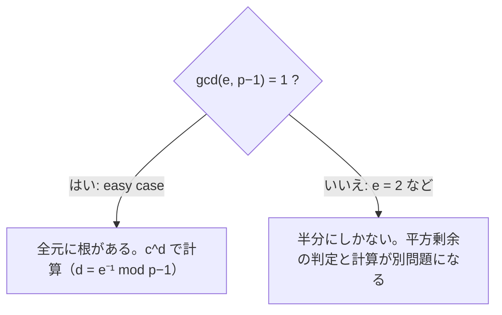

# 03. modular な e 乗根

> 親: [README](./README.md) ｜ 前: [Fermat と Euler](./02_fermat-euler.md) ｜ 次: [算術アルゴリズム](./04_arithmetic-algorithms.md) ｜ 出典: Crypto I ビデオ2 (4:53:44–5:10:58)

**この1ページで分かること**

- `gcd(e, p−1) = 1` なら e 乗根は常に存在し `c^d`（`d = e⁻¹ mod p−1`）で求まる
- `e = 2` は例外。平方剰余は半分だけで、Euler の判定法は存在を言うが根は与えない
- 合成数を法とすると e 乗根の計算は素因数分解を要する — これが RSA の源

一次方程式は解けた。次は `x² = c` や `x³ = c` である。結論は**素数を法とするなら大体解ける、合成数を法とすると素因数分解と同じくらい難しい**。

---

## e 乗根の定義

`p` を素数、`c ∈ Z_p` とする。`x^e = c` を満たす `x` を `c` の **e 乗根**と呼ぶ。`p = 11` の例。

```
6³ = 216 = 19·11 + 7 = 7     → 7 の 3 乗根は 6
5² = 25  = 2·11 + 3  = 3     → 3 の平方根は 5
1³ = 1                       → 1 の 3 乗根は 1（任意の素数で）
```

**e 乗根は常に存在するとは限らない**。`√2 mod 11` は存在しない。問いは 2 つ — **いつ存在するか**、**存在するとき効率的に計算できるか**。



---

## easy case: `gcd(e, p−1) = 1`

このときは**常に存在し、簡単に計算できる**。`e` が `p−1` と互いに素なら `e` は `mod (p−1)` で可逆なので

```
d = e⁻¹ mod (p−1)      とおくと      c^(1/e) = c^d  (in Z_p)
```

**証明**: `d·e = 1 (mod p−1)` とは、ある整数 `k` で `d·e = k(p−1) + 1` ということ。e 乗して `c` に戻るか確かめる。

```
(c^d)^e = c^(d·e)
        = c^(k(p−1) + 1)
        = (c^(p−1))^k · c
        = 1^k · c              ← Fermat の小定理
        = c                    ∎
```

この証明は構成的で、**`d` を拡張ユークリッドで求めて `c^d` を計算する**アルゴリズムを与えている。

**例**（`p = 11`, `e = 3`）: `gcd(3, 10) = 1`。`d = 3⁻¹ mod 10 = 7`。`c = 7` の 3 乗根は

```
7^7 :  7² = 49 = 5,  7⁴ = 5² = 25 = 3,  7⁶ = 3·5 = 15 = 4,  7⁷ = 4·7 = 28 = 6
```

`6` が得られ、冒頭の `6³ = 7` と一致する ✓

---

## less easy case: `e = 2`

奇素数 `p` では `p − 1` が偶数なので `gcd(2, p−1) = 2 ≠ 1`。**平方根は easy case ではない**。

二乗写像は `x` と `−x` を同じ値に送る **2 対 1 写像**である。`p = 11` で全部書き出す（`−x = 11 − x`）。

| `x` | 1,10 | 2,9 | 3,8 | 4,7 | 5,6 |
|---|---|---|---|---|---|
| `x² mod 11` | 1 | 4 | 9 | 5 | 3 |

像は `{1, 3, 4, 5, 9}` の 5 個だけ。残る `{2, 6, 7, 8, 10}` に平方根はない。平方根を持つ元を **平方剰余 (quadratic residue, QR)** と呼ぶ。

> `Z_p` の平方剰余の個数 = `(p−1)/2 + 1`

`Z_p^*` 上で 2 対 1 なので像は半分の `(p−1)/2` 個。これに常に QR である `0` を足して `+1`。`p = 11` なら 6 個。

**easy case との決定的な違い**: `gcd(e, p−1) = 1` では**全元**に根があった。`e = 2` では**半分にしかない**。

---

## Euler の判定法

> `x ∈ Z_p^*` が平方剰余 ⇔ `x^((p−1)/2) = 1 in Z_p`

`p = 11` なら `(p−1)/2 = 5` なので `x^5` を全部計算する。

| `x` | 1 | 2 | 3 | 4 | 5 | 6 | 7 | 8 | 9 | 10 |
|---|---|---|---|---|---|---|---|---|---|---|
| `x^5 mod 11` | 1 | 10 | 1 | 1 | 1 | 10 | 10 | 10 | 1 | 10 |
| QR? | ✓ | ✗ | ✓ | ✓ | ✓ | ✗ | ✗ | ✗ | ✓ | ✗ |

`1` が出るのはちょうど `{1, 3, 4, 5, 9}` — 二乗の像と完全に一致する ✓

**値が必ず ±1 になる理由**。`x ≠ 0` なら

```
x^((p−1)/2) = √(x^(p−1)) = √1
```

`1` の平方根であり、`Z_p` でそれは `+1` と `−1` の 2 つしかない。この値には **Legendre 記号**という名前がついている。

**重要な限界**: この判定法は**非構成的**である。存在は教えるが**平方根そのものは与えない**。

---

## 平方根の計算

判定と計算は別問題なので、改めて計算法が要る。

**`p = 3 (mod 4)` のとき** — 単純な公式がある。

```
√c = c^((p+1)/4)  (in Z_p)
```

`p + 1 = 0 mod 4` なので `(p+1)/4` は整数になる。**検算**（二乗して `c` に戻るか）:

```
(c^((p+1)/4))² = c^((p+1)/2)
               = c^((p−1)/2) · c
               = 1 · c              ← c は平方剰余なので Euler の判定法より 1
               = c                  ∎
```

**例**（`p = 7`）: `√c = c²`。`c = 2` なら `√2 = 4`。検算 `4² = 16 = 2 (mod 7)` ✓（もう一方の根は `−4 = 3`、`3² = 9 = 2` ✓）

**`p = 1 (mod 4)` のとき** — `(p+1)/4` が整数にならず公式が使えない。計算自体は可能だが**決定的アルゴリズムは知られておらず乱択を使う**。決定的にやるには解析的整数論の**拡張 Riemann 予想**を証明する必要がある。素朴な問いに未解決予想が絡む好例である。実務上はどちらも数回の冪乗で済み、**立方時間**の easy な問題とみなしてよい。

---

## 二次方程式が解けるようになった

`Z_p` の `a·x² + b·x + c = 0` は高校と同じ解の公式で解ける。

```
x = ( −b ± √(b² − 4ac) ) · (2a)⁻¹   (in Z_p)
```

`(2a)⁻¹` は拡張ユークリッド、`√(b² − 4ac)` は上の平方根アルゴリズムで求まる。ただし `b² − 4ac` が平方剰余でなければ解は存在しない（実数体で判別式が負なら実数解がないのと同じ構図）。

---

## 合成数を法とする場合

同じ問いを合成数 `n` で立てると様相が一変する。

> **合成数 `n` を法とする e 乗根の計算は、現在知られている最良のアルゴリズムでは `n` の素因数分解を必要とする。**

`n` を素因数分解できれば `mod p` と `mod q` で e 乗根を求め、中国剰余定理で合成すればよい。逆に素因数分解を経由しない方法は知られていない。

素数を法とすれば多くの `e` で簡単、合成数なら困難 — この落差が RSA の安全性の源である。RSA は `x^e mod n` を公開関数とし、その逆を「素因数分解を知る者だけができる操作」に押し込む。→ [12. 公開鍵暗号(RSA)](../12_public-key-encryption/README.md)

---

## 問題

**Q1.** `p = 13`, `e = 5` のとき 5 乗根は常に存在するか。存在するならその計算式を書け。

<details><summary>解答</summary>

`gcd(5, 12) = 1` なので easy case にあたり、すべての `c` に 5 乗根が存在する。`d = 5⁻¹ mod 12 = 5`（`5·5 = 25 = 1 mod 12`）なので `c^(1/5) = c^5`。

</details>

**Q2.** `Z_11` で `9` が平方剰余かを Euler の判定法で確かめ、平方根も求めよ。

<details><summary>解答</summary>

`9^5 mod 11`: `9² = 81 = 4`、`9⁴ = 16 = 5`、`9^5 = 5·9 = 45 = 1`。判定法より **平方剰余** ✓。平方根は `3`（`3² = 9`）と `−3 = 8`（`8² = 64 = 9`）の 2 つ。

</details>

**Q3.** `p = 7` で `√4` を公式 `c^((p+1)/4)` を使って求め、検算せよ。

<details><summary>解答</summary>

`(7+1)/4 = 2` なので `√4 = 4² = 16 = 2 (mod 7)`。検算 `2² = 4` ✓。もう一方の根は `−2 = 5`（`5² = 25 = 4`）✓

</details>

**Q4.** `e = 2` が easy case に入らないのはなぜか。またそのことが平方剰余の個数にどう現れるか。

<details><summary>解答</summary>

奇素数 `p` では `p−1` が偶数なので `gcd(2, p−1) = 2 ≠ 1` となり、`2⁻¹ mod (p−1)` が存在しない。結果として easy case のように全元に根が付くことはなく、二乗写像が 2 対 1 であることから `Z_p^*` のちょうど半分 `(p−1)/2` 個（`Z_p` では `0` を加えて `(p−1)/2 + 1` 個）だけが平方剰余になる。

</details>

## 関連リンク

- [Fermat と Euler](./02_fermat-euler.md) — easy case の証明で使った `x^(p-1) = 1`
- [算術アルゴリズム](./04_arithmetic-algorithms.md) — ここで多用した冪乗が立方時間である理由
- [05. 困難な問題](./05_hard-problems.md) — 合成数を法とする e 乗根と素因数分解の関係
- [12. 公開鍵暗号(RSA)](../12_public-key-encryption/README.md) — この落差を安全性に変換した方式
